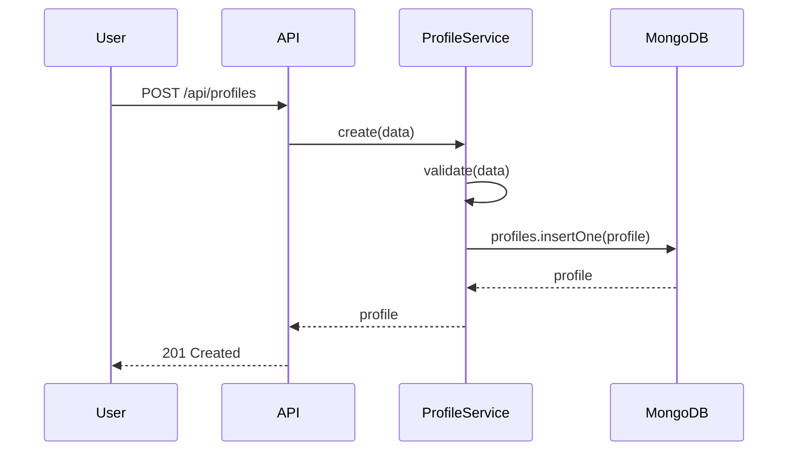
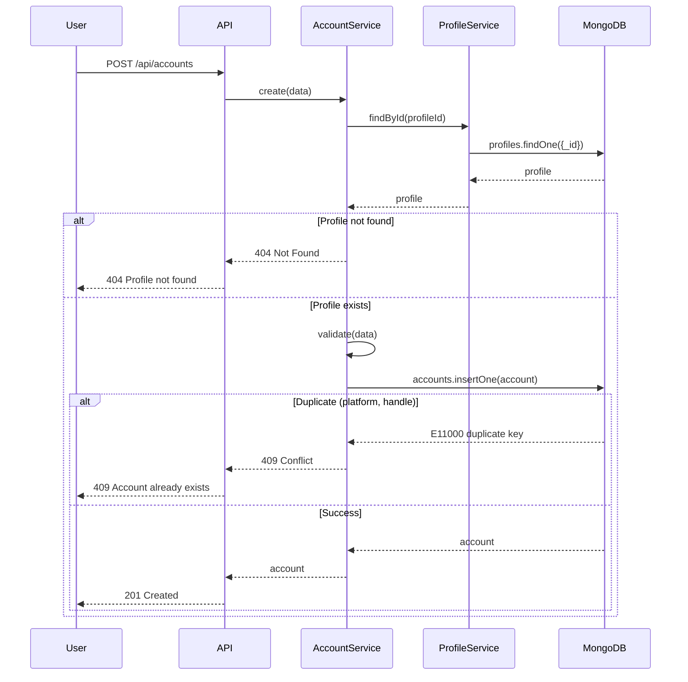
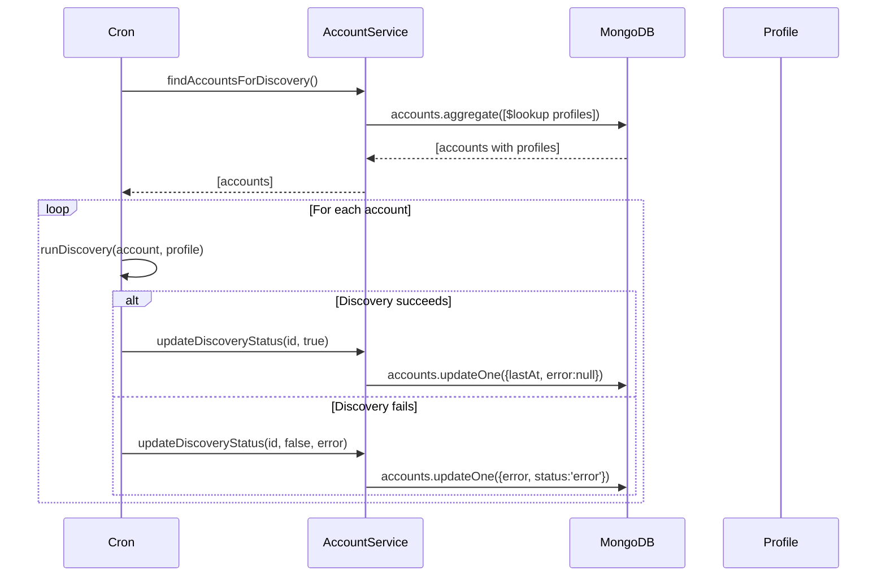

# Account Configuration - Design Document

📋 **Decision Context**: [ADR-006: Profile and Account Separation](../../../../docs/architecture/decisions/006-profile-account-separation.md) - Read this first to understand **why** we chose this architecture.

**Date**: 2025-12-29  
**Designer**: Designer Agent  
**Status**: Approved  

---

## Problem Statement

ngaj needs to store configuration for social media accounts, including platform credentials, discovery preferences, voice/tone settings, and scheduling. The system must:

1. **Support v0.1 single account** without overengineering
2. **Enable v0.2 multi-account/multi-platform** expansion without major refactoring
3. **Allow consistent personas across platforms** (same voice on Bluesky and LinkedIn)
4. **Separate platform-agnostic configuration** (voice, interests) from platform-specific details (handle, scheduling)

**User Story**:
> As a user configuring ngaj,
> I want to define my voice, interests, and account connections once,
> so that I can maintain consistent engagement across multiple platforms without duplicating configuration.

## Design Overview

We separate **Profile** (cross-platform persona: voice, discovery preferences) from **Account** (platform-specific connection: handle, credentials, scheduling) with a **1-to-many relationship**.

**Key Insight**: Users maintain personas (professional, casual, domain expert) that span platforms. Coupling voice to account would force duplication when adding platforms in v0.2.

**Collections**:
- `profiles` - Stores persona configuration (voice, interests, knowledge base)
- `accounts` - Stores platform connections (Bluesky, LinkedIn, Reddit)

**Relationship**: 1 Profile → Many Accounts

## Data Models

### Entity: Profile

**Purpose**: Represents a cross-platform persona with consistent voice and discovery preferences

**TypeScript Interface**:
```typescript
interface Profile {
  _id: ObjectId;                    // MongoDB document ID
  name: string;                     // "Professional Tech Persona"
  
  voice: {
    tone: string;                   // "professional-friendly" (lowercase)
    style: string;                  // Free-text style description
    examples: string[];             // 3-5 sample responses for few-shot learning
  };
  
  discovery: {
    interests: string[];            // ["ai", "typescript", "distributed systems"]
    keywords: string[];             // ["machine learning", "vector database"]
    communities: string[];          // ["@alice.bsky.social", "r/machinelearning"]
  };
  
  createdAt: Date;
  updatedAt: Date;
  isActive: boolean;                // Soft delete flag
}
```

**MongoDB Schema Notes**:
- Collection name: `profiles`
- Indexes:
  - `{ name: 1 }` - Find profile by name (for UI display)
  - `{ isActive: 1 }` - Filter active profiles
- Relationships:
  - Referenced by `accounts.profileId`

**Validation Rules**:
- `name`: Required, min 3 chars, max 100 chars, unique
- `voice.tone`: Required, lowercase, max 50 chars
- `voice.style`: Required, max 500 chars
- `voice.examples`: Array of 3-5 strings, each max 500 chars
- `discovery.interests`: Array of strings (lowercase, max 30 chars each)
- `discovery.keywords`: Array of strings (lowercase, max 50 chars each)
- `discovery.communities`: Array of strings (platform-specific format)

**Design Decisions**:
- `voice.examples` stored in MongoDB (not ChromaDB) for v0.1 simplicity
- No `availability` field (quiet hours, timezone) - deferred to v0.2+
- No `knowledgeBaseId` yet - will design knowledge base separately

### Entity: Account

**Purpose**: Represents a connection to a specific social media platform for a given profile

**TypeScript Interface**:
```typescript
type Platform = 'bluesky' | 'linkedin' | 'reddit';
type AccountStatus = 'active' | 'paused' | 'error';
type DiscoveryType = 'replies' | 'search';

interface Account {
  _id: ObjectId;                    // MongoDB document ID
  profileId: ObjectId;              // Reference to profiles collection
  
  platform: Platform;               // 'bluesky' | 'linkedin' | 'reddit'
  handle: string;                   // "@user.bsky.social", "u/username"
  
  discovery: {
    /**
     * Array of typed discovery schedules.
     * Each discovery type (replies, search) has independent scheduling.
     * Per ADR-008, one account can have multiple schedules.
     * 
     * Example:
     * [
     *   { type: 'replies', enabled: true, cronExpression: '*/15 * * * *' },
     *   { type: 'search', enabled: true, cronExpression: '0 */2 * * *' }
     * ]
     */
    schedules: DiscoveryTypeSchedule[];
    lastAt?: Date;                  // Last successful discovery (any type)
    error?: string;                 // Last discovery error message
  };
  
  status: AccountStatus;            // 'active' | 'paused' | 'error'
  
  createdAt: Date;
  updatedAt: Date;
}

/**
 * Typed discovery schedule with independent cron expression.
 * Enables different schedules for different discovery sources.
 */
interface DiscoveryTypeSchedule {
  type: DiscoveryType;              // 'replies' | 'search'
  enabled: boolean;                 // Whether this discovery type is enabled
  cronExpression: string;           // Cron expression for this type
  lastRunAt?: Date;                 // When this specific type last ran
}
```

**MongoDB Schema Notes**:
- Collection name: `accounts`
- Indexes:
  - `{ profileId: 1 }` - Find all accounts for a profile
  - `{ platform: 1, handle: 1 }` - **Unique constraint**: one handle per platform
  - `{ status: 1 }` - Find active accounts for discovery scheduling
- Relationships:
  - `profileId` → `profiles._id` (many-to-one)

**Note on Discovery Scheduling**: Per ADR-008, the cron scheduler loads accounts and registers separate cron jobs for each enabled schedule in the `schedules` array. This allows replies to run every 15 minutes while searches run every 2 hours.

**Validation Rules**:
- `profileId`: Required, must reference existing profile
- `platform`: Required, must be 'bluesky' | 'linkedin' | 'reddit'
- `handle`: Required, platform-specific format (regex validation)
- `discovery.schedules`: Required array, must have at least one schedule
- `discovery.schedules[].type`: Required, must be 'replies' | 'search'
- `discovery.schedules[].enabled`: Required boolean
- `discovery.schedules[].cronExpression`: Required, valid cron syntax
- `status`: Required, must be 'active' | 'paused' | 'error'

**Design Decisions**:
- **Multiple schedules per account** (ADR-008): Each discovery type has independent cron expression
- Credentials (passwords, tokens) stored in `.env` per ADR-002, not in MongoDB
- `handle` is non-sensitive, safe to store in DB
- Feature-oriented `discovery` structure groups schedules array, status, errors
- No `platformSettings` field for v0.1 (all platforms use profile discovery config)

## API Contracts

### Endpoint: `GET /api/profiles`

**Purpose**: List all profiles

**Request**:
```typescript
GET /api/profiles?active=true
```

**Query Parameters**:
- `active` (optional): Filter by isActive flag (true/false)

**Response (Success - 200)**:
```typescript
{
  "profiles": [
    {
      "id": "507f1f77bcf86cd799439011",
      "name": "Professional Tech Persona",
      "voice": {
        "tone": "professional-friendly",
        "style": "Clear explanations with technical depth",
        "examples": ["Great question! In distributed systems..."]
      },
      "discovery": {
        "interests": ["ai", "typescript"],
        "keywords": ["machine learning"],
        "communities": ["@alice.bsky.social"]
      },
      "createdAt": "2025-12-29T12:00:00Z",
      "updatedAt": "2025-12-29T12:00:00Z",
      "isActive": true
    }
  ]
}
```

**Error Codes**:
- `500` - Internal server error

### Endpoint: `GET /api/profiles/:id`

**Purpose**: Get a specific profile by ID

**Request**:
```typescript
GET /api/profiles/507f1f77bcf86cd799439011
```

**Response (Success - 200)**:
```typescript
{
  "id": "507f1f77bcf86cd799439011",
  "name": "Professional Tech Persona",
  "voice": { ... },
  "discovery": { ... },
  "createdAt": "2025-12-29T12:00:00Z",
  "updatedAt": "2025-12-29T12:00:00Z",
  "isActive": true
}
```

**Response (Error - 404)**:
```typescript
{
  "error": "NotFound",
  "message": "Profile not found",
  "details": {
    "profileId": "507f1f77bcf86cd799439011"
  }
}
```

**Error Codes**:
- `404` - Profile not found
- `500` - Internal server error

### Endpoint: `POST /api/profiles`

**Purpose**: Create a new profile

**Request**:
```typescript
POST /api/profiles
Content-Type: application/json

{
  "name": "Professional Tech Persona",
  "voice": {
    "tone": "professional-friendly",
    "style": "Clear explanations with technical depth",
    "examples": [
      "Great question! In distributed systems...",
      "I've found that TypeScript's type system..."
    ]
  },
  "discovery": {
    "interests": ["ai", "typescript"],
    "keywords": ["machine learning"],
    "communities": ["@alice.bsky.social"]
  },
  "isActive": true
}
```

**Response (Success - 201)**:
```typescript
{
  "id": "507f1f77bcf86cd799439011",
  "name": "Professional Tech Persona",
  "voice": { ... },
  "discovery": { ... },
  "createdAt": "2025-12-29T12:00:00Z",
  "updatedAt": "2025-12-29T12:00:00Z",
  "isActive": true
}
```

**Response (Error - 400)**:
```typescript
{
  "error": "ValidationError",
  "message": "voice.tone is required",
  "details": {
    "field": "voice.tone",
    "constraint": "required"
  }
}
```

**Response (Error - 409)**:
```typescript
{
  "error": "Conflict",
  "message": "Profile with name 'Professional Tech Persona' already exists",
  "details": {
    "field": "name",
    "value": "Professional Tech Persona"
  }
}
```

**Error Codes**:
- `400` - Validation error
- `409` - Duplicate profile name
- `500` - Internal server error

### Endpoint: `PUT /api/profiles/:id`

**Purpose**: Update an existing profile

**Request**:
```typescript
PUT /api/profiles/507f1f77bcf86cd799439011
Content-Type: application/json

{
  "voice": {
    "tone": "technical-concise",
    "style": "Direct, technical explanations",
    "examples": ["..."]
  }
}
```

**Response (Success - 200)**:
```typescript
{
  "id": "507f1f77bcf86cd799439011",
  "name": "Professional Tech Persona",
  "voice": {
    "tone": "technical-concise",  // Updated
    "style": "Direct, technical explanations",  // Updated
    "examples": ["..."]
  },
  "discovery": { ... },
  "createdAt": "2025-12-29T12:00:00Z",
  "updatedAt": "2025-12-29T14:30:00Z",  // Updated
  "isActive": true
}
```

**Error Codes**:
- `400` - Validation error
- `404` - Profile not found
- `409` - Duplicate profile name (if updating name)
- `500` - Internal server error

### Endpoint: `DELETE /api/profiles/:id`

**Purpose**: Soft delete a profile (sets isActive = false)

**Request**:
```typescript
DELETE /api/profiles/507f1f77bcf86cd799439011
```

**Response (Success - 204)**:
```
No content
```

**Response (Error - 409)**:
```typescript
{
  "error": "Conflict",
  "message": "Cannot delete profile with active accounts",
  "details": {
    "accountCount": 2
  }
}
```

**Error Codes**:
- `404` - Profile not found
- `409` - Profile has active accounts (prevent orphaned accounts)
- `500` - Internal server error

### Endpoint: `GET /api/accounts`

**Purpose**: List all accounts (optionally filtered by profile)

**Request**:
```typescript
GET /api/accounts?profileId=507f1f77bcf86cd799439011&status=active
```

**Query Parameters**:
- `profileId` (optional): Filter by profile ID
- `status` (optional): Filter by status ('active' | 'paused' | 'error')

**Response (Success - 200)**:
```typescript
{
  "accounts": [
    {
      "id": "507f1f77bcf86cd799439012",
      "profileId": "507f1f77bcf86cd799439011",
      "platform": "bluesky",
      "handle": "@user.bsky.social",
      "discovery": {
        "schedules": [
          {
            "type": "replies",
            "enabled": true,
            "cronExpression": "*/15 * * * *",
            "lastRunAt": "2025-12-29T12:00:00Z"
          },
          {
            "type": "search",
            "enabled": true,
            "cronExpression": "0 */2 * * *",
            "lastRunAt": "2025-12-29T10:00:00Z"
          }
        ],
        "lastAt": "2025-12-29T12:00:00Z",
        "error": null
      },
      "status": "active",
      "createdAt": "2025-12-29T10:00:00Z",
      "updatedAt": "2025-12-29T12:00:00Z"
    }
  ]
}
```

**Error Codes**:
- `500` - Internal server error

### Endpoint: `GET /api/accounts/:id`

**Purpose**: Get a specific account by ID (with populated profile)

**Request**:
```typescript
GET /api/accounts/507f1f77bcf86cd799439012?populate=profile
```

**Query Parameters**:
- `populate` (optional): 'profile' to include full profile document

**Response (Success - 200)**:
```typescript
{
  "id": "507f1f77bcf86cd799439012",
  "profileId": "507f1f77bcf86cd799439011",
  "platform": "bluesky",
  "handle": "@user.bsky.social",
  "discovery": { ... },
  "status": "active",
  "createdAt": "2025-12-29T10:00:00Z",
  "updatedAt": "2025-12-29T12:00:00Z",
  "profile": {  // Populated if ?populate=profile
    "id": "507f1f77bcf86cd799439011",
    "name": "Professional Tech Persona",
    "voice": { ... },
    "discovery": { ... }
  }
}
```

**Error Codes**:
- `404` - Account not found
- `500` - Internal server error

### Endpoint: `POST /api/accounts`

**Purpose**: Create a new account

**Request**:
```typescript
POST /api/accounts
Content-Type: application/json

{
  "profileId": "507f1f77bcf86cd799439011",
  "platform": "bluesky",
  "handle": "@user.bsky.social",
  "discovery": {
    "schedules": [
      {
        "type": "replies",
        "enabled": true,
        "cronExpression": "*/15 * * * *"
      },
      {
        "type": "search",
        "enabled": true,
        "cronExpression": "0 */2 * * *"
      }
    ]
  },
  "status": "active"
}
```

**Response (Success - 201)**:
```typescript
{
  "id": "507f1f77bcf86cd799439012",
  "profileId": "507f1f77bcf86cd799439011",
  "platform": "bluesky",
  "handle": "@user.bsky.social",
  "discovery": {
    "schedules": [
      {
        "type": "replies",
        "enabled": true,
        "cronExpression": "*/15 * * * *"
      },
      {
        "type": "search",
        "enabled": true,
        "cronExpression": "0 */2 * * *"
      }
    ],
    "lastAt": null,
    "error": null
  },
  "status": "active",
  "createdAt": "2025-12-29T10:00:00Z",
  "updatedAt": "2025-12-29T10:00:00Z"
}
```

**Response (Error - 400)**:
```typescript
{
  "error": "ValidationError",
  "message": "Invalid cron expression",
  "details": {
    "field": "discovery.schedules[0].cronExpression",
    "value": "invalid cron",
    "constraint": "valid cron syntax"
  }
}
```

**Response (Error - 409)**:
```typescript
{
  "error": "Conflict",
  "message": "Account already exists for this platform and handle",
  "details": {
    "platform": "bluesky",
    "handle": "@user.bsky.social"
  }
}
```

**Error Codes**:
- `400` - Validation error (invalid cron, missing fields)
- `404` - Profile not found
- `409` - Duplicate (platform, handle) combination
- `500` - Internal server error

### Endpoint: `PUT /api/accounts/:id`

**Purpose**: Update an existing account

**Request**:
```typescript
PUT /api/accounts/507f1f77bcf86cd799439012
Content-Type: application/json

{
  "discovery": {
    "schedules": [
      {
        "type": "replies",
        "enabled": false,  // Disable replies discovery
        "cronExpression": "*/15 * * * *"
      },
      {
        "type": "search",
        "enabled": false,  // Disable search discovery
        "cronExpression": "0 */2 * * *"
      }
    ]
  },
  "status": "paused"
}
```

**Response (Success - 200)**:
```typescript
{
  "id": "507f1f77bcf86cd799439012",
  "profileId": "507f1f77bcf86cd799439011",
  "platform": "bluesky",
  "handle": "@user.bsky.social",
  "discovery": {
    "schedules": [
      {
        "type": "replies",
        "enabled": false,  // Updated - disabled
        "cronExpression": "*/15 * * * *",
        "lastRunAt": "2025-12-29T12:00:00Z"
      },
      {
        "type": "search",
        "enabled": false,  // Updated - disabled
        "cronExpression": "0 */2 * * *",
        "lastRunAt": "2025-12-29T10:00:00Z"
      }
    ],
    "lastAt": "2025-12-29T12:00:00Z",
    "error": null
  },
  "status": "paused",  // Updated
  "createdAt": "2025-12-29T10:00:00Z",
  "updatedAt": "2025-12-29T14:30:00Z"  // Updated
}
```

**Error Codes**:
- `400` - Validation error
- `404` - Account not found
- `500` - Internal server error

### Endpoint: `DELETE /api/accounts/:id`

**Purpose**: Delete an account

**Request**:
```typescript
DELETE /api/accounts/507f1f77bcf86cd799439012
```

**Response (Success - 204)**:
```
No content
```

**Error Codes**:
- `404` - Account not found
- `500` - Internal server error

## Service Interfaces (Internal)

### Service: ProfileService

**Purpose**: Business logic for managing profiles

**Interface**:
```typescript
interface IProfileService {
  // CRUD operations
  create(data: CreateProfileInput): Promise<Profile>;
  findById(id: ObjectId): Promise<Profile | null>;
  findAll(filters?: { active?: boolean }): Promise<Profile[]>;
  update(id: ObjectId, data: UpdateProfileInput): Promise<Profile>;
  softDelete(id: ObjectId): Promise<void>;
  
  // Business logic
  validateProfileName(name: string): Promise<boolean>;
  canDelete(id: ObjectId): Promise<{ canDelete: boolean; reason?: string }>;
}
```

### Service: AccountService

**Purpose**: Business logic for managing accounts

**Interface**:
```typescript
interface IAccountService {
  // CRUD operations
  create(data: CreateAccountInput): Promise<Account>;
  findById(id: ObjectId, populate?: boolean): Promise<Account | AccountWithProfile | null>;
  findAll(filters?: { profileId?: ObjectId; status?: AccountStatus }): Promise<Account[]>;
  update(id: ObjectId, data: UpdateAccountInput): Promise<Account>;
  delete(id: ObjectId): Promise<void>;
  
  // Business logic
  findAccountsForDiscovery(): Promise<Account[]>;
  updateDiscoveryStatus(id: ObjectId, success: boolean, error?: string): Promise<void>;
  validateCredentials(platform: Platform, handle: string): Promise<boolean>;
}
```

## Integration Points

### External: .env File (Credentials)

**Purpose**: Store sensitive credentials outside MongoDB per ADR-002

**Format**:
```bash
# Bluesky account credentials
BLUESKY_HANDLE=user.bsky.social
BLUESKY_APP_PASSWORD=xxxx-xxxx-xxxx-xxxx

# Future: LinkedIn credentials
# LINKEDIN_EMAIL=user@example.com
# LINKEDIN_PASSWORD=xxxxx

# Future: Reddit credentials
# REDDIT_CLIENT_ID=xxxxx
# REDDIT_CLIENT_SECRET=xxxxx
```

**Error Handling**:
- Missing credentials → Return 500 with "Configuration error: credentials not found"
- Invalid credentials → Mark account status as 'error', store error message

### Internal: MongoDB

**Purpose**: Store profile and account configuration

**Operations**:
- Insert, update, delete, find (standard CRUD)
- Aggregation with `$lookup` to join accounts with profiles

**Error Handling**:
- Connection error → Retry with exponential backoff, return 503 Service Unavailable
- Validation error → Return 400 with specific field errors
- Unique constraint violation → Return 409 Conflict

## Sequence Diagrams

### Flow: Create Profile



### Flow: Create Account



### Flow: Discovery Cron Finds Accounts



## Edge Cases & Error Handling

1. **Case**: User creates profile with duplicate name
   - **Detection**: Unique index on `profiles.name`
   - **Handling**: Return 409 Conflict with message "Profile with name 'X' already exists"
   - **Recovery**: Suggest renaming or using existing profile

2. **Case**: User creates account with duplicate (platform, handle)
   - **Detection**: Unique index on `accounts(platform, handle)`
   - **Handling**: Return 409 Conflict with message "Account already exists for this platform and handle"
   - **Recovery**: Suggest using existing account or different handle

3. **Case**: User tries to delete profile with active accounts
   - **Detection**: Query `accounts.countDocuments({ profileId })`
   - **Handling**: Return 409 Conflict with message "Cannot delete profile with active accounts"
   - **Recovery**: UI shows "Delete all accounts first" with list of accounts

4. **Case**: User provides invalid cron expression
   - **Detection**: Validate with cron parser library (e.g., `cron-parser`)
   - **Handling**: Return 400 with message "Invalid cron expression: 'X'"
   - **Recovery**: UI shows cron syntax help or visual cron builder

5. **Case**: Credentials missing from .env
   - **Detection**: Check `process.env.BLUESKY_HANDLE` at startup
   - **Handling**: Log error, mark account status as 'error'
   - **Recovery**: UI shows "Configuration error: Add credentials to .env"

6. **Case**: MongoDB connection lost
   - **Detection**: MongoDB driver throws connection error
   - **Handling**: Retry 3 times with exponential backoff (1s, 2s, 4s)
   - **Fallback**: Return 503 Service Unavailable with "Database connection error"

7. **Case**: User updates account.profileId to non-existent profile
   - **Detection**: Validate profileId exists before update
   - **Handling**: Return 404 with message "Profile not found: X"
   - **Recovery**: UI prevents changing profileId (immutable after creation)

## Performance Considerations

- **Expected Load**: 
  - v0.1: 1 profile, 1 account, <10 requests/day
  - v0.2: 5 profiles, 10 accounts, <100 requests/day
  
- **Indexing**: 
  - Critical: `accounts(platform, handle)` for uniqueness check
  - Critical: `accounts(discovery.schedule.enabled, status)` for cron queries
  - Nice-to-have: `profiles(name)` for UI searches
  
- **Caching**: 
  - Cache profile data in memory for cron job (reload every 5 minutes)
  - Cache account list for discovery (reload when schedule changes)
  
- **Bottlenecks**: 
  - MongoDB `$lookup` for account+profile queries (acceptable for v0.1 load)
  - Future: Denormalize profile name into accounts for UI performance

## Security Considerations

- **Authentication**: Not in scope for v0.1 (local app, single user). v0.2+ may add auth.
- **Authorization**: Not applicable (single user owns all profiles/accounts)
- **Input Validation**: 
  - Validate all string lengths (name, tone, style)
  - Sanitize discovery keywords/communities (prevent injection)
  - Validate cron expressions (prevent code execution)
- **Data Sanitization**: 
  - Escape MongoDB queries (use parameterized queries)
  - No sensitive data in MongoDB (credentials in .env)
- **Sensitive Data**: 
  - Passwords/tokens in `.env` only (never log, never return in API)
  - Handle is non-sensitive (safe to store/return)

## Testing Strategy

### Unit Tests
- ProfileService CRUD methods (mocked MongoDB)
- AccountService CRUD methods (mocked MongoDB)
- Validation logic (profile name, cron expressions, handle formats)
- Business rules (canDelete, validateCredentials)

### Integration Tests
- API endpoints (real MongoDB test DB, mocked .env)
- MongoDB indexes (unique constraints, query performance)
- Error handling (404, 409, 400, 500 scenarios)
- Account+Profile join queries ($lookup)

### E2E Tests
- Create profile → Create account → Update account → Delete account
- Cron job finds accounts and runs discovery
- Profile deletion blocked by active accounts

## Open Questions

1. **Q**: Should profile name be unique, or allow duplicates?
   - **Impact**: Affects UI display and user experience
   - **Decision**: **Unique** - Prevents confusion, simpler to implement
   - **Status**: ✅ Decided

2. **Q**: Should we validate cron expressions at API level or service level?
   - **Impact**: Affects error response format
   - **Decision**: **Service level** - Keeps API thin, business logic in service
   - **Status**: ✅ Decided

3. **Q**: What format for account.handle? Store with @ prefix or normalize?
   - **Impact**: Affects display and validation logic
   - **Decision**: **Store as user enters** - Preserve original format, normalize for comparisons
   - **Status**: ✅ Decided

## Risks & Mitigations

| Risk | Likelihood | Impact | Mitigation |
|------|------------|--------|------------|
| v0.2 migration breaks existing data | Low | High | Design schema to avoid migration (already done) |
| Unique constraint on (platform, handle) causes user confusion | Medium | Low | Clear error messages, UI validation |
| MongoDB $lookup performance degrades with many accounts | Low | Medium | Monitor query time, add caching if needed |
| Cron expression validation library has vulnerabilities | Low | High | Use well-maintained library (cron-parser), pin version |

## Handoff to Test-Writer

### Entities to Test
1. **Profile** - Create, read, update, soft delete operations
2. **Account** - Create, read, update, delete operations
3. **Account+Profile** - Join queries, cascading deletes

### API Contracts to Test
1. `POST /api/profiles` - Success (201), validation errors (400), duplicates (409)
2. `GET /api/profiles/:id` - Found (200), not found (404)
3. `PUT /api/profiles/:id` - Success (200), validation (400), not found (404)
4. `DELETE /api/profiles/:id` - Success (204), not found (404), has accounts (409)
5. `POST /api/accounts` - Success (201), validation (400), profile not found (404), duplicate (409)
6. `GET /api/accounts/:id` - Found (200), not found (404), with populated profile (200)
7. `PUT /api/accounts/:id` - Success (200), validation (400), not found (404)
8. `DELETE /api/accounts/:id` - Success (204), not found (404)

### Edge Cases to Cover
1. Duplicate profile name creation
2. Duplicate (platform, handle) account creation
3. Delete profile with active accounts (should fail)
4. Invalid cron expression in account schedule
5. Create account with non-existent profileId
6. MongoDB connection failure scenarios
7. Account.handle format validation (Bluesky @, Reddit u/)

### Integration Dependencies
- MongoDB test database (separate from production)
- Mocked .env file (test credentials)
- Cron-parser library (for validation)

### Acceptance Criteria
- [ ] All profile CRUD operations work correctly
- [ ] All account CRUD operations work correctly
- [ ] Profile cannot be deleted if it has active accounts
- [ ] Account (platform, handle) uniqueness is enforced
- [ ] Profile name uniqueness is enforced
- [ ] Cron expression validation prevents invalid schedules
- [ ] MongoDB indexes improve query performance
- [ ] Error responses are clear and actionable
- [ ] Account+Profile join queries return correct data

## References

- [ADR-006: Profile and Account Separation](../../../../docs/architecture/decisions/006-profile-account-separation.md)
- [ADR-002: Environment Variables for Credentials](../../../../docs/architecture/decisions/002-env-credentials.md)
- [ADR-001: MongoDB Storage](../../../../docs/architecture/decisions/001-mongodb-storage.md)
- [Tech Stack](../../../context/tech-stack.md)
- [Project Glossary](../../../context/project-glossary.md)
- [MongoDB $lookup](https://www.mongodb.com/docs/manual/reference/operator/aggregation/lookup/)
- [Cron Syntax](https://crontab.guru/)

## Change Log

| Date | Change | Reason |
|------|--------|--------|
| 2025-12-29 | Initial design | Feature kickoff |
| 2025-12-29 | Approved | Design session completed with user |

