# Activation System - Design Document

📋 **Decision Context**: [ADR-020](../../../docs/architecture/decisions/020-activation-system.md)

## Overview

The activation system prevents unauthorized and concurrent usage of ngaj installations. It uses a heartbeat-based model where:

- Each installation must have an activation key (issued by caretaker)
- On startup, the app validates the key and checks for concurrent sessions
- While running, the app sends periodic heartbeats
- If another device tries to start with the same key while heartbeats are active, it's rejected

**Key Entities**: ActivationRecord, DeviceFingerprint, Heartbeat
**External Dependencies**: Cloudflare Workers, Cloudflare KV

---

## 1. Data Models

### 1.1 Activation Record (Server-Side)

Stored in Cloudflare KV with key pattern: `activation:{activation_key}`

```typescript
interface ActivationRecord {
  /** The activation key (NGAJ-{uuid}) */
  key: string;
  
  /** When the key was created */
  created_at: string; // ISO 8601
  
  /** Key status */
  status: 'active' | 'revoked';
  
  /** Optional label for caretaker reference */
  label?: string;
  
  /** Current active session (null if no active session) */
  current_session: ActiveSession | null;
}

interface ActiveSession {
  /** SHA256 hash of (HOST_MACHINE_ID + ACTIVATION_SALT) */
  device_fingerprint: string;
  
  /** Last heartbeat timestamp */
  last_heartbeat_at: string; // ISO 8601
  
  /** When this session started */
  started_at: string; // ISO 8601
}
```

**Cloudflare KV Storage**:
- Namespace: `NGAJ_ACTIVATIONS`
- Key format: `activation:NGAJ-{uuid}`
- Value: JSON-serialized `ActivationRecord`

### 1.2 Client-Side Storage

Added to `~/.ngaj/.env`:

```bash
# Activation credentials
ACTIVATION_KEY=NGAJ-550e8400-e29b-41d4-a716-446655440000
ACTIVATION_SALT=random-32-char-string-generated-once
```

**Note**: `HOST_MACHINE_ID` is NOT stored in `.env` — it's injected at runtime by the host startup script.

### 1.3 Device Fingerprint

```typescript
/**
 * Device fingerprint is computed at runtime:
 * SHA256(HOST_MACHINE_ID + ACTIVATION_SALT)
 * 
 * - HOST_MACHINE_ID: From host OS, injected via environment variable
 * - ACTIVATION_SALT: Generated once during setup, stored in .env
 */
type DeviceFingerprint = string; // 64-char hex string (SHA256)
```

---

## 2. Device Fingerprint Generation

### 2.1 Host Machine ID Detection

The startup scripts (`ngaj-start.sh`, `ngaj-start.ps1`) detect host machine ID before starting containers:

**macOS**:
```bash
HOST_MACHINE_ID=$(ioreg -rd1 -c IOPlatformExpertDevice | awk -F'"' '/IOPlatformUUID/{print $4}')
```

**Linux**:
```bash
HOST_MACHINE_ID=$(cat /etc/machine-id)
```

**Windows (PowerShell)**:
```powershell
$HOST_MACHINE_ID = (Get-CimInstance -Class Win32_ComputerSystemProduct).UUID
```

### 2.2 Fingerprint Computation (Backend)

```typescript
import { createHash } from 'crypto';

function computeDeviceFingerprint(
  hostMachineId: string,
  activationSalt: string
): string {
  return createHash('sha256')
    .update(hostMachineId + activationSalt)
    .digest('hex');
}
```

### 2.3 Why This Prevents Copying

| Scenario | HOST_MACHINE_ID | ACTIVATION_SALT | Fingerprint |
|----------|-----------------|-----------------|-------------|
| Original machine | `abc123` | `xyz789` | `hash(abc123+xyz789)` |
| Copied `.env` to new machine | `def456` (different!) | `xyz789` (same) | `hash(def456+xyz789)` ≠ original |

---

## 3. API Contracts (Cloudflare Worker)

### 3.1 Endpoints Overview

| Endpoint | Method | Auth | Purpose |
|----------|--------|------|---------|
| `/api/v1/activate` | POST | None | First-time activation |
| `/api/v1/validate` | POST | None | Startup validation |
| `/api/v1/heartbeat` | POST | None | Periodic heartbeat |
| `/api/v1/deactivate` | POST | None | Graceful shutdown |
| `/api/v1/admin/keys` | GET | Admin | List all keys |
| `/api/v1/admin/keys` | POST | Admin | Create new key |
| `/api/v1/admin/keys/:key` | GET | Admin | Get key details |
| `/api/v1/admin/keys/:key` | DELETE | Admin | Revoke key |

### 3.2 Client Endpoints

#### POST /api/v1/activate

Called during first-time setup to register a device with an activation key.

```typescript
interface ActivateRequest {
  key: string;              // NGAJ-{uuid}
  device_fingerprint: string;
}

interface ActivateSuccessResponse {
  success: true;
}

interface ActivateErrorResponse {
  success: false;
  error: 'invalid_key' | 'concurrent_session' | 'revoked';
  message: string;
  retry_after_seconds?: number; // For concurrent_session
}
```

**Logic**:
1. Look up `activation:{key}` in KV
2. If not found → `invalid_key`
3. If `status === 'revoked'` → `revoked`
4. If `current_session` exists and `last_heartbeat_at` within 10 minutes and `device_fingerprint` differs → `concurrent_session`
5. Otherwise → set `current_session`, return success

#### POST /api/v1/validate

Called on every startup to check if device can start.

```typescript
interface ValidateRequest {
  key: string;
  device_fingerprint: string;
}

interface ValidateSuccessResponse {
  success: true;
}

interface ValidateErrorResponse {
  success: false;
  error: 'invalid_key' | 'concurrent_session' | 'revoked';
  message: string;
  retry_after_seconds?: number;
}
```

**Logic**: Same as `/activate` — both check and establish session.

#### POST /api/v1/heartbeat

Called every 5 minutes while app is running.

```typescript
interface HeartbeatRequest {
  key: string;
  device_fingerprint: string;
}

interface HeartbeatSuccessResponse {
  success: true;
  next_heartbeat_seconds: number; // Server can adjust interval
}

interface HeartbeatErrorResponse {
  success: false;
  error: 'session_expired' | 'invalid_key';
  message: string;
}
```

**Logic**:
1. Look up activation record
2. Verify `device_fingerprint` matches `current_session.device_fingerprint`
3. Update `last_heartbeat_at` to now
4. Return `next_heartbeat_seconds: 300` (5 minutes)

#### POST /api/v1/deactivate

Called on graceful shutdown to immediately release the session.

```typescript
interface DeactivateRequest {
  key: string;
  device_fingerprint: string;
}

interface DeactivateResponse {
  success: true;
}
```

**Logic**:
1. Look up activation record
2. If `device_fingerprint` matches, clear `current_session`
3. Return success (always, even if no match — fire-and-forget)

### 3.3 Admin Endpoints

All admin endpoints require `Authorization: Bearer {NGAJ_ADMIN_SECRET}` header.

#### GET /api/v1/admin/keys

List all activation keys.

```typescript
interface ListKeysResponse {
  keys: Array<{
    key: string;
    status: 'active' | 'revoked';
    label?: string;
    created_at: string;
    current_session: {
      device_fingerprint: string;
      last_heartbeat_at: string;
      is_stale: boolean; // last_heartbeat > 10 min ago
    } | null;
  }>;
}
```

#### POST /api/v1/admin/keys

Create a new activation key.

```typescript
interface CreateKeyRequest {
  label?: string;
}

interface CreateKeyResponse {
  key: string; // NGAJ-{uuid}
  created_at: string;
}
```

#### GET /api/v1/admin/keys/:key

Get details for a specific key.

```typescript
interface GetKeyResponse {
  key: string;
  status: 'active' | 'revoked';
  label?: string;
  created_at: string;
  current_session: ActiveSession | null;
}
```

#### DELETE /api/v1/admin/keys/:key

Revoke a key (sets `status: 'revoked'`).

```typescript
interface RevokeKeyResponse {
  success: true;
  key: string;
  status: 'revoked';
}
```

---

## 4. Timing Parameters

| Parameter | Value | Rationale |
|-----------|-------|-----------|
| Heartbeat interval | 5 minutes | Frequent enough to detect crashes quickly |
| Stale timeout | 10 minutes | 2x heartbeat; covers missed beat + buffer |
| API timeout | 5 seconds | Max wait before "server unreachable" |

---

## 5. Integration Points

### 5.1 Setup Wizard Integration (ADR-011)

Add activation key prompt to the CLI setup wizard:

```
[1/3] Activation Key
────────────────────────────────
Enter your activation key:
> NGAJ-550e8400-e29b-41d4-a716-446655440000

Validating... ✓ Activation successful

ℹ️  Don't have an activation key?
   Contact the caretaker: https://github.com/ziohimself
```

**Sequence**:
1. Prompt for activation key
2. Generate `ACTIVATION_SALT` (random 32 chars)
3. Compute device fingerprint (salt + HOST_MACHINE_ID)
4. Call `POST /api/v1/activate`
5. If success → write `ACTIVATION_KEY` and `ACTIVATION_SALT` to `.env`
6. If error → show error message, re-prompt

### 5.2 Startup Script Changes

`ngaj-start.sh` / `ngaj-start.ps1` must:

1. Detect host machine ID (platform-specific)
2. Export as `HOST_MACHINE_ID` environment variable
3. Pass to Docker container via `--env HOST_MACHINE_ID`

**Modified docker-compose.yml**:
```yaml
services:
  ngaj-backend:
    environment:
      - HOST_MACHINE_ID=${HOST_MACHINE_ID}
```

### 5.3 Backend Startup Validation

Before starting HTTP server, backend must:

1. Read `ACTIVATION_KEY` and `ACTIVATION_SALT` from environment
2. Compute device fingerprint
3. Call `POST /api/v1/validate`
4. If rejected → log error, exit with non-zero status
5. If success → start heartbeat loop, continue startup

### 5.4 Heartbeat Service

```typescript
class HeartbeatService {
  private intervalMs = 5 * 60 * 1000; // 5 minutes
  private intervalId?: NodeJS.Timeout;
  
  async start(): Promise<void> {
    await this.sendHeartbeat(); // Immediate first heartbeat
    this.intervalId = setInterval(() => this.sendHeartbeat(), this.intervalMs);
  }
  
  async stop(): Promise<void> {
    if (this.intervalId) {
      clearInterval(this.intervalId);
    }
    await this.deactivate(); // Graceful deactivation
  }
  
  private async sendHeartbeat(): Promise<void> {
    // POST to /api/v1/heartbeat
    // On failure: log warning, continue (don't crash running app)
  }
  
  private async deactivate(): Promise<void> {
    // POST to /api/v1/deactivate
    // Fire-and-forget on shutdown
  }
}
```

### 5.5 Graceful Shutdown

On SIGTERM/SIGINT:
1. Stop accepting new requests
2. Call `heartbeatService.stop()` (sends deactivate)
3. Close database connections
4. Exit

---

## 6. Error Messages

### Concurrent Session

```
❌ Activation failed

Another device is currently using this activation key.
If you recently stopped ngaj on another device, please wait 
up to 10 minutes and try again.

If you need to use ngaj on this device, please contact
the caretaker: https://github.com/ziohimself
```

### Invalid Key

```
❌ Invalid activation key

The activation key you entered is not recognized.
Please check for typos and try again.

If you don't have an activation key, contact the 
caretaker: https://github.com/ziohimself
```

### Server Unreachable

```
❌ Cannot reach activation server

ngaj requires an internet connection to verify your activation.
Please check your network and try again.

If this problem persists, contact the 
caretaker: https://github.com/ziohimself
```

---

## 7. Caretaker CLI

### 7.1 Overview

The Caretaker CLI is an **interactive** tool for managing activation keys. It uses inquirer for menu-driven interaction (same pattern as the setup wizard). Run via `npm run caretaker` from the monorepo root.

### 7.2 Package Structure

```
packages/caretaker-cli/
├── package.json
├── tsconfig.json
└── src/
    ├── index.ts              # CLI entry point
    ├── menu.ts               # Main menu (inquirer)
    ├── config.ts             # Configuration loading
    ├── api-client.ts         # HTTP client for admin endpoints
    ├── types.ts              # API types (mirrored from Worker)
    ├── formatters.ts         # Output formatting (tables, etc.)
    └── commands/
        ├── create-key.ts     # Create key flow
        ├── list-keys.ts      # List keys flow
        ├── get-key.ts        # Get key details flow
        └── revoke-key.ts     # Revoke key flow
```

### 7.3 Configuration

**Environment Variables:**

| Variable | Required | Default | Description |
|----------|----------|---------|-------------|
| `NGAJ_ADMIN_SECRET` | No* | None | Admin bearer token for API auth |
| `NGAJ_ACTIVATION_API` | No | `https://ngaj-activation.ziohimself.workers.dev` | Worker API URL |

*If `NGAJ_ADMIN_SECRET` is not set, CLI prompts with masked password input (more secure than env var).

**Configuration Loading Order:**
1. Check `NGAJ_ADMIN_SECRET` env var
2. If not set, prompt user with `type: 'password'` (masked input)
3. For API URL, use env var if set, otherwise use default

```typescript
// src/config.ts
import inquirer from 'inquirer';

export interface CaretakerConfig {
  adminSecret: string;
  apiUrl: string;
}

const DEFAULT_API_URL = 'https://ngaj-activation.ziohimself.workers.dev';

export async function loadConfig(): Promise<CaretakerConfig> {
  let adminSecret = process.env.NGAJ_ADMIN_SECRET;
  
  if (!adminSecret) {
    console.log('⚠️  NGAJ_ADMIN_SECRET not found in environment\n');
    const { secret } = await inquirer.prompt([{
      type: 'password',
      name: 'secret',
      message: 'Enter admin secret:',
      mask: '•',
      validate: (input) => input.length > 0 || 'Admin secret is required',
    }]);
    adminSecret = secret;
  }
  
  return {
    adminSecret,
    apiUrl: process.env.NGAJ_ACTIVATION_API || DEFAULT_API_URL,
  };
}
```

### 7.4 Interactive Menu Flow

```
$ npm run caretaker

╭──────────────────────────────────────────╮
│   ngaj Caretaker Console                 │
╰──────────────────────────────────────────╯

? What would you like to do? (Use arrow keys)
❯ Create new activation key
  List all keys
  View key details
  Revoke a key
  ─────────────
  Exit
```

**Main Menu Implementation:**

```typescript
// src/menu.ts
import inquirer from 'inquirer';
import { createKey } from './commands/create-key';
import { listKeys } from './commands/list-keys';
import { getKey } from './commands/get-key';
import { revokeKey } from './commands/revoke-key';
import type { CaretakerConfig } from './config';

type MenuChoice = 'create' | 'list' | 'get' | 'revoke' | 'exit';

export async function showMainMenu(config: CaretakerConfig): Promise<void> {
  while (true) {
    console.log('\n╭──────────────────────────────────────────╮');
    console.log('│   ngaj Caretaker Console                 │');
    console.log('╰──────────────────────────────────────────╯\n');

    const { action } = await inquirer.prompt<{ action: MenuChoice }>([{
      type: 'list',
      name: 'action',
      message: 'What would you like to do?',
      choices: [
        { name: 'Create new activation key', value: 'create' },
        { name: 'List all keys', value: 'list' },
        { name: 'View key details', value: 'get' },
        { name: 'Revoke a key', value: 'revoke' },
        new inquirer.Separator(),
        { name: 'Exit', value: 'exit' },
      ],
    }]);

    if (action === 'exit') {
      console.log('\nGoodbye! 👋\n');
      break;
    }

    try {
      switch (action) {
        case 'create':
          await createKey(config);
          break;
        case 'list':
          await listKeys(config);
          break;
        case 'get':
          await getKey(config);
          break;
        case 'revoke':
          await revokeKey(config);
          break;
      }
    } catch (error) {
      console.error(`\n❌ Error: ${error instanceof Error ? error.message : 'Unknown error'}\n`);
    }

    // Pause before returning to menu
    await inquirer.prompt([{
      type: 'input',
      name: 'continue',
      message: 'Press Enter to continue...',
    }]);
  }
}
```

### 7.5 Command Flows

#### Create Key Flow

```typescript
// src/commands/create-key.ts
export async function createKey(config: CaretakerConfig): Promise<void> {
  const { label } = await inquirer.prompt([{
    type: 'input',
    name: 'label',
    message: 'Label for this key (optional):',
    default: '',
  }]);

  console.log('\nCreating activation key...');
  
  const result = await apiClient.createKey(config, label || undefined);
  
  console.log(`\n✓ Created: ${result.key}`);
  console.log(`  Label: ${label || '(none)'}`);
  console.log(`  Created: ${new Date(result.created_at).toLocaleString()}`);
}
```

#### List Keys Flow

```typescript
// src/commands/list-keys.ts
export async function listKeys(config: CaretakerConfig): Promise<void> {
  console.log('\nFetching keys...\n');
  
  const { keys } = await apiClient.listKeys(config);
  
  if (keys.length === 0) {
    console.log('No activation keys found.');
    return;
  }

  // Table output
  console.log('KEY (last 8)    STATUS    LABEL                 LAST HEARTBEAT');
  console.log('─'.repeat(70));
  
  for (const key of keys) {
    const shortKey = `...${key.key.slice(-8)}`;
    const status = key.status.padEnd(9);
    const label = (key.label || '-').slice(0, 20).padEnd(21);
    const lastSeen = formatLastSeen(key.current_session);
    
    console.log(`${shortKey}   ${status} ${label} ${lastSeen}`);
  }
}

function formatLastSeen(session: KeySession | null): string {
  if (!session) return '-';
  if (session.is_stale) return `stale (${formatAge(session.last_heartbeat_at)})`;
  return formatAge(session.last_heartbeat_at);
}

function formatAge(isoDate: string): string {
  const ms = Date.now() - new Date(isoDate).getTime();
  const minutes = Math.floor(ms / 60000);
  if (minutes < 1) return 'just now';
  if (minutes < 60) return `${minutes} min ago`;
  const hours = Math.floor(minutes / 60);
  if (hours < 24) return `${hours}h ago`;
  const days = Math.floor(hours / 24);
  return `${days}d ago`;
}
```

#### View Key Details Flow

```typescript
// src/commands/get-key.ts
export async function getKey(config: CaretakerConfig): Promise<void> {
  // First, fetch list to show available keys
  const { keys } = await apiClient.listKeys(config);
  
  if (keys.length === 0) {
    console.log('\nNo activation keys found.');
    return;
  }

  const { selectedKey } = await inquirer.prompt([{
    type: 'list',
    name: 'selectedKey',
    message: 'Select a key to view:',
    choices: keys.map(k => ({
      name: `${k.key.slice(-12)}... (${k.label || 'no label'}) - ${k.status}`,
      value: k.key,
    })),
  }]);

  const details = await apiClient.getKey(config, selectedKey);
  
  console.log('\n' + JSON.stringify(details, null, 2));
}
```

#### Revoke Key Flow

```typescript
// src/commands/revoke-key.ts
export async function revokeKey(config: CaretakerConfig): Promise<void> {
  const { keys } = await apiClient.listKeys(config);
  
  const activeKeys = keys.filter(k => k.status === 'active');
  if (activeKeys.length === 0) {
    console.log('\nNo active keys to revoke.');
    return;
  }

  const { selectedKey } = await inquirer.prompt([{
    type: 'list',
    name: 'selectedKey',
    message: 'Select a key to revoke:',
    choices: activeKeys.map(k => ({
      name: `${k.key.slice(-12)}... (${k.label || 'no label'})`,
      value: k.key,
    })),
  }]);

  const { confirm } = await inquirer.prompt([{
    type: 'confirm',
    name: 'confirm',
    message: `Are you sure you want to revoke ${selectedKey}?`,
    default: false,
  }]);

  if (!confirm) {
    console.log('\nRevocation cancelled.');
    return;
  }

  await apiClient.revokeKey(config, selectedKey);
  console.log(`\n✓ Revoked: ${selectedKey}`);
}
```

### 7.6 API Client

```typescript
// src/api-client.ts
import type { CaretakerConfig } from './config';
import type { 
  CreateKeyResponse, 
  ListKeysResponse, 
  GetKeyResponse,
  RevokeKeyResponse 
} from './types';

class ApiClient {
  private async fetch<T>(
    config: CaretakerConfig, 
    path: string, 
    options: RequestInit = {}
  ): Promise<T> {
    const url = `${config.apiUrl}${path}`;
    const response = await fetch(url, {
      ...options,
      headers: {
        'Authorization': `Bearer ${config.adminSecret}`,
        'Content-Type': 'application/json',
        ...options.headers,
      },
    });

    if (!response.ok) {
      const error = await response.json().catch(() => ({ message: response.statusText }));
      throw new Error(error.message || `HTTP ${response.status}`);
    }

    return response.json();
  }

  async createKey(config: CaretakerConfig, label?: string): Promise<CreateKeyResponse> {
    return this.fetch(config, '/api/v1/admin/keys', {
      method: 'POST',
      body: JSON.stringify({ label }),
    });
  }

  async listKeys(config: CaretakerConfig): Promise<ListKeysResponse> {
    return this.fetch(config, '/api/v1/admin/keys');
  }

  async getKey(config: CaretakerConfig, key: string): Promise<GetKeyResponse> {
    return this.fetch(config, `/api/v1/admin/keys/${encodeURIComponent(key)}`);
  }

  async revokeKey(config: CaretakerConfig, key: string): Promise<RevokeKeyResponse> {
    return this.fetch(config, `/api/v1/admin/keys/${encodeURIComponent(key)}`, {
      method: 'DELETE',
    });
  }
}

export const apiClient = new ApiClient();
```

### 7.7 Package Configuration

```json
// packages/caretaker-cli/package.json
{
  "name": "@ngaj/caretaker-cli",
  "version": "0.1.0",
  "private": true,
  "type": "module",
  "main": "dist/index.js",
  "scripts": {
    "build": "tsc",
    "start": "node dist/index.js",
    "dev": "tsx src/index.ts"
  },
  "dependencies": {
    "inquirer": "^9.2.12"
  },
  "devDependencies": {
    "@types/inquirer": "^9.0.7",
    "@types/node": "^20.10.0",
    "tsx": "^4.7.0",
    "typescript": "^5.3.0"
  }
}
```

**Root package.json addition:**

```json
{
  "scripts": {
    "caretaker": "npm run dev --workspace=packages/caretaker-cli"
  }
}
```

---

## 8. Cloudflare Worker Implementation

### 8.1 Overview

The activation Worker is a Cloudflare Worker using **Hono** for routing. It provides both client endpoints (activate, validate, heartbeat, deactivate) and admin endpoints (key management).

**Key Decisions:**
- **Routing**: Hono (lightweight, TypeScript-native, good Cloudflare support)
- **Storage**: Cloudflare KV (serverless key-value store)
- **Rate Limiting**: Not implemented in v0.1 (UUID entropy makes brute-force impractical)
- **Monitoring**: Cloudflare built-in analytics (defer advanced tracking)

### 8.2 Project Structure

```
services/activation-worker/
├── wrangler.toml             # Cloudflare configuration
├── package.json
├── tsconfig.json
└── src/
    ├── index.ts              # Worker entry point (Hono app)
    ├── types.ts              # Request/response types
    ├── storage.ts            # KV operations
    ├── middleware/
    │   └── admin-auth.ts     # Admin bearer token auth
    └── routes/
        ├── client.ts         # /activate, /validate, /heartbeat, /deactivate
        └── admin.ts          # /admin/keys CRUD
```

### 8.3 Wrangler Configuration

```toml
# wrangler.toml
name = "ngaj-activation"
main = "src/index.ts"
compatibility_date = "2024-01-01"
compatibility_flags = ["nodejs_compat"]

# KV namespace for activation records
[[kv_namespaces]]
binding = "ACTIVATIONS"
id = "your-kv-namespace-id"
preview_id = "your-preview-kv-id"

# Environment variables
[vars]
STALE_TIMEOUT_MS = "600000"      # 10 minutes
HEARTBEAT_INTERVAL_MS = "300000"  # 5 minutes

# Secrets (set via `wrangler secret put ADMIN_SECRET`)
# ADMIN_SECRET = "your-secret-here"
```

**KV Namespace Setup:**

```bash
# Create KV namespace
wrangler kv:namespace create "ACTIVATIONS"
# Output: { binding = "ACTIVATIONS", id = "xxx" }

# Create preview namespace for local dev
wrangler kv:namespace create "ACTIVATIONS" --preview
# Output: { binding = "ACTIVATIONS", preview_id = "yyy" }

# Set admin secret
wrangler secret put ADMIN_SECRET
# Enter secret when prompted
```

### 8.4 Package Configuration

```json
// services/activation-worker/package.json
{
  "name": "ngaj-activation-worker",
  "version": "0.1.0",
  "private": true,
  "type": "module",
  "scripts": {
    "dev": "wrangler dev",
    "deploy": "wrangler deploy",
    "tail": "wrangler tail"
  },
  "dependencies": {
    "hono": "^4.0.0"
  },
  "devDependencies": {
    "@cloudflare/workers-types": "^4.20240117.0",
    "wrangler": "^3.25.0",
    "typescript": "^5.3.0"
  }
}
```

### 8.5 TypeScript Types

```typescript
// src/types.ts

/** Cloudflare Worker environment bindings */
export interface Env {
  ACTIVATIONS: KVNamespace;
  ADMIN_SECRET: string;
  STALE_TIMEOUT_MS: string;
  HEARTBEAT_INTERVAL_MS: string;
}

/** Stored in KV at key `activation:{key}` */
export interface ActivationRecord {
  key: string;
  created_at: string;
  status: 'active' | 'revoked';
  label?: string;
  current_session: ActiveSession | null;
}

export interface ActiveSession {
  device_fingerprint: string;
  last_heartbeat_at: string;
  started_at: string;
}

// --- Client Request/Response Types ---

export interface ActivateRequest {
  key: string;
  device_fingerprint: string;
}

export interface ValidateRequest {
  key: string;
  device_fingerprint: string;
}

export interface HeartbeatRequest {
  key: string;
  device_fingerprint: string;
}

export interface DeactivateRequest {
  key: string;
  device_fingerprint: string;
}

export type ClientSuccessResponse = { success: true };
export type HeartbeatSuccessResponse = { success: true; next_heartbeat_seconds: number };

export interface ClientErrorResponse {
  success: false;
  error: 'invalid_key' | 'concurrent_session' | 'revoked' | 'session_expired';
  message: string;
  retry_after_seconds?: number;
}

// --- Admin Request/Response Types ---

export interface CreateKeyRequest {
  label?: string;
}

export interface CreateKeyResponse {
  key: string;
  created_at: string;
}

export interface ListKeysResponse {
  keys: Array<{
    key: string;
    status: 'active' | 'revoked';
    label?: string;
    created_at: string;
    current_session: (ActiveSession & { is_stale: boolean }) | null;
  }>;
}

export interface GetKeyResponse extends ActivationRecord {}

export interface RevokeKeyResponse {
  success: true;
  key: string;
  status: 'revoked';
}
```

### 8.6 Worker Entry Point (Hono App)

```typescript
// src/index.ts
import { Hono } from 'hono';
import { cors } from 'hono/cors';
import type { Env } from './types';
import { clientRoutes } from './routes/client';
import { adminRoutes } from './routes/admin';

const app = new Hono<{ Bindings: Env }>();

// CORS for browser-based requests (if needed)
app.use('*', cors());

// Health check
app.get('/', (c) => c.json({ status: 'ok', service: 'ngaj-activation' }));

// Client endpoints (no auth)
app.route('/api/v1', clientRoutes);

// Admin endpoints (bearer auth)
app.route('/api/v1/admin', adminRoutes);

// 404 handler
app.notFound((c) => c.json({ error: 'not_found', message: 'Endpoint not found' }, 404));

// Error handler
app.onError((err, c) => {
  console.error('Unhandled error:', err);
  return c.json({ error: 'internal_error', message: 'Internal server error' }, 500);
});

export default app;
```

### 8.7 Client Routes

```typescript
// src/routes/client.ts
import { Hono } from 'hono';
import type { Env, ActivateRequest, ValidateRequest, HeartbeatRequest, DeactivateRequest } from '../types';
import { getActivation, setActivation } from '../storage';

const client = new Hono<{ Bindings: Env }>();

/** POST /api/v1/activate - First-time activation */
client.post('/activate', async (c) => {
  const body = await c.req.json<ActivateRequest>();
  const { key, device_fingerprint } = body;

  const record = await getActivation(c.env.ACTIVATIONS, key);
  
  if (!record) {
    return c.json({ success: false, error: 'invalid_key', message: 'Activation key not recognized' }, 401);
  }
  
  if (record.status === 'revoked') {
    return c.json({ success: false, error: 'revoked', message: 'This activation key has been revoked' }, 403);
  }

  const staleTimeoutMs = parseInt(c.env.STALE_TIMEOUT_MS, 10);
  const now = new Date().toISOString();
  
  // Check for concurrent session
  if (record.current_session) {
    const lastHeartbeat = new Date(record.current_session.last_heartbeat_at).getTime();
    const isStale = Date.now() - lastHeartbeat > staleTimeoutMs;
    const isSameDevice = record.current_session.device_fingerprint === device_fingerprint;
    
    if (!isStale && !isSameDevice) {
      const retrySeconds = Math.ceil((staleTimeoutMs - (Date.now() - lastHeartbeat)) / 1000);
      return c.json({
        success: false,
        error: 'concurrent_session',
        message: 'Another device is currently using this activation key',
        retry_after_seconds: retrySeconds,
      }, 409);
    }
  }

  // Set/update session
  record.current_session = {
    device_fingerprint,
    last_heartbeat_at: now,
    started_at: record.current_session?.device_fingerprint === device_fingerprint 
      ? record.current_session.started_at 
      : now,
  };

  await setActivation(c.env.ACTIVATIONS, record);
  return c.json({ success: true });
});

/** POST /api/v1/validate - Startup validation (same logic as activate) */
client.post('/validate', async (c) => {
  // Identical logic to /activate
  const body = await c.req.json<ValidateRequest>();
  const { key, device_fingerprint } = body;

  const record = await getActivation(c.env.ACTIVATIONS, key);
  
  if (!record) {
    return c.json({ success: false, error: 'invalid_key', message: 'Activation key not recognized' }, 401);
  }
  
  if (record.status === 'revoked') {
    return c.json({ success: false, error: 'revoked', message: 'This activation key has been revoked' }, 403);
  }

  const staleTimeoutMs = parseInt(c.env.STALE_TIMEOUT_MS, 10);
  const now = new Date().toISOString();
  
  if (record.current_session) {
    const lastHeartbeat = new Date(record.current_session.last_heartbeat_at).getTime();
    const isStale = Date.now() - lastHeartbeat > staleTimeoutMs;
    const isSameDevice = record.current_session.device_fingerprint === device_fingerprint;
    
    if (!isStale && !isSameDevice) {
      const retrySeconds = Math.ceil((staleTimeoutMs - (Date.now() - lastHeartbeat)) / 1000);
      return c.json({
        success: false,
        error: 'concurrent_session',
        message: 'Another device is currently using this activation key',
        retry_after_seconds: retrySeconds,
      }, 409);
    }
  }

  record.current_session = {
    device_fingerprint,
    last_heartbeat_at: now,
    started_at: record.current_session?.device_fingerprint === device_fingerprint 
      ? record.current_session.started_at 
      : now,
  };

  await setActivation(c.env.ACTIVATIONS, record);
  return c.json({ success: true });
});

/** POST /api/v1/heartbeat - Periodic heartbeat */
client.post('/heartbeat', async (c) => {
  const body = await c.req.json<HeartbeatRequest>();
  const { key, device_fingerprint } = body;

  const record = await getActivation(c.env.ACTIVATIONS, key);
  
  if (!record) {
    return c.json({ success: false, error: 'invalid_key', message: 'Activation key not recognized' }, 401);
  }

  if (!record.current_session || record.current_session.device_fingerprint !== device_fingerprint) {
    return c.json({ success: false, error: 'session_expired', message: 'Session not found or fingerprint mismatch' }, 401);
  }

  // Update heartbeat timestamp
  record.current_session.last_heartbeat_at = new Date().toISOString();
  await setActivation(c.env.ACTIVATIONS, record);

  const heartbeatIntervalMs = parseInt(c.env.HEARTBEAT_INTERVAL_MS, 10);
  return c.json({ success: true, next_heartbeat_seconds: heartbeatIntervalMs / 1000 });
});

/** POST /api/v1/deactivate - Graceful shutdown */
client.post('/deactivate', async (c) => {
  const body = await c.req.json<DeactivateRequest>();
  const { key, device_fingerprint } = body;

  const record = await getActivation(c.env.ACTIVATIONS, key);
  
  // Fire-and-forget: always return success
  if (record && record.current_session?.device_fingerprint === device_fingerprint) {
    record.current_session = null;
    await setActivation(c.env.ACTIVATIONS, record);
  }

  return c.json({ success: true });
});

export { client as clientRoutes };
```

### 8.8 Admin Routes

```typescript
// src/routes/admin.ts
import { Hono } from 'hono';
import type { Env, ActivationRecord, CreateKeyRequest } from '../types';
import { getActivation, setActivation, listAllActivations } from '../storage';
import { adminAuth } from '../middleware/admin-auth';

const admin = new Hono<{ Bindings: Env }>();

// Apply admin auth to all routes
admin.use('*', adminAuth);

/** GET /api/v1/admin/keys - List all keys */
admin.get('/keys', async (c) => {
  const staleTimeoutMs = parseInt(c.env.STALE_TIMEOUT_MS, 10);
  const records = await listAllActivations(c.env.ACTIVATIONS);
  
  const keys = records.map(record => ({
    key: record.key,
    status: record.status,
    label: record.label,
    created_at: record.created_at,
    current_session: record.current_session ? {
      ...record.current_session,
      is_stale: Date.now() - new Date(record.current_session.last_heartbeat_at).getTime() > staleTimeoutMs,
    } : null,
  }));

  return c.json({ keys });
});

/** POST /api/v1/admin/keys - Create new key */
admin.post('/keys', async (c) => {
  const body = await c.req.json<CreateKeyRequest>();
  
  const key = `NGAJ-${crypto.randomUUID()}`;
  const now = new Date().toISOString();
  
  const record: ActivationRecord = {
    key,
    created_at: now,
    status: 'active',
    label: body.label,
    current_session: null,
  };

  await setActivation(c.env.ACTIVATIONS, record);
  
  return c.json({ key, created_at: now }, 201);
});

/** GET /api/v1/admin/keys/:key - Get key details */
admin.get('/keys/:key', async (c) => {
  const key = decodeURIComponent(c.req.param('key'));
  const record = await getActivation(c.env.ACTIVATIONS, key);
  
  if (!record) {
    return c.json({ error: 'not_found', message: 'Key not found' }, 404);
  }

  return c.json(record);
});

/** DELETE /api/v1/admin/keys/:key - Revoke key */
admin.delete('/keys/:key', async (c) => {
  const key = decodeURIComponent(c.req.param('key'));
  const record = await getActivation(c.env.ACTIVATIONS, key);
  
  if (!record) {
    return c.json({ error: 'not_found', message: 'Key not found' }, 404);
  }

  record.status = 'revoked';
  await setActivation(c.env.ACTIVATIONS, record);

  return c.json({ success: true, key, status: 'revoked' });
});

export { admin as adminRoutes };
```

### 8.9 Admin Auth Middleware

```typescript
// src/middleware/admin-auth.ts
import { Context, Next } from 'hono';
import type { Env } from '../types';

export async function adminAuth(c: Context<{ Bindings: Env }>, next: Next) {
  const authHeader = c.req.header('Authorization');
  
  if (!authHeader || !authHeader.startsWith('Bearer ')) {
    return c.json({ error: 'unauthorized', message: 'Missing or invalid Authorization header' }, 401);
  }

  const token = authHeader.slice(7); // Remove "Bearer "
  
  if (token !== c.env.ADMIN_SECRET) {
    return c.json({ error: 'unauthorized', message: 'Invalid admin secret' }, 401);
  }

  await next();
}
```

### 8.10 KV Storage Operations

```typescript
// src/storage.ts
import type { ActivationRecord } from './types';

const KEY_PREFIX = 'activation:';

export async function getActivation(kv: KVNamespace, key: string): Promise<ActivationRecord | null> {
  const data = await kv.get(`${KEY_PREFIX}${key}`);
  return data ? JSON.parse(data) : null;
}

export async function setActivation(kv: KVNamespace, record: ActivationRecord): Promise<void> {
  await kv.put(`${KEY_PREFIX}${record.key}`, JSON.stringify(record));
}

export async function listAllActivations(kv: KVNamespace): Promise<ActivationRecord[]> {
  const records: ActivationRecord[] = [];
  let cursor: string | undefined;

  do {
    const list = await kv.list({ prefix: KEY_PREFIX, cursor });
    
    for (const key of list.keys) {
      const data = await kv.get(key.name);
      if (data) {
        records.push(JSON.parse(data));
      }
    }
    
    cursor = list.list_complete ? undefined : list.cursor;
  } while (cursor);

  return records;
}
```

### 8.11 Deployment

**Initial Setup:**

```bash
cd services/activation-worker

# Install dependencies
npm install

# Create KV namespace
wrangler kv:namespace create "ACTIVATIONS"
# Copy the id to wrangler.toml

# Set admin secret
wrangler secret put ADMIN_SECRET
# Enter a strong secret (e.g., 32+ random characters)

# Deploy
wrangler deploy

# Verify
curl https://ngaj-activation.your-subdomain.workers.dev/
# Should return: {"status":"ok","service":"ngaj-activation"}
```

**Local Development:**

```bash
# Start local dev server
npm run dev

# Test endpoints locally
curl http://localhost:8787/
```

**Monitoring:**

```bash
# View real-time logs
npm run tail
# or
wrangler tail
```

---

## 9. Sequence Diagrams

### 9.1 First-Time Activation

```mermaid
sequenceDiagram
    participant U as User
    participant S as Setup Wizard
    participant H as Host Script
    participant W as CF Worker
    participant KV as Cloudflare KV
    
    U->>S: Enter activation key
    S->>S: Generate ACTIVATION_SALT
    H->>H: Detect HOST_MACHINE_ID
    S->>S: Compute fingerprint(ID + salt)
    S->>W: POST /activate {key, fingerprint}
    W->>KV: Get activation:{key}
    KV-->>W: ActivationRecord
    W->>W: Check no concurrent session
    W->>KV: Update current_session
    W-->>S: {success: true}
    S->>S: Write to .env
    S-->>U: ✓ Activation successful
```



### 9.2 Startup Validation


---

## 10. Open Questions & Risks

### Questions (Resolved)

- [x] Device fingerprint in Docker? → Host-injected machine ID
- [x] Admin tooling? → Interactive TypeScript CLI (inquirer) with password prompt; optional env vars
- [x] Key format? → `NGAJ-{UUID}`
- [x] Worker routing? → Hono (lightweight, TypeScript-native)
- [x] Rate limiting? → Skip for v0.1 (UUID entropy makes brute-force impractical)
- [x] CLI distribution? → Run via `npm run caretaker` from monorepo

### Risks

| Risk | Impact | Mitigation |
|------|--------|------------|
| Cloudflare outage | High | Accept for v0.1; add grace period in v0.2 |
| Machine ID changes (hardware replacement) | Medium | User contacts caretaker for new key |
| Clock skew on server | Low | Use server time for all timestamps |

---

## 11. References

- **Decision Rationale**: [ADR-020](../../../docs/architecture/decisions/020-activation-system.md)
- **Related**: [ADR-011 Installation](../../../docs/architecture/decisions/011-installation-and-setup.md)
- **Related**: [ADR-014 Token Auth](../../../docs/architecture/decisions/014-simple-token-auth.md)
