# Expiration Mechanics - Design Document

📋 **Decision Context**: [ADR-018](../../../docs/architecture/decisions/018-expiration-mechanics.md)

## Overview

This design implements automatic cleanup of stale opportunities, bulk dismiss functionality, and scoring rebalance to prioritize fresh content.

**Key Components**:
- Cleanup service (scheduled job)
- Bulk dismiss API
- Selection mode UI
- Updated scoring weights

---

## 1. Data Model Changes

### 1.1 Opportunity TTL Update

**Change**: `expiresAt` calculation reduced from 48 hours to 4 hours.

```typescript
// In DiscoveryService.discover()
const OPPORTUNITY_TTL_HOURS = 4; // Was: 48
const expiresAt = new Date(discoveredAt.getTime() + OPPORTUNITY_TTL_HOURS * 60 * 60 * 1000);
```

### 1.2 Retention Constants

```typescript
// packages/backend/src/services/cleanup-service.ts

/** Time after which dismissed opportunities are hard deleted */
const DISMISSED_RETENTION_MS = 5 * 60 * 1000; // 5 minutes

/** Cleanup job interval */
const CLEANUP_INTERVAL_MS = 5 * 60 * 1000; // 5 minutes
```

---

## 2. Cleanup Service

### 2.1 Interface

```typescript
export interface ICleanupService {
  /**
   * Run cleanup cycle: expire pending, delete expired/dismissed
   * @returns Stats on items processed
   */
  cleanup(): Promise<CleanupStats>;
  
  /**
   * Start scheduled cleanup job
   */
  start(): void;
  
  /**
   * Stop scheduled cleanup job
   */
  stop(): void;
}

export interface CleanupStats {
  /** Pending opportunities marked as expired */
  expired: number;
  /** Expired opportunities hard deleted */
  deletedExpired: number;
  /** Dismissed opportunities hard deleted */
  deletedDismissed: number;
  /** Orphaned responses deleted */
  deletedResponses: number;
}
```

### 2.2 Implementation Logic

```typescript
async cleanup(): Promise<CleanupStats> {
  const now = new Date();
  const stats: CleanupStats = { expired: 0, deletedExpired: 0, deletedDismissed: 0, deletedResponses: 0 };

  // 1. Mark expired pending opportunities
  const expireResult = await this.db.collection('opportunities').updateMany(
    { status: 'pending', expiresAt: { $lt: now } },
    { $set: { status: 'expired', updatedAt: now } }
  );
  stats.expired = expireResult.modifiedCount;

  // 2. Get IDs of opportunities to delete (for cascade)
  const toDelete = await this.db.collection('opportunities').find({
    $or: [
      { status: 'expired' },
      { status: 'dismissed', updatedAt: { $lt: new Date(now.getTime() - DISMISSED_RETENTION_MS) } }
    ]
  }, { projection: { _id: 1 } }).toArray();
  
  const opportunityIds = toDelete.map(o => o._id);

  // 3. Cascade: delete associated responses
  if (opportunityIds.length > 0) {
    const responseResult = await this.db.collection('responses').deleteMany({
      opportunityId: { $in: opportunityIds }
    });
    stats.deletedResponses = responseResult.deletedCount;
  }

  // 4. Hard delete expired opportunities (immediate)
  const deleteExpiredResult = await this.db.collection('opportunities').deleteMany({
    status: 'expired'
  });
  stats.deletedExpired = deleteExpiredResult.deletedCount;

  // 5. Hard delete dismissed opportunities (after 5 min retention)
  const deleteDismissedResult = await this.db.collection('opportunities').deleteMany({
    status: 'dismissed',
    updatedAt: { $lt: new Date(now.getTime() - DISMISSED_RETENTION_MS) }
  });
  stats.deletedDismissed = deleteDismissedResult.deletedCount;

  return stats;
}
```

### 2.3 Scheduling

```typescript
import * as cron from 'node-cron';

start(): void {
  // Run every 5 minutes
  this.task = cron.schedule('*/5 * * * *', async () => {
    const stats = await this.cleanup();
    this.logger.debug({ stats }, 'Cleanup completed');
  });
}
```

---

## 3. Scoring Adjustment

### 3.1 Updated Weights

```typescript
// packages/backend/src/services/scoring-service.ts

const RECENCY_WEIGHT = 0.70; // Was: 0.60
const IMPACT_WEIGHT = 0.30;  // Was: 0.40

calculateTotalScore(recency: number, impact: number): number {
  return Math.round(RECENCY_WEIGHT * recency + IMPACT_WEIGHT * impact);
}
```

**Note**: Existing opportunities keep their current scores. New opportunities use updated weights.

---

## 4. Query Filtering

### 4.1 Exclude Expired from Pending Queries

```typescript
// In DiscoveryService.getOpportunities()

async getOpportunities(accountId: ObjectId, filters?: OpportunityFilters) {
  const query: any = { accountId };
  
  if (filters?.status) {
    if (Array.isArray(filters.status)) {
      query.status = { $in: filters.status };
    } else if (filters.status === 'pending') {
      // Exclude expired when querying pending
      query.status = 'pending';
      query.expiresAt = { $gt: new Date() }; // Not yet expired
    } else {
      query.status = filters.status;
    }
  }
  // ... rest of method
}
```

---

## 5. Bulk Dismiss API

### 5.1 Endpoint

**`POST /api/opportunities/bulk-dismiss`**

**Request**:
```typescript
interface BulkDismissRequest {
  /** Array of opportunity IDs to dismiss */
  opportunityIds: string[];
}
```

**Response** (200 OK):
```typescript
interface BulkDismissResponse {
  /** Number of opportunities dismissed */
  dismissed: number;
  /** IDs that were not found or already non-pending */
  skipped: string[];
}
```

### 5.2 Implementation

```typescript
async bulkDismiss(accountId: ObjectId, opportunityIds: ObjectId[]): Promise<BulkDismissResponse> {
  const result = await this.db.collection('opportunities').updateMany(
    {
      _id: { $in: opportunityIds },
      accountId,
      status: 'pending' // Only dismiss pending
    },
    {
      $set: { status: 'dismissed', updatedAt: new Date() }
    }
  );
  
  return {
    dismissed: result.modifiedCount,
    skipped: [] // Compute if needed
  };
}
```

---

## 6. Selection Mode UI

### 6.1 State Management

```typescript
interface SelectionState {
  /** Whether selection mode is active */
  isSelectionMode: boolean;
  /** Set of selected opportunity IDs */
  selectedIds: Set<string>;
}
```

### 6.2 Desktop Behavior

- **Enter selection**: Click checkbox (visible on hover)
- **Toggle selection**: Click checkbox
- **Exit selection**: Click "Cancel" or deselect all

```tsx
// OpportunityCard.tsx additions

interface OpportunityCardProps {
  // ... existing props
  isSelectionMode: boolean;
  isSelected: boolean;
  onToggleSelect: (id: string) => void;
}

// Checkbox appears on hover when not in selection mode
// Always visible when in selection mode
<div className={`
  ${isSelectionMode ? 'opacity-100' : 'opacity-0 group-hover:opacity-100'}
  transition-opacity
`}>
  <input
    type="checkbox"
    checked={isSelected}
    onChange={() => onToggleSelect(opportunity._id)}
  />
</div>
```

### 6.3 Mobile Behavior

- **Enter selection**: Long-press (500ms) on any card
- **Toggle selection**: Tap card (while in selection mode)
- **Exit selection**: Tap "Cancel" button

```tsx
// Long-press detection
const LONG_PRESS_MS = 500;

const handleTouchStart = () => {
  longPressTimer.current = setTimeout(() => {
    enterSelectionMode();
    toggleSelect(opportunity._id);
  }, LONG_PRESS_MS);
};

const handleTouchEnd = () => {
  clearTimeout(longPressTimer.current);
};
```

### 6.4 Selection Actions

```tsx
// SelectionToolbar.tsx

interface SelectionToolbarProps {
  selectedCount: number;
  totalCount: number;
  onDismissSelected: () => void;
  onSelectAll: () => void;
  onSelectOthers: () => void;
  onCancel: () => void;
}

<div className="fixed bottom-0 left-0 right-0 bg-white border-t p-4">
  <div className="flex justify-between items-center">
    <span>{selectedCount} selected</span>
    <div className="flex gap-2">
      <button onClick={onSelectAll}>Select all</button>
      <button onClick={onSelectOthers}>Select others</button>
      <button onClick={onDismissSelected}>
        Dismiss selected ({selectedCount})
      </button>
      <button onClick={onCancel}>Cancel</button>
    </div>
  </div>
</div>
```

### 6.5 Select All Logic

Selects all visible opportunities in the current filter view.

```typescript
const handleSelectAll = () => {
  const visibleIds = new Set(opportunities.map(o => o._id));
  setSelectedIds(visibleIds);
};
```

### 6.6 Select Others Logic

Selects all visible opportunities NOT currently selected, deselecting the current selection. Enables "dismiss everything except these" workflow.

```typescript
const handleSelectOthers = () => {
  const visibleIds = new Set(opportunities.map(o => o._id));
  const othersIds = new Set(
    [...visibleIds].filter(id => !selectedIds.has(id))
  );
  setSelectedIds(othersIds);
};
```

---

## 7. Sequence Diagram: Cleanup Flow

```mermaid
sequenceDiagram
    participant Cron as Cron Scheduler
    participant CS as CleanupService
    participant Opp as opportunities
    participant Res as responses

    Cron->>CS: cleanup() [every 5 min]
    
    CS->>Opp: updateMany(pending + expiresAt < now → expired)
    Opp-->>CS: {modifiedCount: N}
    
    CS->>Opp: find(expired OR dismissed > 5min)
    Opp-->>CS: [opportunityIds]
    
    CS->>Res: deleteMany(opportunityId in [...])
    Res-->>CS: {deletedCount: M}
    
    CS->>Opp: deleteMany(status: expired)
    Opp-->>CS: {deletedCount: X}
    
    CS->>Opp: deleteMany(status: dismissed, updatedAt < 5min ago)
    Opp-->>CS: {deletedCount: Y}
    
    CS-->>Cron: CleanupStats
```



---

## 8. Environment Variables

| Variable | Default | Description |
|----------|---------|-------------|
| `OPPORTUNITY_TTL_HOURS` | `4` | Hours until pending opportunities expire |
| `CLEANUP_INTERVAL_MINUTES` | `5` | Minutes between cleanup runs |
| `DISMISSED_RETENTION_MINUTES` | `5` | Minutes before dismissed items are deleted |

---

## 9. Edge Cases

| Case | Handling |
|------|----------|
| Cleanup runs while user viewing dashboard | OK - items disappear on next refresh |
| User dismisses, then undoes within 5 min | Not supported in v0.1 - must re-discover |
| Bulk dismiss with invalid IDs | Skip invalid, dismiss valid, return skipped list |
| Selection mode + new opportunities load | New items appear unselected |
| Long-press triggers card expand | Prevent expand during long-press; only selection |
| "Select all" with pagination | Only selects visible/loaded items, not across pages |
| "Select all" then "Select others" | Results in empty selection (inverts all-selected to none) |
| "Select others" with none selected | Selects all visible items |

---

## 10. References

- **Decision Rationale**: [ADR-018](../../../docs/architecture/decisions/018-expiration-mechanics.md)
- **Test Guidance**: [Handoff Document](../handoffs/015-expiration-mechanics-handoff.md)
- **Original Discovery Design**: [ADR-008](../../../docs/architecture/decisions/008-opportunity-discovery-architecture.md)
- **Dashboard UI**: [ADR-013](../../../docs/architecture/decisions/013-opportunity-dashboard-ui.md)
