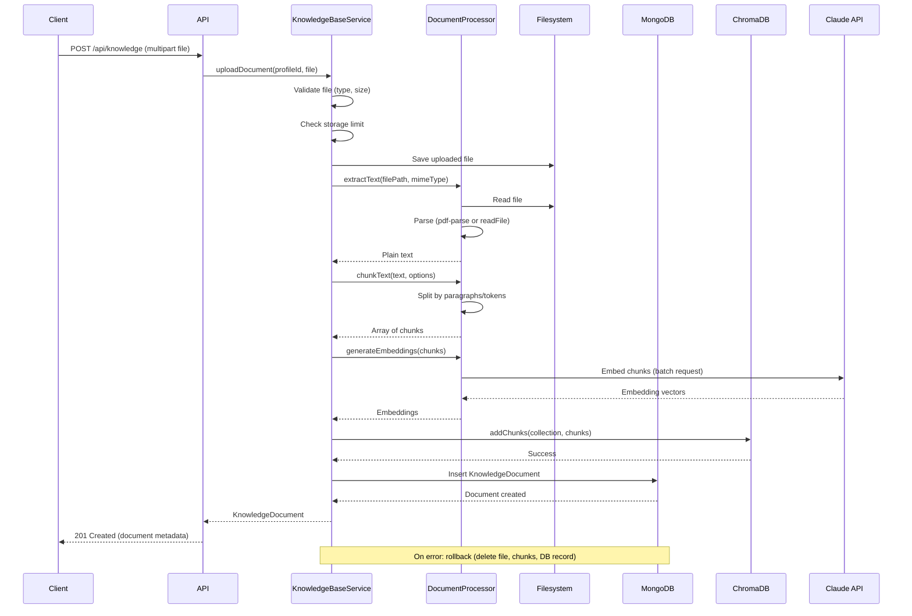
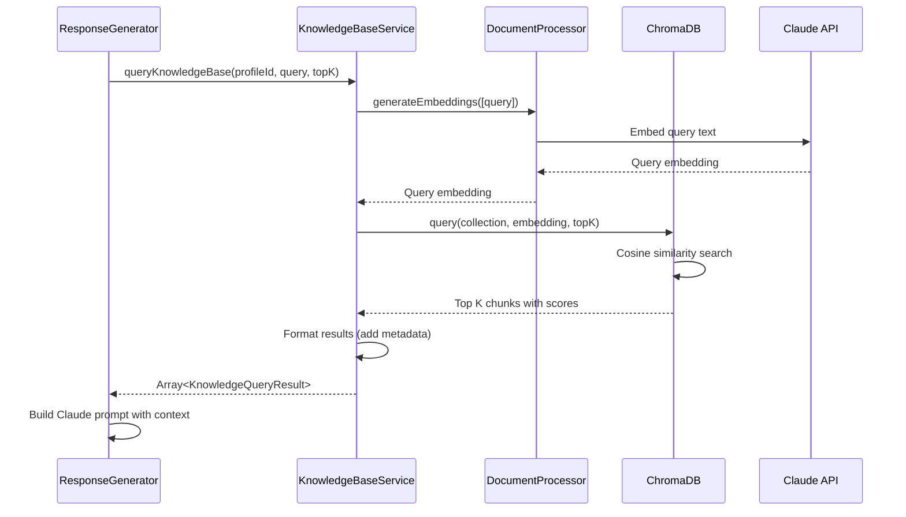
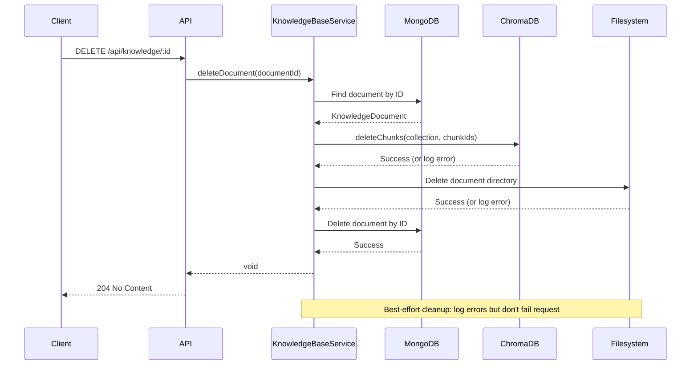

# Knowledge Base - Design Document

📋 **Decision Context**: [ADR-007: Knowledge Base Implementation Strategy](../../../docs/architecture/decisions/007-knowledge-base-implementation.md)

## Overview

The Knowledge Base feature enables users to upload reference materials (PDFs, Markdown, TXT files) that ground AI-generated responses in their personal expertise. Documents are processed synchronously: text extraction → semantic chunking → embedding generation → vector storage. The system supports upload, list, and delete operations with per-profile ownership.

**Key Entities**: `KnowledgeDocument` (MongoDB), `DocumentChunk` (ChromaDB), uploaded files (filesystem)

**External Dependencies**: MongoDB, ChromaDB, Claude API (embeddings), filesystem

---

## 1. Data Models

### 1.1 KnowledgeDocument (MongoDB)

```typescript
/**
 * Represents an uploaded knowledge base document with processing metadata.
 * Stored in MongoDB `knowledge_documents` collection.
 */
interface KnowledgeDocument {
  /**
   * Unique identifier for the document
   * Format: UUID v4
   */
  id: string;

  /**
   * Profile that owns this document
   * References profiles.id
   */
  profileId: string;

  /**
   * Original filename as uploaded by user
   * Example: "my-research-paper.pdf"
   */
  filename: string;

  /**
   * File size in bytes
   */
  fileSizeBytes: number;

  /**
   * MIME type of uploaded file
   * Allowed: "application/pdf", "text/markdown", "text/plain"
   */
  mimeType: string;

  /**
   * Absolute filesystem path to stored file
   * Format: {storageRoot}/knowledge/{profileId}/{id}/original.{ext}
   */
  filePath: string;

  /**
   * Timestamp when document was uploaded
   */
  uploadedAt: Date;

  /**
   * Number of chunks created from this document
   * Used for deletion (must delete all chunks from ChromaDB)
   */
  chunkCount: number;

  /**
   * Total character count of extracted text
   */
  characterCount: number;

  /**
   * ChromaDB collection name where chunks are stored
   * Format: profile_{profileId}_kb
   */
  chromaCollection: string;

  /**
   * Processing metadata (for observability and debugging)
   */
  processingMetadata: {
    /**
     * Time taken to extract text (milliseconds)
     */
    extractionTimeMs: number;

    /**
     * Time taken to chunk text (milliseconds)
     */
    chunkingTimeMs: number;

    /**
     * Time taken to generate embeddings (milliseconds)
     */
    embeddingTimeMs: number;

    /**
     * Total processing time (milliseconds)
     */
    totalTimeMs: number;
  };
}
```

**MongoDB Collection**: `knowledge_documents`

**Indexes**:
```javascript
// Primary queries: list all docs for a profile, find by ID
{ profileId: 1, uploadedAt: -1 }  // List documents for profile (newest first)
{ id: 1 }                          // Unique lookup by document ID
```

**Validation Rules** (MongoDB Schema Validation):
```javascript
{
  validator: {
    $jsonSchema: {
      bsonType: "object",
      required: ["id", "profileId", "filename", "fileSizeBytes", "mimeType", "filePath", "uploadedAt", "chunkCount", "characterCount", "chromaCollection", "processingMetadata"],
      properties: {
        id: { bsonType: "string", pattern: "^[a-f0-9-]{36}$" },
        profileId: { bsonType: "string", pattern: "^[a-f0-9-]{36}$" },
        filename: { bsonType: "string", minLength: 1, maxLength: 255 },
        fileSizeBytes: { bsonType: "int", minimum: 1, maximum: 10485760 }, // 10MB max
        mimeType: { enum: ["application/pdf", "text/markdown", "text/plain"] },
        filePath: { bsonType: "string", minLength: 1 },
        uploadedAt: { bsonType: "date" },
        chunkCount: { bsonType: "int", minimum: 0 },
        characterCount: { bsonType: "int", minimum: 0 },
        chromaCollection: { bsonType: "string", pattern: "^profile_[a-f0-9-]{36}_kb$" },
        processingMetadata: {
          bsonType: "object",
          required: ["extractionTimeMs", "chunkingTimeMs", "embeddingTimeMs", "totalTimeMs"],
          properties: {
            extractionTimeMs: { bsonType: "int", minimum: 0 },
            chunkingTimeMs: { bsonType: "int", minimum: 0 },
            embeddingTimeMs: { bsonType: "int", minimum: 0 },
            totalTimeMs: { bsonType: "int", minimum: 0 }
          }
        }
      }
    }
  }
}
```

---

### 1.2 DocumentChunk (ChromaDB)

```typescript
/**
 * Represents a semantic chunk of a document stored in ChromaDB.
 * Each chunk has an embedding vector for similarity search.
 */
interface DocumentChunk {
  /**
   * Unique identifier for the chunk
   * Format: {documentId}_chunk_{index}
   * Example: "abc-123_chunk_0", "abc-123_chunk_1"
   */
  id: string;

  /**
   * The actual text content of this chunk
   */
  document: string;

  /**
   * Embedding vector generated by Claude API
   * Dimensions: depends on Claude's embedding model (typically 1024 or 1536)
   */
  embedding: number[];

  /**
   * Metadata for filtering and reconstruction
   */
  metadata: {
    /**
     * Parent document ID (references KnowledgeDocument.id)
     */
    documentId: string;

    /**
     * Profile ID (for multi-profile filtering in future)
     */
    profileId: string;

    /**
     * Original filename (for display in search results)
     */
    filename: string;

    /**
     * Chunk index within document (0-based)
     * Used for ordering chunks from same document
     */
    chunkIndex: number;

    /**
     * Character offset where this chunk starts in original document
     * Enables reconstruction or context expansion in future
     */
    startOffset: number;

    /**
     * Character offset where this chunk ends in original document
     */
    endOffset: number;

    /**
     * Timestamp when chunk was created (for debugging)
     */
    createdAt: string; // ISO 8601 format
  };
}
```

**ChromaDB Collection Structure**:
- **Collection Name**: `profile_{profileId}_kb`
- **Distance Metric**: Cosine similarity (default, works well for text embeddings)
- **Metadata Indexing**: `documentId`, `profileId`, `chunkIndex` (for filtering)

**ChromaDB Storage**:
```typescript
// Example ChromaDB add operation
await chromaCollection.add({
  ids: ["abc-123_chunk_0", "abc-123_chunk_1"],
  documents: ["First chunk text...", "Second chunk text..."],
  embeddings: [[0.1, 0.2, ...], [0.3, 0.4, ...]],
  metadatas: [
    {
      documentId: "abc-123",
      profileId: "profile-xyz",
      filename: "document.pdf",
      chunkIndex: 0,
      startOffset: 0,
      endOffset: 512,
      createdAt: "2026-01-01T12:00:00Z"
    },
    // ... more chunks
  ]
});
```

---

### 1.3 Filesystem Organization

**Storage Root**: Configurable via environment variable `KNOWLEDGE_STORAGE_PATH` (default: `~/.ngaj/knowledge`)

**Directory Structure**:
```
{storageRoot}/
  knowledge/
    {profileId}/              # One directory per profile
      {documentId}/           # One directory per document
        original.pdf          # Original uploaded file (or .md, .txt)
        extracted.txt         # Extracted plain text (for debugging, optional)
        metadata.json         # Processing metadata (for debugging, optional)
```

**Example**:
```
~/.ngaj/knowledge/
  profile_abc-123_kb/
    doc_xyz-789/
      original.pdf
      extracted.txt
      metadata.json
    doc_def-456/
      original.md
      extracted.txt
```

**File Permissions**: `0600` (read/write for owner only, security)

---

## 2. API Contracts

> **📋 API Specification**: REST API endpoints are documented in [docs/api/openapi.yaml](../../../docs/api/openapi.yaml). This section provides high-level design rationale only.

### 2.1 Upload Knowledge Document

**Purpose**: Upload a new document to the knowledge base, process synchronously, store embeddings.

**Endpoint**: `POST /api/knowledge`

**Key Design Decisions**:
- **Multipart Form Upload**: Standard file upload pattern, easy client-side integration
- **Synchronous Processing**: Blocks until complete or timeout (60s), returns final state
- **Atomic Operation**: If any step fails (extraction, chunking, embedding), entire upload fails and cleanup occurs
- **201 Created**: Returns created document with processing metadata on success

**Error Handling Strategy**:
- `400 Bad Request`: Invalid file type, file too large, missing required fields
- `409 Conflict`: Total storage limit exceeded for profile
- `413 Payload Too Large`: File size exceeds configured limit
- `422 Unprocessable Entity`: File extraction/parsing failed (corrupt PDF, etc.)
- `504 Gateway Timeout`: Processing exceeded timeout limit
- `500 Internal Server Error`: Unexpected errors (embedding API failure, disk I/O error)

**Complete API Specification**: See [openapi.yaml - uploadKnowledgeDocument](../../../docs/api/openapi.yaml#/operations/uploadKnowledgeDocument)

---

### 2.2 List Knowledge Documents

**Purpose**: Retrieve all documents for a profile (metadata only, not content).

**Endpoint**: `GET /api/knowledge?profileId={profileId}`

**Key Design Decisions**:
- **Query Parameter**: `profileId` required (supports multi-profile in future)
- **Metadata Only**: Returns filename, size, upload date, chunk count (no text content)
- **Descending Order**: Newest documents first (most common use case)
- **No Pagination**: v0.1 expects <100 documents per profile, pagination deferred to v0.2

**Error Handling Strategy**:
- `400 Bad Request`: Missing or invalid `profileId`
- `404 Not Found`: Profile does not exist
- `500 Internal Server Error`: Database query failure

**Complete API Specification**: See [openapi.yaml - listKnowledgeDocuments](../../../docs/api/openapi.yaml#/operations/listKnowledgeDocuments)

---

### 2.3 Delete Knowledge Document

**Purpose**: Permanently delete a document, its chunks, and filesystem files.

**Endpoint**: `DELETE /api/knowledge/:id`

**Key Design Decisions**:
- **Hard Delete**: Removes from MongoDB, ChromaDB, and filesystem atomically
- **No Cascade**: Does not delete responses that may have cited this document (v0.1 has no citation tracking)
- **Idempotent**: Deleting non-existent document returns `404`, but operation is safe to retry
- **Best-Effort Cleanup**: If ChromaDB deletion fails, logs error but still removes MongoDB record (user can retry)

**Error Handling Strategy**:
- `400 Bad Request`: Invalid document ID format
- `404 Not Found`: Document does not exist (may have been already deleted)
- `500 Internal Server Error`: Partial deletion failure (MongoDB succeeded but ChromaDB/filesystem failed)

**Complete API Specification**: See [openapi.yaml - deleteKnowledgeDocument](../../../docs/api/openapi.yaml#/operations/deleteKnowledgeDocument)

---

### 2.4 Query Knowledge Base (Internal API)

**Purpose**: Semantic search for relevant chunks given a query (used by response generation, not exposed to users).

**Interface**: Service method (not REST endpoint)

**Key Design Decisions**:
- **Top-K Results**: Configurable via environment variable `KNOWLEDGE_QUERY_TOP_K` (default: 5)
- **No Similarity Threshold**: Always returns best K chunks, even if similarity is low (LLM can ignore irrelevant context)
- **No Deduplication**: If 3 chunks from same document are top 5, return all 3 (preserves ranking signal)
- **Metadata Included**: Returns chunk text + filename + chunk index (for citation in future)

**Method Signature**:
```typescript
interface KnowledgeQueryResult {
  chunkId: string;
  documentId: string;
  filename: string;
  chunkIndex: number;
  content: string;
  similarity: number; // Cosine similarity score (0-1)
}

queryKnowledgeBase(
  profileId: string,
  query: string,
  topK?: number
): Promise<KnowledgeQueryResult[]>
```

---

## 3. Service Architecture

### 3.1 KnowledgeBaseService

**Responsibilities**:
- Orchestrate document upload workflow (extract → chunk → embed → store)
- Manage document lifecycle (create, list, delete)
- Coordinate between MongoDB, ChromaDB, and filesystem
- Handle errors and cleanup on failure
- Enforce storage limits and validations

**Interface**:
```typescript
interface IKnowledgeBaseService {
  /**
   * Upload and process a new document.
   * Synchronous operation (blocks until complete or timeout).
   *
   * @param profileId - Profile owning this document
   * @param file - Uploaded file (buffer, filename, mimeType)
   * @param options - Processing options (optional)
   * @returns Created document with processing metadata
   * @throws {ValidationError} Invalid file type or size
   * @throws {StorageLimitError} Profile storage limit exceeded
   * @throws {ProcessingError} Extraction, chunking, or embedding failed
   * @throws {TimeoutError} Processing exceeded configured timeout
   */
  uploadDocument(
    profileId: string,
    file: {
      buffer: Buffer;
      filename: string;
      mimeType: string;
    },
    options?: {
      chunkSize?: number;
      chunkOverlap?: number;
    }
  ): Promise<KnowledgeDocument>;

  /**
   * List all documents for a profile.
   *
   * @param profileId - Profile to query
   * @returns Array of documents, sorted by uploadedAt (descending)
   * @throws {ValidationError} Invalid profileId format
   */
  listDocuments(profileId: string): Promise<KnowledgeDocument[]>;

  /**
   * Delete a document and all associated data.
   * Removes from MongoDB, ChromaDB, and filesystem.
   *
   * @param documentId - Document to delete
   * @returns void
   * @throws {NotFoundError} Document does not exist
   * @throws {DeletionError} Partial deletion failure (logged, may need retry)
   */
  deleteDocument(documentId: string): Promise<void>;

  /**
   * Query knowledge base for relevant chunks (semantic search).
   * Internal API used by response generation service.
   *
   * @param profileId - Profile whose knowledge base to query
   * @param query - Search query (natural language)
   * @param topK - Number of results to return (default from config)
   * @returns Array of chunks with similarity scores, sorted by relevance
   */
  queryKnowledgeBase(
    profileId: string,
    query: string,
    topK?: number
  ): Promise<KnowledgeQueryResult[]>;

  /**
   * Get total storage used by a profile's knowledge base.
   * Used to enforce storage limits.
   *
   * @param profileId - Profile to query
   * @returns Total bytes used
   */
  getStorageUsed(profileId: string): Promise<number>;
}
```

---

### 3.2 DocumentProcessor (Internal Module)

**Responsibilities**:
- Extract text from different file types (PDF, MD, TXT)
- Chunk text into semantic segments
- Generate embeddings via Claude API

**Interface**:
```typescript
interface IDocumentProcessor {
  /**
   * Extract plain text from uploaded file.
   *
   * @param filePath - Path to uploaded file
   * @param mimeType - File MIME type
   * @returns Extracted text
   * @throws {ExtractionError} File parsing failed (corrupt, unsupported format)
   */
  extractText(filePath: string, mimeType: string): Promise<string>;

  /**
   * Chunk text into semantic segments.
   * Respects paragraph boundaries where possible.
   *
   * @param text - Extracted text to chunk
   * @param options - Chunking parameters
   * @returns Array of text chunks with position metadata
   */
  chunkText(
    text: string,
    options: {
      maxTokens: number;  // ~500 default
      overlapTokens: number;  // ~50 default
    }
  ): Promise<Array<{
    text: string;
    startOffset: number;
    endOffset: number;
  }>>;

  /**
   * Generate embeddings for text chunks using Claude API.
   *
   * @param chunks - Array of text chunks
   * @returns Array of embedding vectors (same length as input)
   * @throws {EmbeddingError} Claude API call failed
   */
  generateEmbeddings(chunks: string[]): Promise<number[][]>;
}
```

---

### 3.3 ChromaDBClient (Integration Layer)

**Responsibilities**:
- Abstract ChromaDB HTTP API
- Manage collection lifecycle (create, get, delete)
- Handle connection errors and retries

**Interface**:
```typescript
interface IChromaDBClient {
  /**
   * Get or create a collection for a profile's knowledge base.
   *
   * @param profileId - Profile owning the collection
   * @returns ChromaDB collection handle
   */
  getOrCreateCollection(profileId: string): Promise<ChromaCollection>;

  /**
   * Add chunks to a collection.
   *
   * @param collection - ChromaDB collection
   * @param chunks - Array of chunks with embeddings and metadata
   */
  addChunks(
    collection: ChromaCollection,
    chunks: Array<{
      id: string;
      document: string;
      embedding: number[];
      metadata: Record<string, any>;
    }>
  ): Promise<void>;

  /**
   * Query collection for similar chunks.
   *
   * @param collection - ChromaDB collection
   * @param queryEmbedding - Embedding vector of query
   * @param topK - Number of results to return
   * @param filter - Optional metadata filter
   * @returns Query results with similarity scores
   */
  query(
    collection: ChromaCollection,
    queryEmbedding: number[],
    topK: number,
    filter?: Record<string, any>
  ): Promise<ChromaQueryResult[]>;

  /**
   * Delete chunks from a collection.
   *
   * @param collection - ChromaDB collection
   * @param chunkIds - Array of chunk IDs to delete
   */
  deleteChunks(
    collection: ChromaCollection,
    chunkIds: string[]
  ): Promise<void>;
}
```

---

### 3.4 Upload Workflow Sequence Diagram



---

### 3.5 Query Workflow Sequence Diagram



---

### 3.6 Delete Workflow Sequence Diagram



---

## 4. Implementation Notes

### 4.1 Performance Considerations

**Text Extraction**:
- PDF parsing is slowest operation (~1-5s for 10-page PDF)
- Use streaming APIs where possible to reduce memory usage
- Consider caching extracted text to filesystem for debugging

**Chunking**:
- Paragraph-aware chunking requires NLP tokenization (use `tiktoken` for token counting)
- Balance chunk size: too small = loss of context, too large = poor matching granularity
- Overlap ensures semantic continuity across chunk boundaries

**Embedding Generation**:
- Claude API has rate limits (check current tier: ~1000 requests/min)
- Batch embedding requests (send all chunks in one API call if API supports it)
- Retry with exponential backoff on rate limit errors (429 status)

**Vector Search**:
- ChromaDB performs well for <100k vectors (expected: 500-5000 in v0.1)
- Cosine similarity is fast (optimized BLAS operations)
- Local deployment = <10ms query latency (no network overhead)

**Storage**:
- 10MB file = ~20k characters = ~40 chunks = ~160KB embeddings (negligible)
- 100MB total limit = ~1000 documents of 100KB each (sufficient for v0.1)

---

### 4.2 Error Handling Strategy

**Validation Errors** (400 Bad Request):
- File type not in allowed list → "Unsupported file type. Allowed: PDF, Markdown, TXT"
- File size exceeds limit → "File too large. Maximum: {limit}MB"
- Invalid profileId format → "Invalid profile ID"

**Business Logic Errors** (409 Conflict, 422 Unprocessable):
- Storage limit exceeded → "Storage limit exceeded. Delete old documents to upload new ones"
- Corrupt PDF → "Failed to extract text from PDF. File may be corrupt or password-protected"
- Empty document → "Document contains no text content"

**Processing Errors** (500 Internal Server Error, 504 Timeout):
- Embedding API failure → "Failed to generate embeddings. Please try again"
- ChromaDB connection error → "Vector storage unavailable. Please contact support"
- Timeout → "Processing timeout exceeded. Try a smaller document"

**Rollback Strategy**:
```typescript
async uploadDocument(profileId: string, file: FileUpload): Promise<KnowledgeDocument> {
  let savedFilePath: string | null = null;
  let chromaChunksAdded = false;
  let mongoDocCreated = false;

  try {
    // Step 1: Save file
    savedFilePath = await this.saveFile(file);

    // Step 2: Process
    const text = await this.processor.extractText(savedFilePath, file.mimeType);
    const chunks = await this.processor.chunkText(text);
    const embeddings = await this.processor.generateEmbeddings(chunks);

    // Step 3: Store in ChromaDB
    await this.chromaClient.addChunks(collection, chunks);
    chromaChunksAdded = true;

    // Step 4: Store in MongoDB
    const doc = await this.mongoRepo.create({...});
    mongoDocCreated = true;

    return doc;
  } catch (error) {
    // Rollback in reverse order
    if (mongoDocCreated) {
      await this.mongoRepo.delete(doc.id).catch(e => logger.error("Rollback failed: MongoDB", e));
    }
    if (chromaChunksAdded) {
      await this.chromaClient.deleteChunks(collection, chunkIds).catch(e => logger.error("Rollback failed: ChromaDB", e));
    }
    if (savedFilePath) {
      await fs.rm(path.dirname(savedFilePath), { recursive: true }).catch(e => logger.error("Rollback failed: Filesystem", e));
    }
    throw error; // Re-throw original error
  }
}
```

---

### 4.3 Edge Cases

| Case | Handling |
|------|----------|
| **Empty document** | Reject during validation (characterCount = 0) → 422 Unprocessable Entity |
| **Single paragraph** | Create one chunk, proceed normally (v0.1 allows this per requirements) |
| **Very long paragraph** | Split mid-paragraph at token limit, preserve overlap |
| **Non-English text** | Claude embeddings support multilingual, no special handling needed |
| **Password-protected PDF** | pdf-parse will fail → Catch and return 422 with clear message |
| **Image-only PDF** | Text extraction returns empty → Reject as empty document (OCR out of scope for v0.1) |
| **Markdown with code blocks** | Include code in chunks (it's knowledge), preserve formatting with newlines |
| **Duplicate filenames** | Allow (documents have unique IDs, filename is just display metadata) |
| **Concurrent uploads** | MongoDB transactions ensure consistency, filesystem writes are isolated by documentId |
| **ChromaDB down during upload** | Fail entire upload, rollback filesystem and MongoDB changes |
| **ChromaDB down during query** | Return empty results, log error (graceful degradation - response generation continues without context) |
| **Partial embedding failure** | Fail entire upload (all-or-nothing: cannot store document with missing chunks) |
| **Storage limit exactly at boundary** | Use `fileSizeBytes` to check before upload, reject if would exceed |
| **Delete non-existent document** | Return 404 Not Found (idempotent: safe to retry) |
| **Delete during query** | Query may return stale chunks (acceptable for v0.1, no locking) |

---

### 4.4 Configuration (Environment Variables)

```bash
# Storage limits
KNOWLEDGE_MAX_FILE_SIZE_MB=10          # Max size per document
KNOWLEDGE_MAX_STORAGE_MB=100           # Max total storage per installation
KNOWLEDGE_STORAGE_PATH=~/.ngaj/knowledge  # Filesystem storage root

# Processing limits
KNOWLEDGE_PROCESSING_TIMEOUT_MS=60000  # 60 seconds
KNOWLEDGE_CHUNK_SIZE_TOKENS=500        # Tokens per chunk
KNOWLEDGE_CHUNK_OVERLAP_TOKENS=50      # Overlap between chunks

# Query settings
KNOWLEDGE_QUERY_TOP_K=5                # Default number of chunks to retrieve

# ChromaDB connection
CHROMADB_HOST=localhost
CHROMADB_PORT=8000
CHROMADB_TIMEOUT_MS=5000

# Claude API
CLAUDE_API_KEY=sk-...                  # Shared with response generation
CLAUDE_EMBEDDING_MODEL=claude-3-sonnet-20240229  # Model for embeddings
```

**Validation on Startup**:
```typescript
function validateKnowledgeConfig() {
  const maxFileSize = parseInt(process.env.KNOWLEDGE_MAX_FILE_SIZE_MB || "10");
  const maxStorage = parseInt(process.env.KNOWLEDGE_MAX_STORAGE_MB || "100");
  const timeout = parseInt(process.env.KNOWLEDGE_PROCESSING_TIMEOUT_MS || "60000");

  if (maxFileSize <= 0 || maxFileSize > 100) {
    throw new Error("KNOWLEDGE_MAX_FILE_SIZE_MB must be between 1 and 100");
  }
  if (maxStorage < maxFileSize) {
    throw new Error("KNOWLEDGE_MAX_STORAGE_MB must be >= KNOWLEDGE_MAX_FILE_SIZE_MB");
  }
  if (timeout < 10000) {
    throw new Error("KNOWLEDGE_PROCESSING_TIMEOUT_MS must be at least 10000 (10 seconds)");
  }
  // ... more validations
}
```

---

## 5. Open Questions & Risks

### Questions
- [x] Should we store extracted text to filesystem for debugging? **Decision: Optional, can add in v0.2 if needed**
- [ ] What's Claude's exact embedding model name and dimensions? **Action: Check Claude API docs during implementation**
- [ ] Should we compress filesystem storage (gzip)? **Decision: Defer to v0.2, premature optimization**

### Risks

| Risk | Impact | Mitigation |
|------|--------|------------|
| **Claude API rate limits** | High | Implement exponential backoff, retry up to 3 times, fail gracefully with clear message |
| **PDF parsing library limitations** | Medium | Use `pdf-parse` (most popular), document edge cases, provide clear error messages for unsupported PDFs |
| **ChromaDB instability** | High | Use stable version (0.4.x), implement health checks, graceful degradation if query fails (continue without KB context) |
| **Timeout for large documents** | Low | 10MB limit + 60s timeout should handle most cases; document recommended limits clearly |
| **Disk space exhaustion** | Medium | Check available disk space before upload, clear error message if insufficient |
| **Concurrent upload race conditions** | Low | MongoDB transactions ensure consistency, document IDs are unique (UUID v4) |

---

## 6. Testing Strategy

See [Test-Writer Handoff](../handoffs/002-knowledge-base-handoff.md) for complete test scenarios and acceptance criteria.

**Key Test Categories**:
- **Unit Tests**: DocumentProcessor (text extraction, chunking, embeddings), KnowledgeBaseService methods
- **Integration Tests**: MongoDB + ChromaDB + Filesystem (atomic operations, rollback, error handling)
- **E2E Tests**: Upload → Query → Delete workflow (via REST API)
- **Error Tests**: Invalid files, timeouts, storage limits, API failures
- **Edge Cases**: Empty documents, single paragraph, corrupt PDFs, concurrent operations

---

## 7. References

- **Decision Rationale**: [ADR-007: Knowledge Base Implementation](../../../docs/architecture/decisions/007-knowledge-base-implementation.md)
- **Test Guidance**: [Handoff Document](../handoffs/002-knowledge-base-handoff.md)
- **Related Designs**: [Profile & Account Configuration](./account-configuration-design.md)
- **External Docs**:
  - [ChromaDB API Reference](https://docs.trychroma.com/reference/Client)
  - [pdf-parse Documentation](https://www.npmjs.com/package/pdf-parse)
  - [Claude API - Embeddings](https://docs.anthropic.com/claude/docs/embeddings)
  - [tiktoken (Token Counting)](https://github.com/openai/tiktoken)

