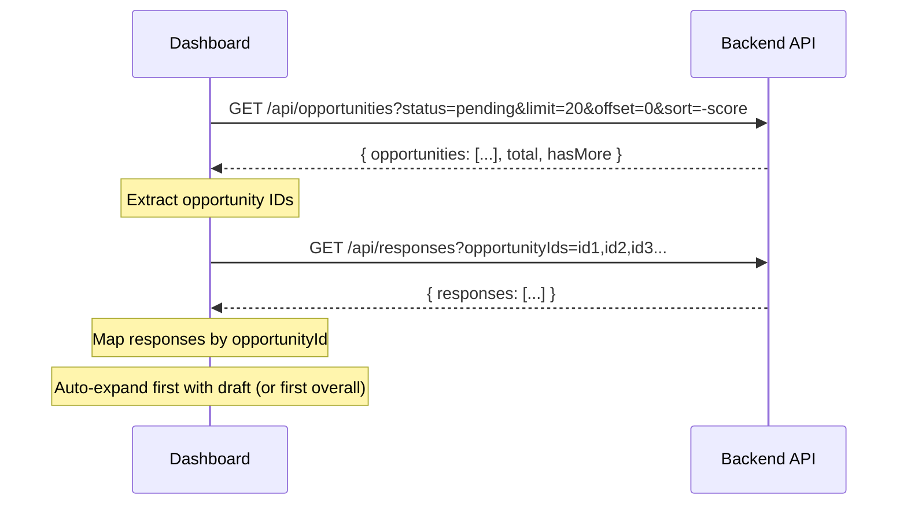
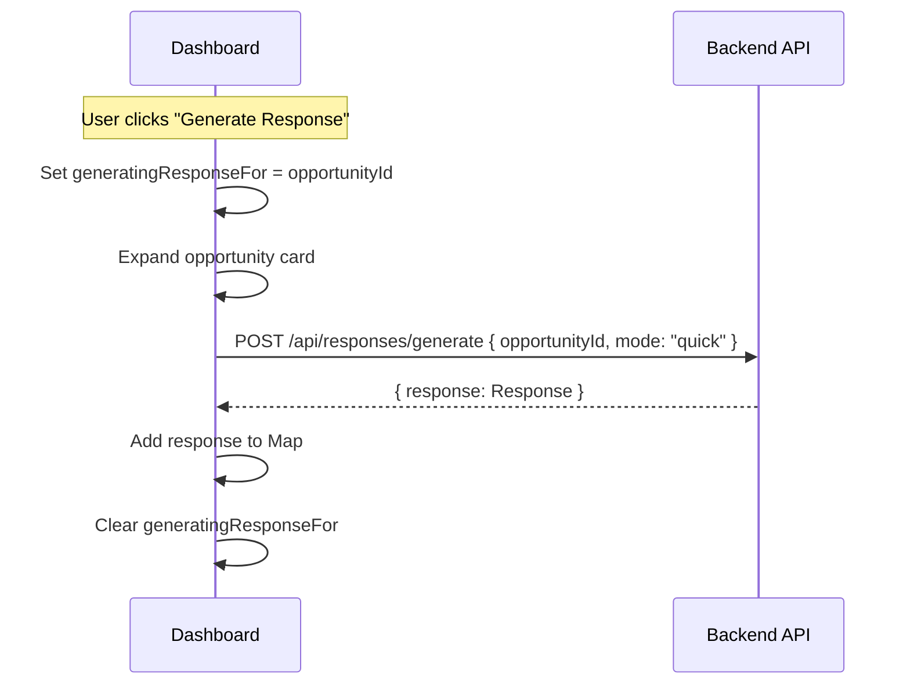
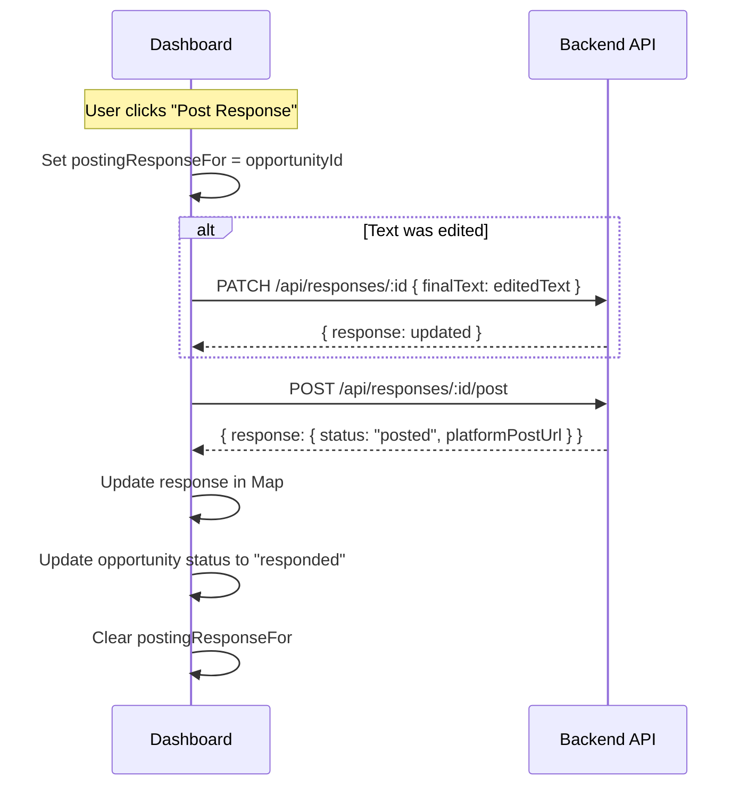
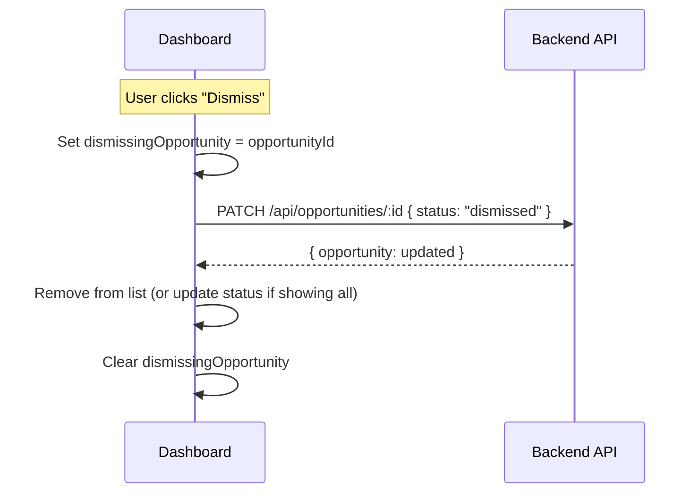

# Opportunity Dashboard UI - Design Document

📋 **Decision Context**: [ADR-013: Opportunity Dashboard User Interface](../../../../docs/architecture/decisions/013-opportunity-dashboard-ui.md)
📱 **UI Layout**: [Responsive Web Design](./responsive-web-design.md) - Mobile-first layout specifications

**Date**: 2026-01-24  
**Status**: Approved

---

## Overview

The Opportunity Dashboard is the primary interface for ngaj v0.1. Users view discovered opportunities, generate AI responses, edit drafts, and post to Bluesky. This document specifies the frontend implementation details.

> **UI Implementation**: This document covers data flow, state management, and component behavior. For responsive layout, touch targets, and Tailwind classes, see [Responsive Web Design](./responsive-web-design.md).

**Key Entities**: Opportunity, Response, Author  
**External Dependencies**: Backend REST API, Bluesky (via backend)

**Type Definitions**: 
- `packages/shared/src/types/opportunity.ts`
- `packages/shared/src/types/response.ts`

---

## 1. Page Structure

> **Layout Specifications**: See [Responsive Web Design](./responsive-web-design.md#8-dashboard-layout) for mobile/desktop layouts and Tailwind classes.

### 1.1 Component Tree

```typescript
// Page component
OpportunitiesDashboard
  ├─ Header (sticky)
  │    ├─ Title
  │    └─ FilterBar (horizontal scrollable tabs)
  ├─ OpportunityList
  │    └─ OpportunityCard[] 
  │         ├─ CardHeader (author, score, age)
  │         ├─ CardContent (post text)
  │         └─ CardActions (generate, dismiss)
  ├─ LoadMore (replaces Pagination)
  │    ├─ LoadMoreButton
  │    └─ ProgressIndicator ("X of Y loaded")
  ├─ ErrorState (conditional - server unreachable)
  └─ EmptyState (conditional - no opportunities)

// Modal (rendered outside main tree)
ResponseModal (full-screen on mobile)
  ├─ ModalHeader (back button, title)
  ├─ OriginalPostPreview (collapsible)
  ├─ ResponseTextarea
  ├─ CharacterCount
  └─ ModalFooter (regenerate, post buttons)
```

### 1.2 Key Changes from Original Design

| Original | Updated | Reason |
|----------|---------|--------|
| Inline ResponseEditor | ResponseModal | Better mobile keyboard handling |
| Numbered Pagination | LoadMore button | Better mobile UX |
| Desktop-first | Mobile-first | Primary access from mobile devices |

See [ADR-015](../../../../docs/architecture/decisions/015-responsive-web-design.md) for decision rationale.

---

## 2. State Management

### 2.1 Page State

```typescript
interface DashboardState {
  // Data
  opportunities: OpportunityWithAuthor[];
  responses: Map<string, Response>; // keyed by opportunityId
  
  // UI State
  loading: boolean;
  error: string | null;
  
  // Filters & Load More
  statusFilter: OpportunityStatus | 'all';
  loadedCount: number;      // Items currently loaded
  totalCount: number;       // Total available
  hasMore: boolean;         // More items to load
  
  // Modal State (replaces expandedOpportunityId)
  selectedOpportunityId: string | null;  // For ResponseModal
  editedResponseText: string;            // Current edits in modal
  
  // Action Loading States
  generatingResponseFor: string | null;  // opportunityId
  postingResponseFor: string | null;     // opportunityId
  dismissingOpportunity: string | null;  // opportunityId
}
```

### 2.2 Initial Load

On page load:
1. Fetch opportunities (first 20, status=pending by default)
2. Fetch responses for those opportunity IDs
3. No auto-expansion - modal opens only when user taps "Generate Response" or card with draft

```typescript
// Initial fetch
const response = await fetch('/api/opportunities?status=pending&limit=20&offset=0&sort=-score');
const { opportunities, total, hasMore } = await response.json();

// Set initial state
setState({
  opportunities,
  totalCount: total,
  loadedCount: opportunities.length,
  hasMore,
  selectedOpportunityId: null,  // No modal open initially
});
```

### 2.3 Draft Editing State

```typescript
interface DraftEditState {
  originalText: string;      // From response.text
  editedText: string;        // User's current edits
  isDirty: boolean;          // editedText !== originalText
}
```

Track per-opportunity to preserve edits when collapsing/expanding.

---

## 3. Data Flow

### 3.1 Initial Load Sequence



### 3.2 Generate Response Flow



### 3.3 Post Response Flow



### 3.4 Dismiss Flow



---

## 4. Component Specifications

### 4.1 OpportunityCard

**Props**:
```typescript
interface OpportunityCardProps {
  opportunity: OpportunityWithAuthor;
  response: Response | undefined;
  isExpanded: boolean;
  isGenerating: boolean;
  isPosting: boolean;
  isDismissing: boolean;
  onExpand: () => void;
  onCollapse: () => void;
  onGenerate: () => void;
  onDismiss: () => void;
  onPost: (text: string) => void;
  onRegenerate: () => void;
}
```

**Display States**:

| State | Visual Treatment |
|-------|------------------|
| Pending (no response) | Default style, "Generate Response" prominent |
| Draft Ready | Highlight badge, draft visible when expanded |
| Posted | Dimmed, checkmark icon, link to platform post |
| Dismissed | Hidden by default (shown if filter includes) |

**Collapsed View** (always visible):
- Author handle + follower count
- Score (number or visual indicator)
- Relative time ("2 hours ago")
- Post text preview (first ~100 chars)
- Status badge (if draft ready or posted)
- Action buttons: [Generate Response] or [Expand] + [Dismiss]

**Expanded View** (additional):
- Full post text (truncate at 300 chars with "Show more")
- ResponseEditor component (if has response or generating)

### 4.2 ResponseModal

> **Layout**: See [Responsive Web Design](./responsive-web-design.md#4-response-editor-modal) for full-screen mobile layout and Tailwind classes.

**Props**:
```typescript
interface ResponseModalProps {
  isOpen: boolean;
  opportunity: OpportunityWithAuthor | null;
  response: Response | undefined;
  isGenerating: boolean;
  isPosting: boolean;
  maxLength: number;  // 300 for Bluesky
  onClose: () => void;
  onTextChange: (text: string) => void;
  onPost: () => void;
  onRegenerate: () => void;
}
```

**Behavior**:
- **Mobile**: Full-screen modal (`fixed inset-0`)
- **Desktop**: Centered dialog with backdrop (`max-w-lg`)
- **Generating**: Show loading spinner in textarea area
- **Draft Ready**: Editable textarea + character count + action buttons in footer
- **Posted**: Read-only with link to platform post, then auto-close

**Character Count Display**:
```typescript
const display = `${text.length}/${maxLength}`;
// Example: "247/300"
// Color changes: slate-500 (normal) → amber-500 (>250) → red-500 (>290)
```

### 4.3 FilterBar

**Props**:
```typescript
interface FilterBarProps {
  currentStatus: OpportunityStatus | 'all';
  onStatusChange: (status: OpportunityStatus | 'all') => void;
}
```

**Filter Options**:
- All
- Pending (default)
- Draft Ready
- Posted
- Dismissed

**Implementation**: Dropdown or horizontal tabs (implementer choice)

### 4.4 LoadMore

> **Layout**: See [Responsive Web Design](./responsive-web-design.md#6-load-more-pagination) for Tailwind implementation.

**Props**:
```typescript
interface LoadMoreProps {
  hasMore: boolean;
  isLoading: boolean;
  loadedCount: number;
  totalCount: number;
  onLoadMore: () => void;
}
```

**Behavior**:
- Show "Load More" button when `hasMore === true`
- Show loading spinner during fetch
- Show "Showing all X opportunities" when no more to load
- Progress: "20 of 47 loaded"

**Load More Handler**:
```typescript
const handleLoadMore = async () => {
  const offset = opportunities.length;
  const response = await fetch(`/api/opportunities?status=${filter}&limit=20&offset=${offset}&sort=-score`);
  const { opportunities: more, hasMore } = await response.json();
  
  setState(prev => ({
    opportunities: [...prev.opportunities, ...more],
    loadedCount: prev.loadedCount + more.length,
    hasMore,
  }));
};
```

---

## 5. API Integration

> **📋 API Specification**: See [docs/api/openapi.yaml](../../../../docs/api/openapi.yaml) for complete schemas.

### 5.1 Endpoints Used

| Action | Endpoint | Method |
|--------|----------|--------|
| List opportunities | `/api/opportunities` | GET |
| List responses (batch) | `/api/responses?opportunityIds=...` | GET |
| Generate response | `/api/responses/generate` | POST |
| Edit response | `/api/responses/:id` | PATCH |
| Post response | `/api/responses/:id/post` | POST |
| Dismiss opportunity | `/api/opportunities/:id` | PATCH |

### 5.2 Query Parameters

**List Opportunities**:
```
GET /api/opportunities?status=pending&limit=20&offset=0&sort=-score
```

**List Responses** (batch):
```
GET /api/responses?opportunityIds=id1,id2,id3
```

### 5.3 Error Handling

| Error | User Message | Recovery |
|-------|--------------|----------|
| Network error | "Unable to connect. Check your connection." | Retry button |
| 404 on opportunity | "This opportunity no longer exists." | Remove from list |
| 503 on generate | "AI service unavailable. Try again later." | Retry button |
| 503 on post | "Bluesky unavailable. Try again later." | Retry button |
| 400 validation | Show specific error message | Fix and retry |

**Error Display**: Inline banner at top of card or toast notification.

---

## 6. Empty States

### 6.1 No Opportunities

**Condition**: `opportunities.length === 0` and `statusFilter === 'pending'`

**Display**:
```
[Icon: Search or Inbox]

No opportunities yet

Discovery will check for new posts based on your schedule.
Next check in approximately [X] minutes.

[Refresh Now]
```

### 6.2 All Caught Up

**Condition**: `opportunities.length === 0` and `statusFilter === 'all'`

**Display**:
```
[Icon: Checkmark]

All caught up!

You've reviewed all discovered opportunities.
Check back later or click Refresh.

[Refresh]
```

### 6.3 No Results for Filter

**Condition**: `opportunities.length === 0` and specific filter active

**Display**:
```
No [status] opportunities

Try changing your filter or check back later.

[Show All]
```

---

## 7. Loading States

### 7.1 Initial Page Load

Show skeleton UI:
- 3-5 placeholder cards with animated shimmer
- Header and filter bar visible but disabled

### 7.2 Action Loading

| Action | Indicator |
|--------|-----------|
| Generating response | Spinner in expanded card, "Generating..." text |
| Posting response | "Post" button shows spinner, disabled |
| Dismissing | "Dismiss" button shows spinner, disabled |
| Page navigation | Skeleton cards replace current list |

### 7.3 Refresh

- Refresh button shows spinner
- Keep current list visible until new data loads
- Replace list on success

---

## 8. Keyboard Accessibility

**v0.1 Minimum**:
- Tab navigation through interactive elements
- Enter/Space to activate buttons
- Escape to collapse expanded card

**Future (v0.2)**:
- j/k navigation between cards
- g to generate, p to post
- d to dismiss

---

## 9. Responsive Behavior

> **Full Specification**: See [Responsive Web Design](./responsive-web-design.md) for complete mobile-first implementation details.

**v0.1**: Mobile-first design (per [ADR-015](../../../../docs/architecture/decisions/015-responsive-web-design.md))

**Breakpoints** (Tailwind defaults):
- Base (< 640px): Mobile - full-width cards, stacked buttons, 48px touch targets
- `sm:` (≥ 640px): Large phones - same as mobile
- `md:` (≥ 768px): Tablets - more padding, inline action buttons
- `lg:` (≥ 1024px): Desktop - constrained width, comfortable spacing

**Key Responsive Patterns**:
- **OpportunityCard buttons**: Full-width stacked on mobile, inline on desktop
- **ResponseModal**: Full-screen on mobile, centered dialog on desktop
- **FilterBar**: Horizontal scroll with hidden scrollbar on mobile
- **Touch targets**: All buttons `min-h-12` (48px) on mobile

---

## 10. Implementation Notes

### 10.1 Performance Considerations

- **Pagination**: 20 items max per page (prevents DOM bloat)
- **Response Map**: O(1) lookup by opportunityId
- **Debounce**: Debounce textarea edits (300ms) before marking dirty
- **Lazy expand**: Only render ResponseEditor when card expanded

### 10.2 Edge Cases

| Case | Handling |
|------|----------|
| Opportunity deleted while viewing | Show error, remove from list |
| Response already posted (race condition) | Show success, update UI |
| Text exceeds limit after edit | Allow submission (backend validates) |
| Rapid clicking generate | Disable button during request |
| Page change with unsaved edits | Warn user or auto-save to local storage |

### 10.3 Browser Support

- Chrome 90+
- Safari 14+
- Firefox 88+
- Edge 90+

---

## 11. Open Questions

- [x] Batch response endpoint - **Resolved**: Added `GET /api/responses?opportunityIds=...`
- [x] Initial expansion behavior - **Resolved**: First with draft, else first overall

---

## 12. References

- **Decision Rationale**: [ADR-013](../../../../docs/architecture/decisions/013-opportunity-dashboard-ui.md)
- **Responsive Design**: [ADR-015](../../../../docs/architecture/decisions/015-responsive-web-design.md) - Mobile-first decisions
- **UI Layout**: [Responsive Web Design](./responsive-web-design.md) - Component layouts, Tailwind classes
- **Test Guidance**: [Handoff Document](../handoffs/008-opportunity-dashboard-ui-handoff.md)
- **Responsive Test Guidance**: [Responsive Handoff](../handoffs/011-responsive-web-design-handoff.md)
- **API Specification**: [openapi.yaml](../../../../docs/api/openapi.yaml)
- **Type Definitions**: 
  - [opportunity.ts](../../../../packages/shared/src/types/opportunity.ts)
  - [response.ts](../../../../packages/shared/src/types/response.ts)
