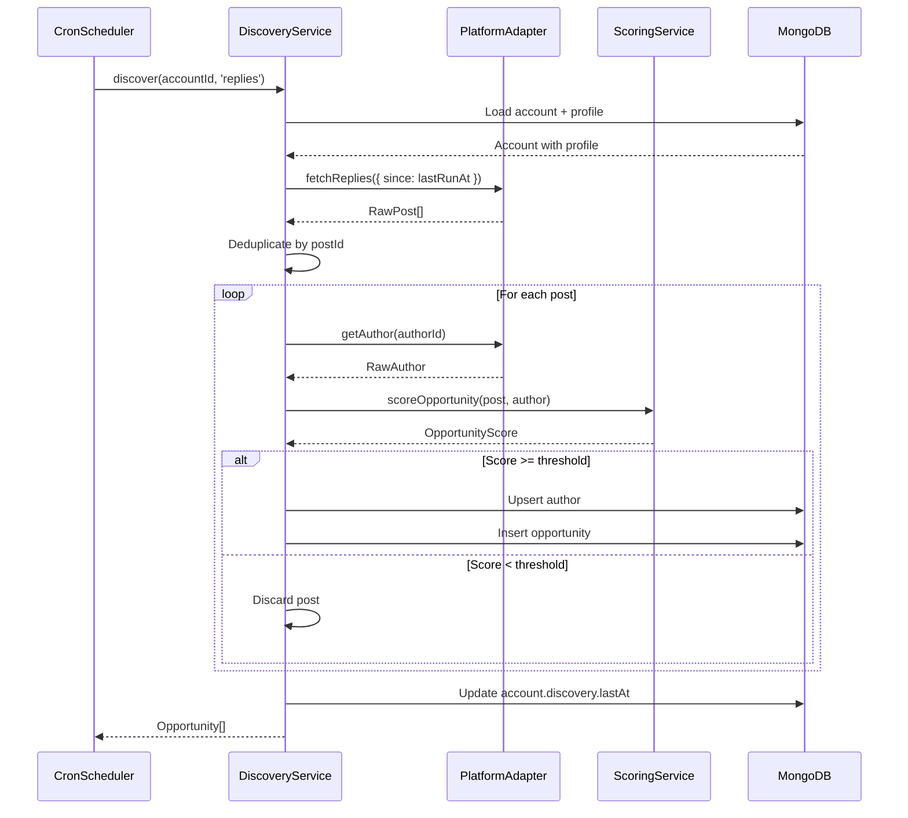
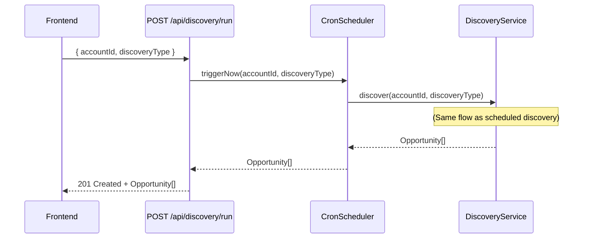
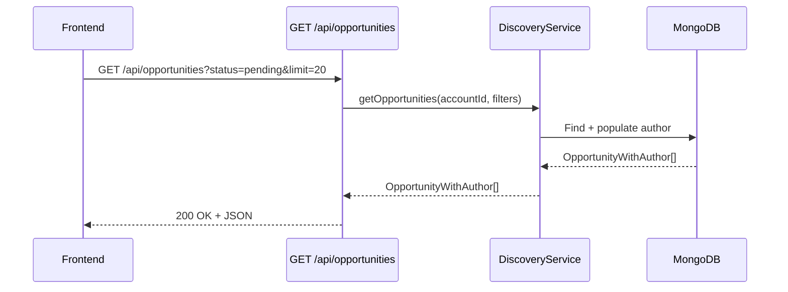

# Opportunity Discovery - Design Document

📋 **Decision Context**: [ADR-008: Opportunity Discovery Architecture](../../../docs/architecture/decisions/008-opportunity-discovery-architecture.md)

## Overview

The Opportunity Discovery system continuously monitors Bluesky for engagement opportunities matching user interests. It runs scheduled discovery jobs, scores posts by relevance and urgency, and presents prioritized opportunities to users for review and response.

**Key Entities**: `Opportunity` (MongoDB), `Author` (MongoDB), `DiscoveryTypeSchedule` (embedded in Account)

**External Dependencies**: Bluesky AT Protocol API, MongoDB, node-cron scheduler

**v0.1 Scope**: Bluesky-only, two discovery types (replies, search), simple scoring algorithm

---

## 1. Data Models

### 1.1 Opportunity (MongoDB)

```typescript
/**
 * Represents a discovered social media post that could be an engagement opportunity.
 * Stored in MongoDB `opportunities` collection.
 */
interface Opportunity {
  /**
   * MongoDB document ID
   */
  _id: ObjectId;

  /**
   * Account that discovered this opportunity
   * References accounts._id
   */
  accountId: ObjectId;

  /**
   * Platform where this opportunity was found
   * v0.1: Only 'bluesky'
   */
  platform: Platform;  // 'bluesky' | 'linkedin' | 'reddit'

  /**
   * Platform-specific post identifier
   * Bluesky: AT URI (e.g., "at://did:plc:xxx/app.bsky.feed.post/xxx")
   */
  postId: string;

  /**
   * Direct URL to the post on the platform
   * Example: "https://bsky.app/profile/user.bsky.social/post/xxx"
   */
  postUrl: string;

  /**
   * Post content and metadata
   */
  content: {
    /** Post text content */
    text: string;
    
    /** When the post was originally created on the platform */
    createdAt: Date;
  };

  /**
   * Reference to the post author
   * References authors._id
   */
  authorId: ObjectId;

  /**
   * Engagement metrics captured at discovery time
   */
  engagement: {
    /** Number of likes/favorites */
    likes: number;
    
    /** Number of reposts/retweets/shares */
    reposts: number;
    
    /** Number of replies */
    replies: number;
  };

  /**
   * Scoring breakdown
   */
  scoring: {
    /** Recency score (0-100), based on exponential decay */
    recency: number;
    
    /** Impact score (0-100), based on reach and engagement */
    impact: number;
    
    /** Total weighted score: (0.7 * recency) + (0.3 * impact) - updated in ADR-018 */
    total: number;
  };

  /**
   * How this opportunity was discovered
   * 'replies': Response to user's post
   * 'search': Keyword search match
   */
  discoveryType: 'replies' | 'search';

  /**
   * Current opportunity status
   * - pending: Awaiting user review
   * - responded: User posted a response
   * - dismissed: User manually dismissed
   * - expired: TTL passed without action
   */
  status: 'pending' | 'responded' | 'dismissed' | 'expired';

  /**
   * When this opportunity was discovered
   */
  discoveredAt: Date;

  /**
   * When this opportunity will expire
   * Calculated: discoveredAt + OPPORTUNITY_TTL_HOURS (default: 4h - reduced from 48h in ADR-018)
   */
  expiresAt: Date;

  /**
   * Last modification timestamp
   */
  updatedAt: Date;
}
```

**MongoDB Collection**: `opportunities`

**Indexes**:
- `{ accountId: 1, status: 1, scoring.total: -1 }` - For fetching prioritized opportunities
- `{ accountId: 1, postId: 1 }` (unique) - Deduplication within account
- `{ expiresAt: 1 }` - For expiration cleanup job
- `{ status: 1, expiresAt: 1 }` - For expiring pending opportunities
- `{ authorId: 1 }` - For author-related queries (future features)

### 1.2 Author (MongoDB)

```typescript
/**
 * Represents a social media user who authored discovered posts.
 * Upserted during discovery; supports future interaction tracking.
 * Stored in MongoDB `authors` collection.
 */
interface Author {
  /**
   * MongoDB document ID
   */
  _id: ObjectId;

  /**
   * Platform identifier
   */
  platform: Platform;  // 'bluesky' | 'linkedin' | 'reddit'

  /**
   * Platform-specific user identifier
   * Bluesky: DID (e.g., "did:plc:abc123...")
   * LinkedIn: User ID
   * Reddit: Username
   */
  platformUserId: string;

  /**
   * Platform-specific handle/username
   * Bluesky: "@user.bsky.social"
   * Reddit: "u/username"
   * LinkedIn: "username"
   */
  handle: string;

  /**
   * User's display name
   */
  displayName: string;

  /**
   * User's bio/description (optional)
   */
  bio?: string;

  /**
   * Follower count (updated on each discovery)
   */
  followerCount: number;

  /**
   * When this author record was last updated
   * Used to determine cache staleness
   */
  lastUpdatedAt: Date;
}
```

**MongoDB Collection**: `authors`

**Indexes**:
- `{ platform: 1, platformUserId: 1 }` (unique) - Author lookup and upsert
- `{ handle: 1 }` - Search by handle (future feature)

**Upsert Strategy**: On every discovery, upsert author with latest data (follower count, bio, displayName). This keeps author info fresh without manual refresh jobs.

### 1.3 DiscoveryTypeSchedule (Embedded in Account)

```typescript
/**
 * Configures a specific type of discovery with independent scheduling.
 * Embedded in Account.discovery.schedules array.
 */
interface DiscoveryTypeSchedule {
  /**
   * Discovery source type
   * 'replies': Fetch replies to user's posts (via notifications/mentions)
   * 'search': Search for keywords from profile interests
   */
  type: 'replies' | 'search';

  /**
   * Whether this discovery type is enabled
   */
  enabled: boolean;

  /**
   * Cron expression defining schedule frequency
   * Examples:
   * - '*/15 * * * *' - Every 15 minutes
   * - '0 */2 * * *' - Every 2 hours
   * - '0 9-17 * * 1-5' - Hourly, weekdays, business hours
   */
  cronExpression: string;

  /**
   * When this specific discovery type last ran
   * Used to calculate "since" parameter for API calls
   */
  lastRunAt?: Date;
}
```

**Modified: AccountDiscoveryConfig**

```typescript
/**
 * Discovery configuration for an account (embedded in Account document).
 * Updated per ADR-008 to support multiple schedules.
 */
interface AccountDiscoveryConfig {
  /**
   * Array of typed discovery schedules
   * v0.1: 'replies' and 'search'
   * v0.2+: Could add 'mentions', 'hashtags', 'follows'
   */
  schedules: DiscoveryTypeSchedule[];

  /**
   * Timestamp of last successful discovery (any type)
   * Used for dashboard display
   */
  lastAt?: Date;

  /**
   * Last error message from any discovery type
   * Cleared on successful run
   */
  error?: string;
}
```

**Default Configuration** (created with new account):
```typescript
{
  schedules: [
    {
      type: 'replies',
      enabled: true,
      cronExpression: '*/15 * * * *',  // Every 15 minutes
      lastRunAt: undefined
    },
    {
      type: 'search',
      enabled: true,
      cronExpression: '0 */2 * * *',  // Every 2 hours
      lastRunAt: undefined
    }
  ],
  lastAt: undefined,
  error: undefined
}
```

---

## 2. Service Architecture

### 2.1 DiscoveryService

**Responsibilities**:
- Orchestrate discovery for a single account and discovery type
- Fetch posts from platform adapter
- Deduplicate by post ID
- Score opportunities using ScoringService
- Filter by threshold
- Persist opportunities and authors to MongoDB
- Update account discovery status

**Interface**:
```typescript
interface IDiscoveryService {
  /**
   * Run discovery for a specific account and type
   * 
   * @param accountId - MongoDB ObjectId of account
   * @param discoveryType - 'replies' or 'search'
   * @returns Array of created opportunities
   * @throws DiscoveryError on failure
   */
  discover(accountId: ObjectId, discoveryType: DiscoveryType): Promise<Opportunity[]>;

  /**
   * Get opportunities for an account, optionally filtered
   * 
   * @param accountId - MongoDB ObjectId of account
   * @param filters - Optional filters (status, limit, offset)
   * @returns Array of opportunities, sorted by score descending
   */
  getOpportunities(
    accountId: ObjectId,
    filters?: OpportunityFilters
  ): Promise<OpportunityWithAuthor[]>;

  /**
   * Update opportunity status
   * 
   * @param opportunityId - MongoDB ObjectId of opportunity
   * @param status - New status
   * @throws NotFoundError if opportunity doesn't exist
   */
  updateStatus(opportunityId: ObjectId, status: OpportunityStatus): Promise<void>;

  /**
   * Manually expire stale opportunities
   * Typically run as a daily cleanup job
   * 
   * @returns Number of opportunities expired
   */
  expireOpportunities(): Promise<number>;
}

type DiscoveryType = 'replies' | 'search';

type OpportunityStatus = 'pending' | 'responded' | 'dismissed' | 'expired';

interface OpportunityFilters {
  status?: OpportunityStatus | OpportunityStatus[];
  limit?: number;
  offset?: number;
}

/**
 * Opportunity with populated author data
 */
interface OpportunityWithAuthor extends Opportunity {
  author: Author;
}
```

**Implementation Notes**:
- `discover()` fetches since `lastRunAt` for the discovery type (fallback: 2 hours ago)
- Deduplication: Check existing opportunities by `(accountId, postId)` before inserting
- Author upsert: Use `updateOne({ platform, platformUserId }, { $set: ... }, { upsert: true })`
- Scoring threshold: Read from `process.env.DISCOVERY_MIN_SCORE` (default: 30)
- On error: Update `account.discovery.error`, throw DiscoveryError (fail entire run)

### 2.2 ScoringService

**Responsibilities**:
- Calculate recency score using exponential decay
- Calculate impact score using logarithmic scaling
- Combine scores with configured weights
- Provide score explanations (for UI tooltips)

**Interface**:
```typescript
interface IScoringService {
  /**
   * Calculate complete score for a post
   * 
   * @param post - Post metadata from platform adapter
   * @param author - Author metadata
   * @returns Score breakdown
   */
  scoreOpportunity(post: RawPost, author: RawAuthor): OpportunityScore;

  /**
   * Get human-readable explanation of score
   * 
   * @param score - Score breakdown
   * @returns Explanation string for UI
   */
  explainScore(score: OpportunityScore): string;
}

interface OpportunityScore {
  recency: number;  // 0-100
  impact: number;   // 0-100
  total: number;    // 0-100
}
```

**Scoring Algorithm**:

```typescript
// Recency Score (70% weight - updated in ADR-018)
function calculateRecencyScore(postCreatedAt: Date): number {
  const ageInMinutes = (Date.now() - postCreatedAt.getTime()) / (1000 * 60);
  const decayFactor = 30;  // Minutes for ~37% decay (1/e)
  
  // Exponential decay: e^(-age / decayFactor)
  const score = Math.exp(-ageInMinutes / decayFactor) * 100;
  
  return Math.max(0, Math.min(100, score));
}

// Impact Score (40% weight)
function calculateImpactScore(
  followerCount: number,
  likes: number,
  reposts: number
): number {
  // Logarithmic scale to prevent large accounts dominating
  const followerScore = Math.log10(Math.max(1, followerCount));  // ~1-6 range
  const likesScore = Math.log10(Math.max(1, likes + 1));         // ~0-3 range
  const repostsScore = Math.log10(Math.max(1, reposts + 1));     // ~0-3 range
  
  // Normalize to 0-100
  // Assume: 1M followers = 6, 100 likes = 2, 100 reposts = 2
  // Max realistic: 6 + 2 + 2 = 10
  const rawScore = followerScore + likesScore + repostsScore;
  const normalizedScore = (rawScore / 10) * 100;
  
  return Math.max(0, Math.min(100, normalizedScore));
}

// Total Score (weights updated in ADR-018: 70/30)
function calculateTotalScore(recency: number, impact: number): number {
  return (0.7 * recency) + (0.3 * impact);
}
```

**Example Scores**:

| Post Age | Followers | Likes | Reposts | Recency | Impact | **Total** |
|----------|-----------|-------|---------|---------|--------|-----------|
| 2 min    | 1,000     | 5     | 2       | 100     | 33     | **73**    |
| 30 min   | 10,000    | 20    | 10      | 37      | 45     | **40**    |
| 2 hours  | 100,000   | 100   | 50      | 1       | 60     | **24**    |
| 6 hours  | 1,000,000 | 500   | 200     | 0       | 78     | **31**    |

*Note: 2-minute old post from small account beats 6-hour post from mega-account due to recency weight.*

### 2.3 Platform Adapter Interface

**Purpose**: Abstract platform-specific API calls; enable future multi-platform support.

**Interface**:
```typescript
interface IPlatformAdapter {
  /**
   * Fetch replies to the authenticated user's posts
   * 
   * @param options - Fetch options (since, limit)
   * @returns Array of raw posts
   * @throws PlatformApiError on failure
   */
  fetchReplies(options: FetchOptions): Promise<RawPost[]>;

  /**
   * Search for posts matching keywords
   * 
   * @param keywords - Array of search terms
   * @param options - Fetch options (since, limit)
   * @returns Array of raw posts
   * @throws PlatformApiError on failure
   */
  searchPosts(keywords: string[], options: FetchOptions): Promise<RawPost[]>;

  /**
   * Get author details by platform user ID
   * 
   * @param platformUserId - Platform-specific user identifier
   * @returns Author metadata
   * @throws PlatformApiError on failure
   */
  getAuthor(platformUserId: string): Promise<RawAuthor>;
}

interface FetchOptions {
  /**
   * Fetch posts created after this timestamp
   * Optional; defaults to "beginning of time" if not provided
   */
  since?: Date;

  /**
   * Maximum number of posts to return
   * Optional; platform may have its own default
   */
  limit?: number;
}

/**
 * Raw post data from platform API (before normalization)
 */
interface RawPost {
  /** Platform-specific post ID */
  id: string;
  
  /** Platform-specific post URL */
  url: string;
  
  /** Post text content */
  text: string;
  
  /** When post was created */
  createdAt: Date;
  
  /** Platform-specific author ID */
  authorId: string;
  
  /** Engagement metrics */
  likes: number;
  reposts: number;
  replies: number;
}

/**
 * Raw author data from platform API
 */
interface RawAuthor {
  /** Platform-specific user ID */
  id: string;
  
  /** Handle/username */
  handle: string;
  
  /** Display name */
  displayName: string;
  
  /** Bio/description */
  bio?: string;
  
  /** Follower count */
  followerCount: number;
}
```

### 2.4 BlueskyAdapter Implementation

**Bluesky-Specific Details**:

```typescript
class BlueskyAdapter implements IPlatformAdapter {
  constructor(
    private agent: BskyAgent,  // @atproto/api client
    private userDid: string     // Authenticated user's DID
  ) {}

  async fetchReplies(options: FetchOptions): Promise<RawPost[]> {
    // 1. Get notifications for authenticated user
    const notifications = await this.agent.listNotifications({
      limit: options.limit || 100
    });

    // 2. Filter for reply notifications
    const replyNotifications = notifications.data.notifications.filter(
      (n) => n.reason === 'reply' && 
             (!options.since || new Date(n.indexedAt) > options.since)
    );

    // 3. Fetch full post data for each reply
    const posts = await Promise.all(
      replyNotifications.map((n) => this.agent.getPost({ uri: n.uri }))
    );

    // 4. Transform to RawPost format
    return posts.map((p) => this.transformPost(p.data));
  }

  async searchPosts(keywords: string[], options: FetchOptions): Promise<RawPost[]> {
    const allPosts: RawPost[] = [];

    // Search for each keyword independently
    for (const keyword of keywords) {
      const results = await this.agent.app.bsky.feed.searchPosts({
        q: keyword,
        limit: options.limit || 50,
        // Note: Bluesky search doesn't have native "since" filter
        // We'll filter client-side after fetch
      });

      const posts = results.data.posts
        .filter((p) => !options.since || new Date(p.indexedAt) > options.since)
        .map((p) => this.transformPost(p));

      allPosts.push(...posts);
    }

    // Deduplicate by post ID (same post may match multiple keywords)
    const uniquePosts = Array.from(
      new Map(allPosts.map((p) => [p.id, p])).values()
    );

    return uniquePosts;
  }

  async getAuthor(platformUserId: string): Promise<RawAuthor> {
    const profile = await this.agent.getProfile({ actor: platformUserId });

    return {
      id: profile.data.did,
      handle: profile.data.handle,
      displayName: profile.data.displayName || profile.data.handle,
      bio: profile.data.description,
      followerCount: profile.data.followersCount || 0
    };
  }

  private transformPost(bskyPost: any): RawPost {
    return {
      id: bskyPost.uri,  // AT URI
      url: `https://bsky.app/profile/${bskyPost.author.handle}/post/${bskyPost.uri.split('/').pop()}`,
      text: bskyPost.record.text,
      createdAt: new Date(bskyPost.record.createdAt),
      authorId: bskyPost.author.did,
      likes: bskyPost.likeCount || 0,
      reposts: bskyPost.repostCount || 0,
      replies: bskyPost.replyCount || 0
    };
  }
}
```

**Error Handling**:
- Rate limit: Throw `RateLimitError` (captured by caller, fails discovery run)
- Network error: Throw `PlatformApiError` (fails discovery run)
- Invalid credentials: Throw `AuthenticationError` (fails discovery run, sets account status to 'error')

### 2.5 CronScheduler

**Purpose**: Manage multiple cron jobs per account and discovery type.

**Interface**:
```typescript
interface ICronScheduler {
  /**
   * Initialize scheduler and load all active accounts
   * Registers cron jobs for each enabled discovery type
   */
  initialize(): Promise<void>;

  /**
   * Start all cron jobs
   */
  start(): void;

  /**
   * Stop all cron jobs
   */
  stop(): void;

  /**
   * Reload schedules (after account config changes)
   */
  reload(): Promise<void>;

  /**
   * Manually trigger discovery for testing
   * 
   * @param accountId - MongoDB ObjectId
   * @param discoveryType - 'replies' | 'search'
   */
  triggerNow(accountId: ObjectId, discoveryType: DiscoveryType): Promise<void>;
}
```

**Implementation Strategy**:

```typescript
class CronScheduler implements ICronScheduler {
  private jobs: Map<string, CronJob> = new Map();  // Key: "accountId:type"
  
  constructor(
    private accountService: AccountService,
    private discoveryService: IDiscoveryService
  ) {}

  async initialize(): Promise<void> {
    // 1. Load all active accounts with enabled discovery
    const accounts = await this.accountService.findAccountsForDiscovery();

    // 2. For each account, register cron jobs for each schedule
    for (const account of accounts) {
      for (const schedule of account.discovery.schedules) {
        if (schedule.enabled) {
          this.registerJob(account._id, schedule);
        }
      }
    }
  }

  private registerJob(accountId: ObjectId, schedule: DiscoveryTypeSchedule): void {
    const jobKey = `${accountId.toString()}:${schedule.type}`;

    // Create cron job
    const job = cron.schedule(schedule.cronExpression, async () => {
      try {
        await this.discoveryService.discover(accountId, schedule.type);
      } catch (error) {
        console.error(`Discovery failed for ${jobKey}:`, error);
        // Error is already logged in account.discovery.error by DiscoveryService
      }
    });

    // Store job reference
    this.jobs.set(jobKey, job);
  }

  start(): void {
    this.jobs.forEach((job) => job.start());
  }

  stop(): void {
    this.jobs.forEach((job) => job.stop());
  }

  async reload(): Promise<void> {
    // Stop and clear existing jobs
    this.stop();
    this.jobs.clear();

    // Re-initialize
    await this.initialize();
    this.start();
  }

  async triggerNow(accountId: ObjectId, discoveryType: DiscoveryType): Promise<void> {
    await this.discoveryService.discover(accountId, discoveryType);
  }
}
```

---

## 3. Sequence Diagrams

### 3.1 Discovery Flow (Scheduled)



### 3.2 Manual Discovery Trigger (API)



### 3.3 Opportunity Retrieval (Dashboard)



---

## 4. Error Handling

### 4.1 Discovery Errors

| Error Type | Handling Strategy | Account Status |
|------------|-------------------|----------------|
| `RateLimitError` | Log error, set `account.discovery.error`, fail run | Keep 'active' |
| `AuthenticationError` | Log error, set `account.status = 'error'` | Set to 'error' |
| `PlatformApiError` | Log error, set `account.discovery.error`, fail run | Keep 'active' |
| `ValidationError` | Log error (shouldn't happen in production), skip | Keep 'active' |
| `NetworkError` | Log error, set `account.discovery.error`, fail run | Keep 'active' |

**Error Propagation**: All errors bubble up to CronScheduler, which logs them and continues. Individual discovery failures don't crash the scheduler.

### 4.2 Error Response Format (API)

```typescript
interface ErrorResponse {
  error: {
    code: string;        // 'RATE_LIMIT_EXCEEDED', 'NOT_FOUND', etc.
    message: string;     // Human-readable message
    details?: any;       // Optional additional context
  };
}
```

**Example**:
```json
{
  "error": {
    "code": "DISCOVERY_FAILED",
    "message": "Failed to fetch replies from Bluesky",
    "details": {
      "accountId": "507f1f77bcf86cd799439011",
      "discoveryType": "replies",
      "platformError": "Rate limit exceeded (429)"
    }
  }
}
```

---

## 5. API Endpoints

> **📋 Complete API Specification**: See [docs/api/openapi.yaml](../../../docs/api/openapi.yaml) for full request/response schemas, error codes, and examples.

### 5.1 GET /api/opportunities

**Purpose**: Fetch opportunities for authenticated account, optionally filtered and paginated.

**Query Parameters**:
- `status` (optional): Filter by status (`pending`, `responded`, `dismissed`, `expired`, or comma-separated list)
- `limit` (optional): Max results (default: 20, max: 100)
- `offset` (optional): Pagination offset (default: 0)

**Response**: `200 OK`
```typescript
{
  opportunities: OpportunityWithAuthor[];
  pagination: {
    total: number;
    limit: number;
    offset: number;
  };
}
```

**Design Decisions**:
- Uses offset/limit pagination (simple, sufficient for v0.1)
- Returns populated author (avoids N+1 query problem)
- Sorts by `scoring.total` descending (highest priority first)
- Default limit of 20 prevents overwhelming UI

### 5.2 GET /api/opportunities/:id

**Purpose**: Fetch single opportunity by ID.

**Response**: `200 OK` with `OpportunityWithAuthor`

**Errors**:
- `404 Not Found`: Opportunity doesn't exist

### 5.3 PATCH /api/opportunities/:id/status

**Purpose**: Update opportunity status (dismiss, mark responded).

**Request Body**:
```typescript
{
  status: 'dismissed' | 'responded';
}
```

**Response**: `200 OK` with updated `Opportunity`

**Errors**:
- `404 Not Found`: Opportunity doesn't exist
- `400 Bad Request`: Invalid status value

**Design Decisions**:
- Separate endpoint for status updates (RESTful, clear semantics)
- Only allows user-initiated statuses ('dismissed', 'responded')
- Cannot set to 'expired' manually (system-managed)
- 'pending' → 'responded' records user action for future analytics

### 5.4 POST /api/discovery/run

**Purpose**: Manually trigger discovery (for testing or on-demand refresh).

**Request Body**:
```typescript
{
  accountId: string;       // MongoDB ObjectId
  discoveryType: 'replies' | 'search';
}
```

**Response**: `201 Created` with array of discovered opportunities

**Errors**:
- `404 Not Found`: Account doesn't exist
- `400 Bad Request`: Invalid discoveryType
- `500 Internal Server Error`: Discovery failed (details in response)

**Design Decisions**:
- Synchronous operation (user waits for completion)
- Useful for testing and "refresh now" UI button
- Returns newly created opportunities (UI can show feedback)

---

## 6. Database Design

### 6.1 Indexes

**opportunities collection**:
```typescript
// Primary query: Get pending opportunities sorted by score
db.opportunities.createIndex({ 
  accountId: 1, 
  status: 1, 
  "scoring.total": -1 
});

// Deduplication: Prevent duplicate posts per account
db.opportunities.createIndex({ 
  accountId: 1, 
  postId: 1 
}, { unique: true });

// Expiration cleanup: Find expired opportunities
db.opportunities.createIndex({ 
  expiresAt: 1 
});

// Status + expiration: Efficiently expire pending opportunities
db.opportunities.createIndex({ 
  status: 1, 
  expiresAt: 1 
});

// Author queries: Future feature (interaction history)
db.opportunities.createIndex({ 
  authorId: 1 
});
```

**authors collection**:
```typescript
// Author lookup and upsert
db.authors.createIndex({ 
  platform: 1, 
  platformUserId: 1 
}, { unique: true });

// Search by handle (future feature)
db.authors.createIndex({ 
  handle: 1 
});
```

### 6.2 Query Patterns

**Get prioritized opportunities**:
```typescript
db.opportunities.find({
  accountId: ObjectId("..."),
  status: "pending"
}).sort({
  "scoring.total": -1
}).limit(20);
```

**Check for duplicate opportunity**:
```typescript
db.opportunities.findOne({
  accountId: ObjectId("..."),
  postId: "at://did:plc:..."
});
```

**Expire stale opportunities**:
```typescript
db.opportunities.updateMany({
  status: "pending",
  expiresAt: { $lt: new Date() }
}, {
  $set: {
    status: "expired",
    updatedAt: new Date()
  }
});
```

**Upsert author**:
```typescript
db.authors.updateOne(
  { platform: "bluesky", platformUserId: "did:plc:..." },
  {
    $set: {
      handle: "@user.bsky.social",
      displayName: "User Name",
      bio: "Bio text",
      followerCount: 1234,
      lastUpdatedAt: new Date()
    }
  },
  { upsert: true }
);
```

---

## 7. Configuration

### 7.1 Environment Variables

```bash
# Discovery Configuration
DISCOVERY_MIN_SCORE=30                    # Minimum score threshold (0-100)
OPPORTUNITY_TTL_HOURS=4                   # Hours until opportunity expires (reduced from 48h in ADR-018)
DISCOVERY_FALLBACK_HOURS=2                # Lookback window if lastRunAt is undefined

# Bluesky Configuration (per ADR-002)
BLUESKY_HANDLE=user.bsky.social           # Authenticated user handle
BLUESKY_APP_PASSWORD=xxxx-xxxx-xxxx-xxxx  # App password

# Display Configuration
OPPORTUNITIES_DEFAULT_LIMIT=20            # Default API limit
OPPORTUNITIES_MAX_LIMIT=100               # Max allowed limit
```

### 7.2 Default Schedules

When creating a new account, set:
```typescript
{
  discovery: {
    schedules: [
      {
        type: 'replies',
        enabled: true,
        cronExpression: '*/15 * * * *'  // Every 15 minutes
      },
      {
        type: 'search',
        enabled: true,
        cronExpression: '0 */2 * * *'   // Every 2 hours
      }
    ]
  }
}
```

---

## 8. Implementation Notes

### 8.1 Performance Considerations

- **Batch Author Upserts**: Fetch all unique authors, then upsert in parallel (not sequential)
- **Deduplication Strategy**: Check existing opportunities via query, not in-memory (scales better)
- **Index Usage**: Ensure queries use compound indexes (explain plans in tests)
- **Pagination**: Offset-based is fine for v0.1; cursor-based if dataset grows large

### 8.2 Edge Cases

| Case | Handling |
|------|----------|
| Post deleted before retrieval | Skip (platform API returns 404), log warning |
| Author account deleted | Store last known author data, mark as unavailable |
| Zero new posts found | Normal case, log info, don't error |
| Duplicate post from different keywords | Deduplicate by postId, keep first occurrence |
| Very old lastRunAt (> 7 days) | Cap lookback to 7 days (prevent overwhelming API) |
| Cron expression invalid | Validate on account update, reject with 400 Bad Request |
| Discovery takes longer than cron interval | Skip overlapping run, log warning |

### 8.3 Testing Strategy

See [Test-Writer Handoff](../handoffs/003-opportunity-discovery-handoff.md) for complete test scenarios.

**Key Test Areas**:
- Unit: Scoring algorithm (known inputs → expected outputs)
- Unit: Schedule parsing and validation
- Integration: Discovery service with mocked platform adapter
- Integration: Database operations (upsert, deduplication, expiration)
- E2E: Full discovery flow with real MongoDB and mocked Bluesky API

---

## 9. Open Questions & Risks

### Questions

- [ ] **Bluesky rate limits**: What are actual limits? Need to monitor and adjust schedules if hitting limits.
- [ ] **Search API limitations**: Does Bluesky search support "since" parameter natively, or must we filter client-side?
- [ ] **Notification API**: Does Bluesky provide efficient "new notifications since X" endpoint, or must we paginate?

### Risks

| Risk | Impact | Mitigation |
|------|--------|------------|
| Bluesky API changes | High | Version adapter interface, isolate platform-specific code |
| Rate limit exceeded | Medium | Conservative defaults, exponential backoff, error tracking |
| Large result sets crash | Medium | Hard limits on result size, pagination, timeout handling |
| Cron jobs overlap | Low | Check for running jobs before starting new one |
| Database performance | Medium | Proper indexes, query profiling, consider read replicas later |

---

## 10. Future Enhancements (Post-v0.1)

### v0.2 Additions

- **Multi-platform**: LinkedIn and Reddit adapters
- **Mentions Discovery**: Separate schedule type for @ mentions
- **Hashtag Discovery**: Track specific hashtags
- **Author Preferences**: Mark authors as "high priority" or "mute"

### v0.3+ Ideas

- **Smart Scheduling**: Adjust cron frequency based on typical activity patterns
- **Duplicate Detection**: Semantic similarity for cross-posts on multiple platforms
- **Historical Data**: Store author follower count over time, track trends
- **Opportunity Recommendations**: ML-based ranking beyond simple scoring

---

## 11. References

- **Decision Rationale**: [ADR-008: Opportunity Discovery Architecture](../../../docs/architecture/decisions/008-opportunity-discovery-architecture.md)
- **Test Guidance**: [Handoff Document](../handoffs/003-opportunity-discovery-handoff.md)
- **Related Designs**: 
  - [Account Configuration Design](./account-configuration-design.md)
  - [Knowledge Base Design](./knowledge-base-design.md)
- **External APIs**:
  - [Bluesky API Docs](https://docs.bsky.app/docs/api/)
  - [AT Protocol Specification](https://atproto.com/specs/atp)
- **Libraries**:
  - [node-cron](https://github.com/node-cron/node-cron)
  - [@atproto/api](https://www.npmjs.com/package/@atproto/api)

