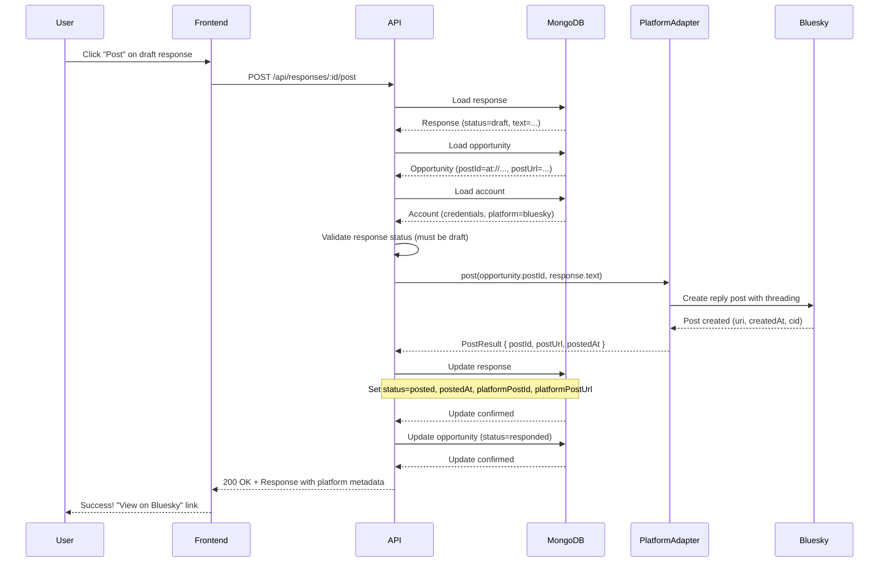
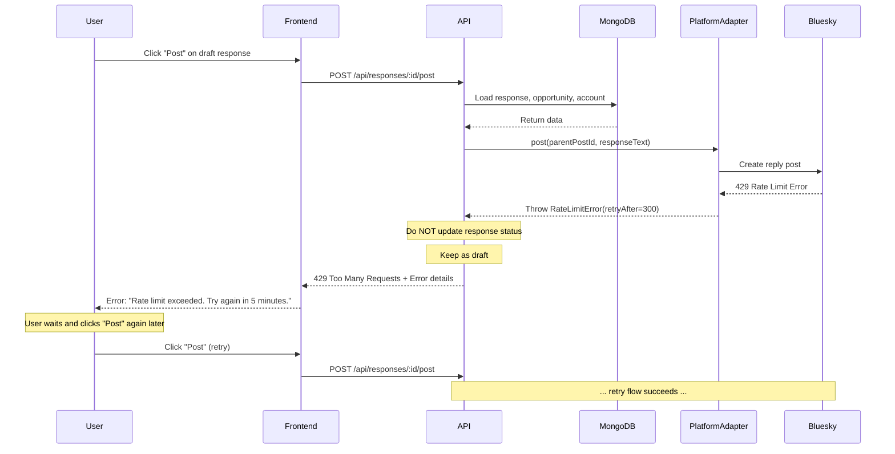

# Response Draft Posting - Design Document

📋 **Decision Context**: [ADR-010: Response Draft Posting](../../../docs/architecture/decisions/010-response-posting.md)

## Overview

The Response Draft Posting feature enables users to post AI-generated response drafts to social media platforms. This completes the core engagement loop: discover opportunities → generate responses → post to platform.

**Key Features:**
- Generic platform adapter interface for posting
- Platform-specific threading handled internally by adapters
- Capture platform metadata (post ID, URL, timestamp)
- Simple error handling with manual retry for v0.1

**External Dependencies:** MongoDB, Platform APIs (Bluesky for v0.1)

---

## 1. Data Models

### 1.1 Updated Response Schema

```typescript
/**
 * Response with added platform post metadata.
 * These fields are populated after successful posting.
 */
interface Response {
  /**
   * MongoDB document ID
   */
  _id: ObjectId;

  /**
   * Opportunity this response addresses
   * References opportunities._id
   */
  opportunityId: ObjectId;

  /**
   * Account generating this response
   * References accounts._id
   */
  accountId: ObjectId;

  /**
   * Generated response text (user-editable)
   */
  text: string;

  /**
   * Response lifecycle status
   * - draft: Generated, awaiting user action
   * - posted: Successfully posted to platform
   * - dismissed: User rejected this response
   */
  status: 'draft' | 'posted' | 'dismissed';

  /**
   * When this response was generated
   */
  generatedAt: Date;

  /**
   * When this response was posted to platform (if status=posted)
   * This is the platform-provided timestamp (authoritative)
   */
  postedAt?: Date;

  /**
   * When this response was dismissed (if status=dismissed)
   */
  dismissedAt?: Date;

  /**
   * Generation metadata for debugging and future learning
   */
  metadata: ResponseMetadata;

  /**
   * Version number for this opportunity
   * Increments with each "regenerate" call
   * Enables multi-draft comparison in future versions
   */
  version: number;

  /**
   * Last update timestamp
   */
  updatedAt: Date;

  /**
   * Platform-specific identifier for posted response
   * Populated after successful posting
   * 
   * Examples:
   * - Bluesky: AT URI (e.g., "at://did:plc:abc123.../app.bsky.feed.post/xyz789")
   * - LinkedIn: Post URN (future)
   * - Reddit: Post ID (future)
   * 
   * Used for:
   * - Linking back to platform post
   * - Future features: edit, delete, engagement tracking
   */
  platformPostId?: string;

  /**
   * Public URL to view the posted response
   * 
   * Examples:
   * - Bluesky: "https://bsky.app/profile/user.bsky.social/post/xyz789"
   * - LinkedIn: "https://www.linkedin.com/feed/update/urn:li:share:abc123"
   * - Reddit: "https://reddit.com/r/subreddit/comments/abc123/..."
   * 
   * Used for:
   * - Clickable link in UI
   * - Sharing posted responses
   */
  platformPostUrl?: string;
}
```

**Changes from Previous Design:**
- ✅ Added `platformPostId?: string`
- ✅ Added `platformPostUrl?: string`
- ✅ Clarified `postedAt` is platform-provided timestamp

---

## 2. Platform Adapter Interface Extension

### 2.1 New Method: post()

```typescript
/**
 * Platform adapter interface extension for posting responses.
 */
interface IPlatformAdapter {
  // ... existing methods (fetchReplies, searchPosts, getAuthor, getConstraints) ...

  /**
   * Post a response to a specific opportunity
   * 
   * This method handles platform-specific threading mechanics internally.
   * For example, Bluesky adapter constructs reply.parent and reply.root
   * from the parentPostId.
   * 
   * @param parentPostId - Platform-specific ID of post being replied to
   *                       (e.g., AT URI for Bluesky, Post ID for Reddit)
   * @param responseText - Text content of the response (already validated)
   * @returns Posted response metadata from platform
   * 
   * @throws {PlatformPostingError} Generic posting failure
   * @throws {AuthenticationError} Invalid or expired credentials
   * @throws {RateLimitError} Platform rate limit exceeded (429)
   * @throws {PostNotFoundError} Parent post no longer exists (404)
   * @throws {ContentViolationError} Response violates platform rules
   */
  post(parentPostId: string, responseText: string): Promise<PostResult>;
}

/**
 * Result of a successful post operation.
 * Contains platform-provided metadata.
 */
interface PostResult {
  /**
   * Platform-specific identifier for the posted response
   * 
   * Format varies by platform:
   * - Bluesky: AT URI (e.g., "at://did:plc:abc.../app.bsky.feed.post/xyz")
   * - LinkedIn: Post URN
   * - Reddit: Post ID (t1_xxx for comments)
   */
  postId: string;

  /**
   * Public URL to view the posted response
   * 
   * This is a human-readable URL suitable for sharing or display.
   * Examples:
   * - Bluesky: "https://bsky.app/profile/user.bsky.social/post/xyz"
   * - LinkedIn: "https://www.linkedin.com/feed/update/urn:li:share:abc"
   * - Reddit: "https://reddit.com/r/subreddit/comments/abc/title/xyz"
   */
  postUrl: string;

  /**
   * Timestamp when post was created on platform
   * 
   * This is the authoritative timestamp provided by the platform,
   * NOT a local timestamp. More accurate than client-side recording.
   */
  postedAt: Date;
}
```

### 2.2 Error Types

```typescript
/**
 * Base error for all posting failures
 */
class PlatformPostingError extends Error {
  constructor(
    message: string,
    public readonly platform: Platform,
    public readonly retryable: boolean = true
  ) {
    super(message);
    this.name = 'PlatformPostingError';
  }
}

/**
 * Authentication failure (expired token, invalid credentials)
 */
class AuthenticationError extends PlatformPostingError {
  constructor(platform: Platform, message: string = 'Authentication failed') {
    super(message, platform, false); // Not retryable
    this.name = 'AuthenticationError';
  }
}

/**
 * Rate limit exceeded (429)
 */
class RateLimitError extends PlatformPostingError {
  constructor(
    platform: Platform,
    public readonly retryAfter?: number, // Seconds until retry allowed
    message: string = 'Rate limit exceeded'
  ) {
    super(message, platform, true); // Retryable after delay
    this.name = 'RateLimitError';
  }
}

/**
 * Parent post not found (404)
 */
class PostNotFoundError extends PlatformPostingError {
  constructor(platform: Platform, postId: string) {
    super(`Post ${postId} not found (may have been deleted)`, platform, false);
    this.name = 'PostNotFoundError';
  }
}

/**
 * Content violates platform rules
 */
class ContentViolationError extends PlatformPostingError {
  constructor(platform: Platform, reason: string) {
    super(`Content violation: ${reason}`, platform, false);
    this.name = 'ContentViolationError';
  }
}
```

---

## 3. API Specifications

### 3.1 Post Response (Updated)

**Endpoint**: `POST /api/responses/:responseId/post`

**Description**: Post a draft response to the platform and update status.

**Path Parameters:**
- `responseId` (string, required): MongoDB ObjectId of response

**Request Body:** None

**Response** (200 OK):
```json
{
  "responseId": "507f1f77bcf86cd799439011",
  "status": "posted",
  "postedAt": "2026-01-04T10:40:00Z",
  "platformPostId": "at://did:plc:abc123.../app.bsky.feed.post/xyz789",
  "platformPostUrl": "https://bsky.app/profile/user.bsky.social/post/xyz789"
}
```

**Changes from Previous Design:**
- ✅ Added `platformPostId` to response
- ✅ Added `platformPostUrl` to response
- ✅ `postedAt` is now platform-provided timestamp

**Error Responses:**

**404 Not Found** - Response not found:
```json
{
  "error": "ResponseNotFound",
  "message": "Response with ID 507f... not found"
}
```

**409 Conflict** - Response already posted:
```json
{
  "error": "InvalidStatus",
  "message": "Response is already posted (cannot post again)"
}
```

**401 Unauthorized** - Authentication failure:
```json
{
  "error": "AuthenticationError",
  "message": "Platform authentication failed. Please reconnect your account.",
  "platform": "bluesky",
  "retryable": false
}
```

**404 Not Found** - Parent post deleted:
```json
{
  "error": "PostNotFoundError",
  "message": "The post you're replying to was deleted",
  "platform": "bluesky",
  "retryable": false
}
```

**429 Too Many Requests** - Rate limit:
```json
{
  "error": "RateLimitError",
  "message": "Rate limit exceeded. Please try again in 5 minutes.",
  "platform": "bluesky",
  "retryable": true,
  "retryAfter": 300
}
```

**500 Internal Server Error** - Network or platform failure:
```json
{
  "error": "PlatformPostingError",
  "message": "Failed to post response: Network timeout",
  "platform": "bluesky",
  "retryable": true
}
```

---

## 4. Sequence Diagrams

### 4.1 Successful Post Flow



### 4.2 Error Handling Flow



---

## 5. Bluesky Adapter Implementation

### 5.1 Threading Mechanics

Bluesky uses the AT Protocol which requires specific reply references:

```typescript
// Bluesky reply structure
interface BlueskyReply {
  parent: {
    uri: string; // AT URI of immediate parent
    cid: string; // Content identifier
  };
  root: {
    uri: string; // AT URI of thread root
    cid: string; // Content identifier
  };
}
```

**Threading Strategy:**
- For v0.1: Always reply directly to opportunity post (simple, direct replies)
- `reply.parent` = opportunity post
- `reply.root` = opportunity post's root (or itself if root)
- Future: Support thread continuation (reply to latest in thread)

### 5.2 Adapter Implementation

```typescript
import { BskyAgent } from '@atproto/api';

class BlueskyAdapter implements IPlatformAdapter {
  private agent: BskyAgent;
  private handle: string;

  constructor(credentials: BlueskyCredentials) {
    this.agent = new BskyAgent({ service: 'https://bsky.social' });
    this.handle = credentials.handle;
    // Authentication handled in constructor or init method
  }

  async post(parentPostId: string, responseText: string): Promise<PostResult> {
    try {
      // 1. Fetch parent post to get reply references
      const parentPost = await this.agent.getPost({ uri: parentPostId });

      if (!parentPost) {
        throw new PostNotFoundError('bluesky', parentPostId);
      }

      // 2. Construct reply with proper threading
      const result = await this.agent.post({
        text: responseText,
        reply: {
          parent: {
            uri: parentPostId,
            cid: parentPost.cid,
          },
          root: parentPost.reply?.root || {
            uri: parentPostId,
            cid: parentPost.cid,
          },
        },
      });

      // 3. Construct public URL from AT URI
      const postPath = result.uri.split('/').pop(); // Extract post ID from URI
      const postUrl = `https://bsky.app/profile/${this.handle}/post/${postPath}`;

      // 4. Return platform metadata
      return {
        postId: result.uri,
        postUrl: postUrl,
        postedAt: new Date(result.createdAt),
      };
    } catch (error) {
      // Map AT Protocol errors to our error types
      if (error.status === 401) {
        throw new AuthenticationError('bluesky', 'Invalid or expired session');
      } else if (error.status === 429) {
        const retryAfter = error.headers?.['retry-after']
          ? parseInt(error.headers['retry-after'], 10)
          : undefined;
        throw new RateLimitError('bluesky', retryAfter);
      } else if (error.status === 404) {
        throw new PostNotFoundError('bluesky', parentPostId);
      } else {
        throw new PlatformPostingError(
          `Failed to post to Bluesky: ${error.message}`,
          'bluesky',
          true
        );
      }
    }
  }

  // ... other methods (fetchReplies, searchPosts, getAuthor, getConstraints) ...
}
```

---

## 6. Service Layer Implementation

### 6.1 ResponseService.postResponse()

```typescript
import { ObjectId } from 'mongodb';
import type { Response, Opportunity, Account } from '@/shared/types';
import type { IPlatformAdapter } from '@/backend/adapters/platform-adapter';

class ResponseService {
  constructor(
    private responsesCollection: Collection<Response>,
    private opportunitiesCollection: Collection<Opportunity>,
    private accountsCollection: Collection<Account>
  ) {}

  /**
   * Post a draft response to the platform
   * 
   * @param responseId - ID of response to post
   * @returns Updated response with platform metadata
   * @throws {ResponseNotFoundError} Response not found
   * @throws {InvalidStatusError} Response is not a draft
   * @throws {PlatformPostingError} Posting failed (various reasons)
   */
  async postResponse(responseId: ObjectId): Promise<Response> {
    // 1. Load response
    const response = await this.responsesCollection.findOne({ _id: responseId });
    if (!response) {
      throw new ResponseNotFoundError(`Response ${responseId} not found`);
    }

    // 2. Validate status
    if (response.status !== 'draft') {
      throw new InvalidStatusError(
        `Cannot post response with status '${response.status}' (must be 'draft')`
      );
    }

    // 3. Load opportunity (contains postId for threading)
    const opportunity = await this.opportunitiesCollection.findOne({
      _id: response.opportunityId,
    });
    if (!opportunity) {
      throw new OpportunityNotFoundError(
        `Opportunity ${response.opportunityId} not found`
      );
    }

    // 4. Load account (contains credentials)
    const account = await this.accountsCollection.findOne({
      _id: response.accountId,
    });
    if (!account) {
      throw new AccountNotFoundError(`Account ${response.accountId} not found`);
    }

    // 5. Get platform adapter
    const adapter = this.getPlatformAdapter(account);

    // 6. Post to platform (throws on failure)
    const postResult = await adapter.post(opportunity.postId, response.text);

    // 7. Update response with platform metadata
    const updatedResponse = await this.responsesCollection.findOneAndUpdate(
      { _id: responseId },
      {
        $set: {
          status: 'posted',
          postedAt: postResult.postedAt,
          platformPostId: postResult.postId,
          platformPostUrl: postResult.postUrl,
          updatedAt: new Date(),
        },
      },
      { returnDocument: 'after' }
    );

    // 8. Update opportunity status
    await this.opportunitiesCollection.updateOne(
      { _id: opportunity._id },
      {
        $set: {
          status: 'responded',
          updatedAt: new Date(),
        },
      }
    );

    return updatedResponse.value!;
  }

  private getPlatformAdapter(account: Account): IPlatformAdapter {
    // Factory method to create platform-specific adapter
    // Implementation depends on account.platform and credentials
    // ...
  }
}
```

### 6.2 Error Handling Strategy

**v0.1 Approach: Fail Fast, User Retries**

- **No automatic retries**: If `adapter.post()` throws, propagate error to API layer
- **Keep response as draft**: Do NOT update response status on failure
- **Clear error messages**: Map platform errors to user-friendly messages
- **Manual retry**: User clicks "Post" again to retry

**Benefits:**
- ✅ Simple implementation (no retry logic)
- ✅ User control (no duplicate posts)
- ✅ Clear failure state (draft remains editable)

**Trade-offs:**
- ❌ Transient network errors require manual retry
- ❌ No automatic recovery

**Future Enhancement (v0.2):**
- Distinguish retryable vs. non-retryable errors
- Exponential backoff for retryable errors (3 attempts)
- Background job queue for deferred retries

---

## 7. Database Design

### 7.1 MongoDB Updates

**Collection: `responses`**

**Schema Changes:**
- Add `platformPostId?: string` (optional, populated after posting)
- Add `platformPostUrl?: string` (optional, populated after posting)

**Migration:**
```javascript
// No migration needed - fields are optional
// Existing responses will not have these fields (which is correct)
```

**Indexes (No Changes):**
```javascript
// Existing indexes remain sufficient
db.responses.createIndex({ opportunityId: 1, version: -1 });
db.responses.createIndex({ accountId: 1, status: 1, generatedAt: -1 });
db.responses.createIndex({ status: 1, generatedAt: 1 });
```

**Future Index (v0.2+):**
```javascript
// If we add engagement tracking
db.responses.createIndex({ platformPostId: 1 }); // Lookup by platform post
```

---

## 8. Error Handling

### 8.1 Error Categories

| Error Type | HTTP Code | Retryable | User Action | API Response Behavior |
|------------|-----------|-----------|-------------|----------------------|
| ResponseNotFound | 404 | No | Check response exists | Response status unchanged |
| InvalidStatus | 409 | No | Cannot post non-draft | Response status unchanged |
| AuthenticationError | 401 | No | Reconnect account | Response status unchanged |
| PostNotFoundError | 404 | No | Opportunity post deleted | Response status unchanged |
| RateLimitError | 429 | Yes | Wait and retry | Response status unchanged, return retryAfter |
| ContentViolationError | 422 | No | Edit response text | Response status unchanged |
| PlatformPostingError | 500 | Yes | Retry | Response status unchanged |

**Key Principle:** Response status remains `draft` unless posting succeeds completely.

### 8.2 Frontend Error Display

**Error Messages by Type:**

- **AuthenticationError**: "Authentication failed. Please reconnect your Bluesky account in Settings."
- **PostNotFoundError**: "The post you're replying to was deleted. This opportunity is no longer available."
- **RateLimitError**: "Rate limit exceeded. Please try again in 5 minutes."
- **ContentViolationError**: "Your response violates platform rules: [reason]. Please edit and try again."
- **PlatformPostingError** (Network): "Network error. Please check your connection and try again."
- **PlatformPostingError** (Generic): "Failed to post response. Please try again."

---

## 9. Performance Considerations

### 9.1 Latency Expectations

| Operation | Target Latency | Notes |
|-----------|---------------|-------|
| Load response, opportunity, account | <100ms | MongoDB queries (3 documents) |
| Platform API call (Bluesky) | 500ms - 2s | Network + platform processing |
| Update response in DB | <50ms | MongoDB update |
| **Total** | **600ms - 2.2s** | Acceptable for user-initiated action |

**v0.1 Performance:**
- No caching (simplicity)
- Synchronous posting (user waits for result)
- Acceptable latency for manual posting action

**Future Optimizations (v0.2+):**
- Cache account credentials (reduce DB queries)
- Batch post multiple responses (queue processing)
- Webhook notifications for post success (async posting)

---

## 10. Security Considerations

### 10.1 Credential Security

- **Account credentials** stored in MongoDB (already handled by account management)
- **Platform tokens** never exposed in API responses
- **HTTPS required** for all platform API calls

### 10.2 Validation

**Input Validation:**
- Response ID format validation (MongoDB ObjectId)
- Response status validation (must be draft)
- Text length validation (already done during generation)

**Authorization:**
- Ensure user owns the response being posted
- Ensure account credentials are valid
- v0.1: Single user, no authorization checks needed
- v0.2+: Multi-user authorization required

### 10.3 Idempotency

**Problem:** User clicks "Post" twice quickly (double-post risk)

**v0.1 Mitigation:**
- Check response status before posting (must be `draft`)
- If status is already `posted`, return 409 Conflict
- No duplicate posts possible

**Future Enhancement (v0.2):**
- Idempotency tokens for API requests
- Disable "Post" button after click (frontend)

---

## 11. Testing Strategy

See [Test-Writer Handoff Document](../handoffs/005-response-posting-handoff.md) for complete test scenarios.

**Key Test Categories:**
1. **Unit**: Error mapping, PostResult construction, validation logic
2. **Integration**: End-to-end posting, platform adapter mocking
3. **E2E**: Full user flow (generate → edit → post → view on platform)
4. **Error Scenarios**: All error types (auth, rate limit, network, etc.)
5. **Threading**: Verify replies attach to correct parent post

---

## 12. Future Enhancements

### v0.2: Resilience
- Automatic retry with exponential backoff (3 attempts)
- Distinguish retryable vs. non-retryable errors
- Background job queue for deferred posting

### v0.3: Advanced Threading
- Thread continuation (reply to latest post in thread)
- Quote posts (embed original in response)
- Multi-post threads (break long responses into parts)

### v0.4: Post Management
- Edit posted responses (where supported)
- Delete posted responses
- Track engagement on posted responses

### v0.5: Batch Operations
- Post multiple responses in sequence
- Schedule posts for future
- Auto-post on approval (optional automation)

---

## 13. Open Questions & Risks

### 13.1 Open Questions

1. **Platform timestamp accuracy**: Do all platforms return creation timestamp in API response?
   - Bluesky: Yes (createdAt field in post record)
   - LinkedIn: TBD (v0.2)
   - Reddit: TBD (v0.2)

2. **Threading edge cases**: What if parent post is deleted between generation and posting?
   - Current: Return PostNotFoundError, keep response as draft
   - Future: Detect before posting, mark opportunity as expired

3. **Rate limit handling**: Should we track rate limits client-side to prevent 429s?
   - v0.1: No (simple error display)
   - v0.2: Consider rate limit tracking per account

### 13.2 Implementation Risks

| Risk | Likelihood | Impact | Mitigation |
|------|------------|--------|------------|
| Platform API changes | Medium | High | Version API calls, monitor breaking changes |
| Network failures | High | Medium | Clear error messages, easy manual retry |
| Threading bugs | Low | High | Extensive testing with real Bluesky posts |
| Double-posting | Low | Medium | Status validation prevents duplicates |
| Credential expiration | Medium | High | AuthenticationError guides user to reconnect |

---

## 14. Related Documentation

- [ADR-010: Response Draft Posting](../../../docs/architecture/decisions/010-response-posting.md) - Decision rationale
- [ADR-009: Response Suggestion Architecture](../../../docs/architecture/decisions/009-response-suggestion-architecture.md) - Response generation
- [ADR-008: Opportunity Discovery Architecture](../../../docs/architecture/decisions/008-opportunity-discovery-architecture.md) - Opportunity data models
- [Test-Writer Handoff](../handoffs/005-response-posting-handoff.md) - Test scenarios and acceptance criteria
- [Bluesky AT Protocol Documentation](https://atproto.com/) - Platform API reference

