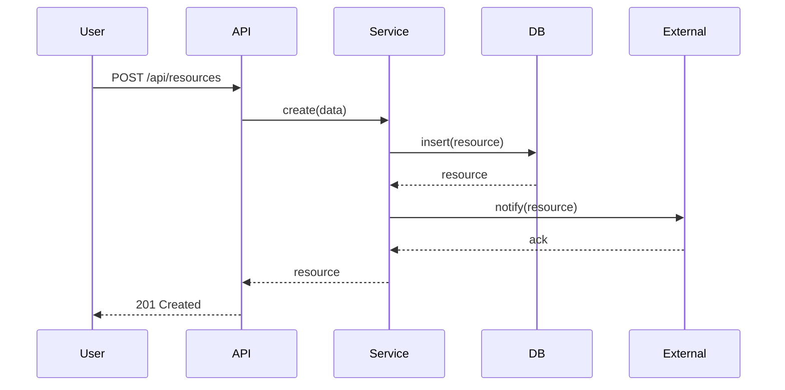

# [Feature Name] - Design Document

**Date**: [YYYY-MM-DD]
**Designer**: Designer Agent
**Status**: [Draft | Under Review | Approved]
**Related ADR**: [ADR-### Link](../../../docs/architecture/decisions/###-title.md)

## Problem Statement

What problem are we solving? Why is this important?

**User Story** (if applicable):
> As a [user type],
> I want [goal],
> so that [benefit].

## Design Overview

High-level summary of the approach.

## Data Models

### Entity: [EntityName]

**Purpose**: [What this entity represents]

**TypeScript Interface**:
```typescript
interface EntityName {
  id: string;                    // MongoDB ObjectId
  created_at: Date;
  updated_at: Date;
  
  // Entity-specific fields
  field_name: string;
  nested_field?: {
    sub_field: number;
  };
  
  // Relations
  related_id: string;            // Reference to other collection
  embedded_items: EmbeddedType[]; // Embedded documents
}
```

**MongoDB Schema Notes**:
- Collection name: `entity_names`
- Indexes:
  - `{ field_name: 1 }` - For queries by field_name
  - `{ created_at: -1 }` - For chronological queries
- Relationships:
  - `related_id` → `other_collection._id`

**Validation Rules**:
- `field_name`: Required, min 3 chars, max 100 chars
- `nested_field.sub_field`: Optional, positive integer

### Entity: [AnotherEntity]

[Repeat structure for each entity]

## API Contracts

### Endpoint: `POST /api/resources`

**Purpose**: Create a new resource

**Request**:
```typescript
POST /api/resources
Content-Type: application/json

{
  "field_name": "value",
  "nested_field": {
    "sub_field": 42
  }
}
```

**Response (Success - 201)**:
```typescript
{
  "id": "507f1f77bcf86cd799439011",
  "field_name": "value",
  "nested_field": {
    "sub_field": 42
  },
  "created_at": "2025-12-29T12:00:00Z",
  "updated_at": "2025-12-29T12:00:00Z"
}
```

**Response (Error - 400)**:
```typescript
{
  "error": "ValidationError",
  "message": "field_name is required",
  "details": {
    "field": "field_name",
    "constraint": "required"
  }
}
```

**Error Codes**:
- `400` - Validation error
- `401` - Unauthorized
- `409` - Conflict (duplicate)
- `500` - Internal server error

### Endpoint: `GET /api/resources/:id`

[Repeat for each endpoint]

## Service Interfaces (Internal)

### Service: ResourceService

**Purpose**: Business logic for managing resources

**Interface**:
```typescript
interface IResourceService {
  create(data: CreateResourceDto): Promise<Resource>;
  findById(id: string): Promise<Resource | null>;
  update(id: string, data: UpdateResourceDto): Promise<Resource>;
  delete(id: string): Promise<void>;
  
  // Custom business logic
  processResource(id: string): Promise<ProcessingResult>;
}
```

## Integration Points

### External: Bluesky API

**Purpose**: [Why we integrate]
**Operations**:
- `fetchPosts()` - Get recent posts from feed
- `postReply(postId, text)` - Reply to a post

**Error Handling**:
- Rate limit: 429 → Exponential backoff (1s, 2s, 4s, ...)
- Network error → Retry 3 times, then fail gracefully
- Auth error → Clear credentials, notify user

### External: Anthropic Claude

**Purpose**: [Why we integrate]
**Operations**:
- `generateResponse(context, knowledge)` - Generate reply suggestion

**Error Handling**:
- Token limit → Truncate context intelligently
- API error → Fall back to template or notify user

### Internal: ChromaDB

**Purpose**: [Why we integrate]
**Operations**:
- `embedAndStore(chunks)` - Store knowledge base chunks
- `semanticSearch(query, limit)` - Find relevant chunks

## Sequence Diagrams

### Flow: Create Resource



### Flow: [Another Key Flow]

[Add more sequence diagrams as needed]

## Edge Cases & Error Handling

1. **Case**: User creates duplicate resource
   - **Detection**: Check unique constraint on `field_name`
   - **Handling**: Return 409 Conflict with clear message
   - **Recovery**: Suggest existing resource

2. **Case**: External API is down
   - **Detection**: Connection timeout or 5xx error
   - **Handling**: Retry with exponential backoff
   - **Fallback**: Queue operation for later or notify user

3. **Case**: [Another edge case]
   - **Detection**: [How we detect it]
   - **Handling**: [What we do]
   - **Recovery**: [How user recovers]

## Performance Considerations

- **Expected Load**: [e.g., 10 requests/minute, 1000 resources]
- **Indexing**: [What indexes are critical]
- **Caching**: [What should be cached and for how long]
- **Bottlenecks**: [Potential performance issues]

## Security Considerations

- **Authentication**: [How we verify identity]
- **Authorization**: [Who can access what]
- **Input Validation**: [What we validate and how]
- **Data Sanitization**: [How we prevent injection]
- **Sensitive Data**: [How we handle secrets, PII]

## Testing Strategy

### Unit Tests
- Service methods (mocked dependencies)
- Validation logic
- Business rules

### Integration Tests
- API endpoints (real DB, mocked externals)
- Database operations
- Error handling

### E2E Tests
- Critical user flows
- End-to-end data flow

## Open Questions

1. **Q**: [Question that needs answering]
   - **Impact**: [Why this matters]
   - **Decision Needed By**: [When]

2. **Q**: [Another open question]
   - **Impact**: [Why this matters]
   - **Decision Needed By**: [When]

## Risks & Mitigations

| Risk | Likelihood | Impact | Mitigation |
|------|------------|--------|------------|
| External API rate limit | Medium | High | Implement caching, backoff |
| Data migration fails | Low | High | Test migration, have rollback plan |
| [Risk 3] | [L/M/H] | [L/M/H] | [Plan] |

## Handoff to Test-Writer

### Entities to Test
1. `EntityName` - Create, read, update, delete operations
2. `AnotherEntity` - [Key operations]

### API Contracts to Test
1. `POST /api/resources` - Success (201), validation errors (400), duplicates (409)
2. `GET /api/resources/:id` - Found (200), not found (404)

### Edge Cases to Cover
1. Duplicate resource creation
2. External API failure scenarios
3. Invalid input validation

### Integration Dependencies
- MongoDB (test database)
- Mocked Bluesky API
- Mocked Anthropic API

### Acceptance Criteria
- [ ] All CRUD operations work correctly
- [ ] Validation prevents invalid data
- [ ] Error responses are clear and actionable
- [ ] External API errors are handled gracefully
- [ ] [Additional criteria]

## References

- [ADR-###](../../../docs/architecture/decisions/###-title.md)
- [Tech Stack](./.agents/context/tech-stack.md)
- [Project Glossary](../../context/project-glossary.md)
- [External API Docs](https://example.com/docs)

## Change Log

| Date | Change | Reason |
|------|--------|--------|
| YYYY-MM-DD | Initial design | Feature kickoff |
| YYYY-MM-DD | Updated data model | Feedback from review |

