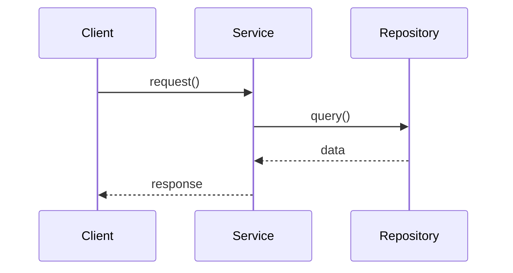

# Designer Documentation Templates

These templates show how to structure the three Designer artifacts with minimal duplication.

---

## Template 1: ADR (Architecture Decision Record)

**File**: `docs/architecture/decisions/###-{topic}.md`
**Purpose**: Record WHAT was decided and WHY

```markdown
# ADR-### {Short Decision Title}

## Status
Accepted | Proposed | Deprecated | Superseded by ADR-XYZ

## Context
What problem or constraint led to this decision?
- Business/product context
- Technical constraints
- Stakeholder requirements

## Options Considered

### Option A: {Name}
- **Pros**: ...
- **Cons**: ...

### Option B: {Name}
- **Pros**: ...
- **Cons**: ...

## Decision
We will {high-level description of chosen approach}.

## Rationale
Why we chose this option:
1. {Reason 1}
2. {Reason 2}
3. {Reason 3}

## Consequences

### Positive
- {Benefit 1}
- {Benefit 2}

### Negative
- {Trade-off 1}
- {Trade-off 2}

## Related Decisions
- Builds on: [ADR-XXX](./xxx-title.md)
- Relates to: [ADR-YYY](./yyy-title.md)

## Technical Details
See [Design Document](../../.agents/artifacts/designer/designs/{feature}-design.md) for complete technical specification.

## References
- Link to requirement document
- Link to external resources
```

**❌ Don't include in ADR**:
- Complete data models (just describe entities at high level)
- Full API schemas (mention endpoints exist, don't detail them)
- Code samples (unless critical to understanding decision)
- Test scenarios

---

## Template 2: Design Document

**File**: `.agents/artifacts/designer/designs/{feature-name}-design.md`
**Purpose**: Complete technical blueprint (HOW to implement)

```markdown
# {Feature Name} - Design Document

📋 **Decision Context**: [ADR-###](../../../docs/architecture/decisions/###-topic.md)

## Overview
Brief description of what this feature does and how it fits in the system.

**Key Entities**: Entity1, Entity2, Entity3
**External Dependencies**: Bluesky API, MongoDB, ChromaDB

---

## 1. Data Models

### 1.1 {Entity Name}

```typescript
interface EntityName {
  id: string;
  // ... complete interface with JSDoc comments
}
```

**MongoDB Collection**: `{collection_name}`
**Indexes**:
- `{ field1: 1, field2: 1 }` - for {query pattern}
- `{ field3: -1 }` - for {query pattern}

### 1.2 {Another Entity}
...

---

## 2. API Contracts

### 2.1 {Endpoint/Method Name}

**Purpose**: {What this does}

**Request**:
```typescript
interface RequestSchema {
  // ... complete schema
}
```

**Response** (Success):
```typescript
interface ResponseSchema {
  // ... complete schema
}
```

**Errors**:
- `400` - {Error condition}
- `404` - {Error condition}
- `500` - {Error condition}

**Example**:
```typescript
// Example request/response
```

---

## 3. Service Architecture

### 3.1 {Service Name}

**Responsibilities**:
- {Responsibility 1}
- {Responsibility 2}

**Interface**:
```typescript
interface IServiceName {
  // ... complete interface
}
```

### 3.2 Sequence Diagram



---

## 4. Implementation Notes

### 4.1 Performance Considerations
- {Consideration 1}
- {Consideration 2}

### 4.2 Error Handling Strategy
- {Strategy 1}
- {Strategy 2}

### 4.3 Edge Cases
| Case | Handling |
|------|----------|
| {Edge case 1} | {How to handle} |
| {Edge case 2} | {How to handle} |

---

## 5. Open Questions & Risks

### Questions
- [ ] {Question 1}
- [ ] {Question 2}

### Risks
| Risk | Impact | Mitigation |
|------|--------|------------|
| {Risk 1} | High/Med/Low | {How to mitigate} |

---

## 6. References

- **Decision Rationale**: [ADR-###](../../../docs/architecture/decisions/###-topic.md)
- **Test Guidance**: [Handoff Document](../handoffs/{feature-name}-handoff.md)
- **Related Designs**: [Other Design](./other-design.md)
```

**✅ This is the "source of truth"** for:
- Complete data models
- Full API schemas
- Detailed implementation guidance

---

## Template 3: Test-Writer Handoff

**File**: `.agents/artifacts/designer/handoffs/{feature-name}-handoff.md`
**Purpose**: Guide Test-Writer on WHAT to test and acceptance criteria

```markdown
# {Feature Name} - Test-Writer Handoff

🔗 **Design Rationale**: [ADR-###](../../../docs/architecture/decisions/###-topic.md)
🔗 **Technical Specs**: [Design Document](../designs/{feature-name}-design.md)

## Overview
{Brief description of what needs testing}

---

## 1. Test Scope

### In Scope
- ✅ {Behavior 1}
- ✅ {Behavior 2}
- ✅ {Behavior 3}

### Out of Scope (for this phase)
- ❌ {Future behavior}
- ❌ {Performance testing}

---

## 2. Test Scenarios

### 2.1 Unit Tests: {Service/Module Name}

#### Scenario: {Test case name}
**Given**: {Preconditions}
**When**: {Action}
**Then**: {Expected outcome}

**Acceptance Criteria**:
- [ ] {Specific assertion 1}
- [ ] {Specific assertion 2}

**Technical Details**: See [Design Doc Section 3.1](../designs/{feature}-design.md#31-service-name) for complete `{MethodName}` signature.

---

#### Scenario: {Another test case}
...

### 2.2 Integration Tests: {Integration Point}

#### Scenario: {Integration test case}
**Given**: {Preconditions}
**When**: {Action}
**Then**: {Expected outcome}

**Mock/Stub Guidance**:
- Mock `{ExternalService}` to return `{mock data}`
- Stub `{Database}` with in-memory implementation

---

## 3. Edge Cases & Error Paths

| Scenario | Expected Behavior | Priority |
|----------|-------------------|----------|
| {Edge case 1} | {How system should behave} | High/Med/Low |
| {Edge case 2} | {How system should behave} | High/Med/Low |
| {Error condition 1} | {Error handling} | High/Med/Low |

---

## 4. Data Fixtures

### Test User
```typescript
const testUser = {
  id: "test-user-123",
  // ... minimal fixture for testing
};
```

**Full Schema**: See [Design Doc Section 1.2](../designs/{feature}-design.md#12-user-entity)

### Test Entities
```typescript
const validEntity = { /* ... */ };
const invalidEntity = { /* ... */ };
```

---

## 5. Integration Dependencies

### External APIs
- **{API Name}**: Mock using `{mock library}`, return `{mock response}`
- **{Another API}**: Stub with in-memory fake

### Database
- **Collections**: `{collection1}`, `{collection2}`
- **Setup**: Use `setup{Feature}TestDB()` helper
- **Teardown**: Clean up after each test

---

## 6. Test Priorities

### Critical Path (Must Pass)
1. {Test 1} - Core functionality
2. {Test 2} - Data integrity
3. {Test 3} - Error handling

### Important (Should Pass)
4. {Test 4} - Edge case handling
5. {Test 5} - Integration validation

### Nice to Have (May Defer)
6. {Test 6} - Performance validation
7. {Test 7} - Logging validation

---

## 7. Definition of Done

A test suite is complete when:
- [ ] All critical path scenarios covered
- [ ] All edge cases from Design Doc Section 4.3 tested
- [ ] All API contracts validated
- [ ] Error paths tested (4xx, 5xx responses)
- [ ] Integration dependencies properly mocked
- [ ] Tests fail before implementation (Red phase verified)

---

## References

- **Why these decisions**: [ADR-###](../../../docs/architecture/decisions/###-topic.md)
- **Complete technical specs**: [Design Document](../designs/{feature-name}-design.md)
- **API schemas**: [Design Doc Section 2](../designs/{feature}-design.md#2-api-contracts)
- **Data models**: [Design Doc Section 1](../designs/{feature}-design.md#1-data-models)
```

**❌ Don't duplicate in Handoff**:
- Complete TypeScript interfaces (link to Design Doc)
- Full API request/response schemas (link to Design Doc)
- Implementation details (Test-Writer doesn't need these)

**✅ Do include**:
- Test-specific fixtures (minimal examples)
- Clear acceptance criteria
- Mock/stub guidance
- Test priorities

---

## Key Principles

### 1. Write Once, Reference Everywhere
- **ADR**: Strategic decisions (no code)
- **Design Doc**: Complete technical details (source of truth)
- **Handoff**: Testing guidance (links to Design Doc, doesn't duplicate)

### 2. Cross-Reference Chain
```
ADR ← Design Doc ← Handoff
 ↓         ↓          ↓
Why      How       Test What
```

### 3. Information Hierarchy

| Document | Audience | Content Type | Detail Level |
|----------|----------|--------------|--------------|
| ADR | Architects, future team | Decisions + rationale | High-level |
| Design Doc | All implementers | Technical specs | Complete detail |
| Handoff | Test-Writer Agent | Test scenarios | Test-focused |

### 4. When to Reference vs. Duplicate

**Reference** (link to Design Doc):
- Complete data schemas
- Full API contracts
- Complex algorithms
- Implementation details

**Duplicate** (include in Handoff):
- Minimal test fixtures
- Acceptance criteria
- Test-specific mock data
- Test priorities

---

## Example: Applying Templates

For "Account Configuration" feature:

1. **ADR-006** (`docs/architecture/decisions/006-profile-account-separation.md`)
   - Context: Why separate Profile and Account
   - Decision: Use two collections
   - Rationale: Different lifecycles, different ownership
   - Consequences: More flexible but more queries
   - ~150-200 lines

2. **Design Doc** (`.agents/artifacts/designer/designs/account-configuration-design.md`)
   - Complete `Account` and `Profile` interfaces
   - All API endpoints with full schemas
   - Sequence diagrams for linking/unlinking
   - ~400-600 lines

3. **Handoff** (`.agents/artifacts/designer/handoffs/account-configuration-handoff.md`)
   - Test scenarios: "Should create account", "Should link profile"
   - Acceptance criteria for each
   - Links to Design Doc: "See Section 1.1 for Account schema"
   - ~200-300 lines

**Total**: ~800 lines vs. ~1,500+ lines with duplication ✅ **47% reduction**

