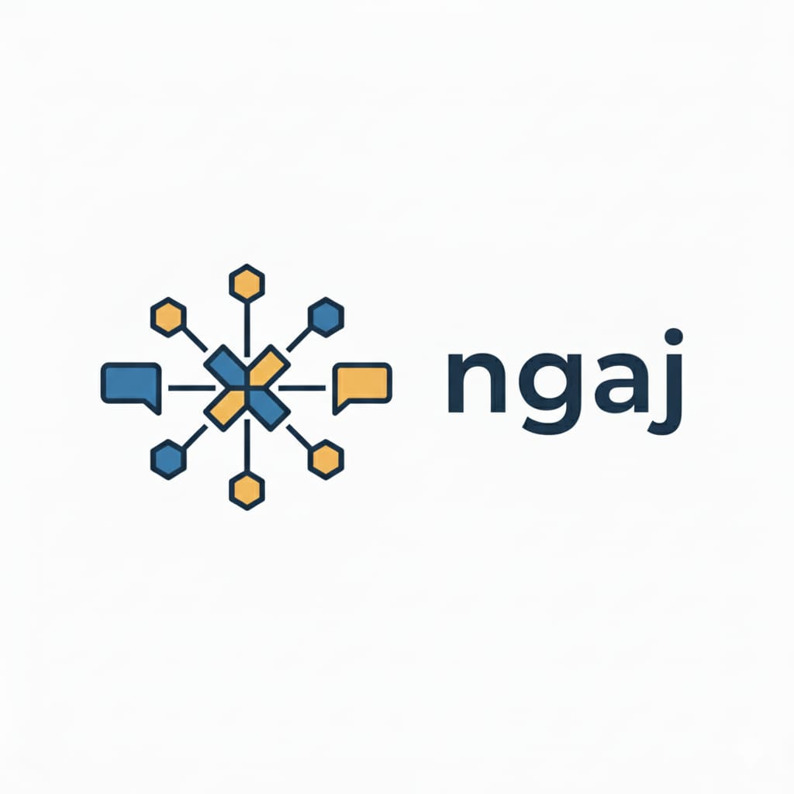

<p align="center">
  
</p>

<h1 align="center">ngaj</h1>

[](https://github.com/ziohimself/ngaj/actions)
[](https://codecov.io/gh/ziohimself/ngaj)
[](LICENSE)
[](https://nodejs.org)

**Proactive engagement companion for social media**

ngaj helps you show up consistently and authentically in high-value conversations by discovering opportunities and crafting AI-powered responses grounded in your knowledge and voice.

## Vision

ngaj is fundamentally about **proactive, authentic engagement amplification**. It surfaces conversations you might miss, lowers the activation energy for engagement, and enhances rather than replaces your voice.

## Core Value Proposition

*"Help you show up consistently and authentically in high-value conversations by discovering opportunities, crafting responses grounded in your knowledge, and protecting against manipulation."*

## Features

### v0.1 MVP (Current)

✅ **Smart Discovery**: Find Bluesky conversations matching your interests  
✅ **AI Responses**: Claude-powered suggestions using your knowledge base  
✅ **Context-Aware**: Grounds responses in your uploaded reference materials  
✅ **Scheduled Polling**: Automatic opportunity discovery on your schedule  
✅ **Knowledge Base**: Upload reference materials and voice samples

### Roadmap

- **v0.2** - Multi-Account & Analysis Mode
  - Multiple account support
  - Multiple platforms (LinkedIn, Reddit)
  - Toulmin analysis brainstorm mode
  - Auto-posting without review

- **v0.3** - Proactive Content
  - Content origination (news monitoring)
  - Scheduled original posts
  - Content calendar

- **v0.4** - Intelligence & Safety
  - Engagement analytics
  - Learning from what works
  - Advanced safety (prompt injection detection)
  - Rate limiting

- **v0.5** - Automation
  - Auto-scraping past posts
  - Advanced scoring models

## Quick Start (Development)

### Prerequisites

- **Node.js** >= 20.0.0
- **npm** >= 9.0.0
- **Docker** (for MongoDB and ChromaDB)

### Setup

```bash
# Clone the repository
git clone https://github.com/ziohimself/ngaj.git
cd ngaj

# Install dependencies (monorepo with npm workspaces)
npm install

# Create environment file with your credentials
cat > .env << 'EOF'
# Bluesky Credentials
BLUESKY_HANDLE=your.handle.bsky.social
BLUESKY_APP_PASSWORD=xxxx-xxxx-xxxx-xxxx

# AI Configuration
ANTHROPIC_API_KEY=sk-ant-api03-your-key-here

# Database Configuration
MONGODB_URI=mongodb://localhost:27017/ngaj
CHROMA_URL=http://localhost:8000

# Application Settings
PORT=3000
NODE_ENV=development

# Auth (generate a random string)
LOGIN_SECRET=your-random-login-secret
EOF

# Start databases (development mode exposes ports locally)
docker compose -f docker-compose.yml -f docker-compose.dev.yml up -d

# Start development servers (backend + frontend with hot reload)
npm run dev
```

Open your browser to http://localhost:3000

### Getting Credentials

- **Bluesky App Password**: [bsky.app/settings/app-passwords](https://bsky.app/settings/app-passwords)
- **Anthropic API Key**: [console.anthropic.com](https://console.anthropic.com)

## Production Deployment

For production, ngaj uses Docker Compose with pre-built images:

```bash
# Build all packages
npm run build

# Build Docker images
npm run docker:build

# Start production services
docker compose up -d
```

Production expects credentials in `~/.ngaj/.env` (created by the setup wizard).

## End-User Installation (Coming Soon)

ngaj will provide native installers (`.pkg` for macOS, `.msi` for Windows) that:
- Install Docker Desktop if needed
- Run an interactive setup wizard for credentials
- Start all services automatically

See [ADR-011](docs/architecture/decisions/011-installation-and-setup.md) for details.

## Documentation

- [Setup Guide](docs/setup.md) - Detailed installation and configuration
- [Architecture Overview](docs/architecture/overview.md) - System design
- [API Specification](docs/api/openapi.yaml) - OpenAPI/Swagger spec
- [Architecture Decisions](docs/architecture/decisions/) - ADRs

## Project Structure

ngaj uses npm workspaces (monorepo):

```
packages/
├── shared/    # Shared types and utilities
├── backend/   # Express API server
├── frontend/  # React web application
└── setup/     # CLI setup wizard
```

## Tech Stack

- **Frontend**: React + TypeScript + Tailwind CSS + Vite
- **Backend**: Node.js + TypeScript + Express
- **Database**: MongoDB (profiles, accounts, opportunities)
- **Vector Store**: ChromaDB (knowledge embeddings)
- **AI**: Anthropic Claude API
- **Social Platforms**: Bluesky (AT Protocol)
- **Testing**: Vitest + Playwright
- **Build**: npm workspaces + Docker

See [tech-stack.md](docs/tech-stack.md) for details.

## Project Principles

1. **Local-First**: Runs on your machine, you control your data
2. **Privacy**: Credentials in environment variables, no cloud storage
3. **Authentic**: AI assists, doesn't replace your voice
4. **Proactive**: Surfaces opportunities you'd otherwise miss
5. **Grounded**: Responses based on your actual knowledge and positions

## License

[MIT © Serhiy Onyshchenko](LICENSE)

## Contributing

```bash
# Run tests
npm test

# Run linting
npm run lint

# Type check
npm run type-check

# Format code
npm run format
```

See [docs/](docs/) for architecture and design documentation.
